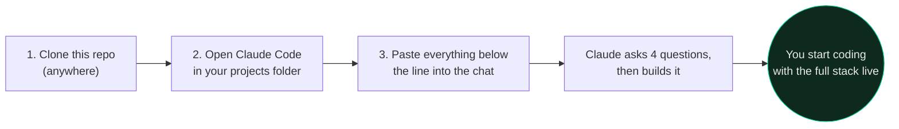
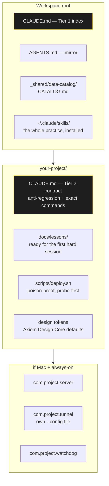

# The Blueprint

**What it is:** the *project* paste. Skills are already installed by the one-liner in the README:

```bash
git clone https://github.com/Nonarkara/dr-non-vibecoding-skills.git
cd dr-non-vibecoding-skills && ./setup.sh --become-builder
```

This document is what you hand a fresh Claude Code session, in an empty (or existing) projects folder, so it grows the memory ladder, deploy discipline, service pattern, and design contract — the scaffolding it took six months to grow by hand.

**How to use it:** one-liner first (if you have not), then three steps, five minutes of your time, then Claude does the rest.

*Visual summary: [`INFOGRAPHICS.md`](INFOGRAPHICS.md), page 7.*



```bash
git clone https://github.com/Nonarkara/dr-non-vibecoding-skills.git
cd ~/Projects   # or wherever your work lives — new or existing, both fine
claude
```

> **Prefer a script instead of chat?** You already ran `./setup.sh --become-builder`. For the project folder: `./setup.sh --init-project ~/Projects/my-app` (or `scripts/new-project.sh ~/Projects/my-app`). Same templates either way.

Then paste the whole block below into the chat. That's it — everything past this line is written *to the agent*, not to you.

---

## ✂️ — copy from here down —

You are bootstrapping a development workspace to match the setup documented in
`dr-non-vibecoding-skills` (https://github.com/Nonarkara/dr-non-vibecoding-skills).
Read that repo first if it's cloned locally nearby — its skills/, playbooks/, and
templates/ directories are the source of truth for everything below. If it isn't
cloned locally, ask me for its path or clone it into a sibling directory before continuing.

**Work in this order. After each step, tell me what you did in one sentence and move
on — don't wait for approval between steps unless a step says to ask me something.**

### Step 1 — Ask me four questions, up front, all at once

1. What's the primary language/stack for what I'll build here? (Next.js+TS / Vite+React / Python+FastAPI / other — pick sensible defaults if I say "whatever you think")
2. Is this workspace for one project or many? (Determines whether we need a Tier-1 workspace index now or can skip it.)
3. Will anything here need to run as an always-on service (a backend, a bot, a cron job) — and is this machine a Mac? (Determines whether we set up the launchd + Cloudflare Tunnel layer.)
4. Do I want the Axiom Design Core lineage (Rams/Braun-style: hairlines, zero radius, 3 type sizes) as the default visual starting point, or do I have my own design language already?

Then proceed using my answers. Don't ask anything else — infer sensible defaults for everything not covered above, the way `dr-non-golden-rules` says to: state the assumption, don't stall on it.

### Step 2 — Install the skills

Preferred — the same one-liner as the README (works without this blueprint):

```bash
<path-to-cloned-repo>/setup.sh --become-builder
# skills-only alt: <path>/setup.sh --install-skills   # or: make -C <path> install-skills
# host-scoped alt: <path>/scripts/install-skills.sh --claude --codex --dry-run
```

Manual fallback:

```bash
mkdir -p ~/.claude/skills
cp -r <path-to-cloned-repo>/skills/* ~/.claude/skills/
mkdir -p ~/.agents/skills
cp -r <path-to-cloned-repo>/skills/* ~/.agents/skills/   # Codex / ChatGPT desktop / Antigravity
# Cursor: mkdir -p .cursor/skills && cp -r <path>/skills/* .cursor/skills/
# Hermes: ~/.hermes/skills/  ·  OpenCode: ~/.config/opencode/skills/
```

Confirm they're readable (`ls ~/.claude/skills | wc -l` → 90). These are the standing instructions for everything that follows — `ship-discipline`, `deploy-verification`, `agent-memory`, `shared-memory-hub` (Obsidian second brain via `obsidian-bridge` MCP), `always-on-services`, `data-catalog`, `axiom-design-core`, `design-dna`, `design-registers`, `no-design-tells` + `no-ai-tells`, `ninja-innovation`, `anti-regression`, `director-not-typer`, `risk-posture`, `dr-non-golden-rules`, `karpathy-guidelines`, `design-method`, `harness-hardening`, `codex-workbench`, `human-walkthrough` (3 personas before a major release), `power-of-hindsight` (Collect → Analyze → Reconstruct), `local-llm-ollama`, `simple-rag`, `obsidian-mcp-forge`, `improvement-radar`, `messaging-gateway`, `home-cctv-grid`, `satellite-change-watch`, `staff-swarm`, `google-cloud-run`, `stripe-checkout-billing`, `auth-entitlement` (identity joined to billing), `observability-budget` (what wakes you at 3 AM), `restore-drill` (a dated restore, not a green backup job), `agent-relay` (when more than one agent touches this repo).

### Step 3 — Workspace index (only if I said "many projects" in Step 1)

Create `CLAUDE.md` at the workspace root from `templates/workspace-CLAUDE.md.template`
(one table of projects, layout conventions, "deliberately outside this folder" list).
Empty for now — one row per project as they're created. See `skills/agent-memory/SKILL.md` Tier 1.

Mirror it to `AGENTS.md` from `templates/workspace-AGENTS.md.template` for non-Claude agents.
Non-agent shortcut: `setup.sh --init-project <workspace> --yes` or `scripts/new-project.sh <dir> --workspace` does this copy for you.

### Step 4 — Project scaffold

For the project I'm about to build (ask its name if I haven't said), create:

- The actual app scaffold for the stack chosen in Step 1 (`npx create-next-app`,
  `npm create vite`, etc. — real working code, not a stub).
- `<project>/CLAUDE.md` from `templates/CLAUDE.md.template` and `<project>/AGENTS.md`
  from `templates/AGENTS.md.template` — filled in, not left with placeholder brackets.
  Include a real (even if short) Anti-Regression section; don't leave it empty — put
  at least "nothing yet, add here as decisions get made."
- `<project>/.gitignore` from `templates/gitignore.template` and
  `<project>/.env.example` from `templates/env.example.template` — trim what you don't need.
- `<project>/docs/lessons/` — empty directory, `.gitkeep`, ready for the first
  lesson doc per `templates/lesson.md.template`.
- Git repo initialized, first commit made following the conventions in
  `reference/commit-conventions.md` (`<type>(<scope>): <sentence>` format).

Non-agent shortcut: `scripts/new-project.sh <project> --stack next` does the five bullets above without an agent.

### Step 5 — Deploy discipline

Copy `templates/deploy-pages.sh` into `<project>/scripts/deploy.sh`, adapted to
whatever host I'm actually using (Cloudflare Pages, Vercel, Netlify, S3+CloudFront —
ask if unclear from Step 1). If the host isn't CDN-based, tell me plainly that
`deploy-verification`'s poison-proof probing doesn't apply and a simpler `curl`
health check is enough — don't force the pattern where it doesn't fit.

Wire the exact deploy + health-check commands into the project's `CLAUDE.md` —
not descriptions, the literal commands, per `agent-memory`'s Tier-2 rules.

### Step 6 — Always-on services (only if I said "yes" and "Mac" in Step 1)

Using `templates/service.plist.template` and `templates/tunnel.yml.template`:

1. Create the three-job pattern (`server` / `tunnel` / `watchdog`) for the service,
   with real labels (`com.<project>.server`, etc.) — not the placeholder `myapp`.
2. Make sure `~/.cloudflared/config.yml` exists and is the deliberately-inert
   fallback from `always-on-services/SKILL.md` — **check this even if a tunnel
   config already exists elsewhere on the machine**, since a shared fallback
   silently breaks unrelated tunnels.
3. Give the new tunnel its own dedicated config file, referenced by explicit
   `--config` flag — never the shared fallback.
4. Tell me the exact `launchctl bootstrap` command to run to install it. Don't
   run it yourself without asking — this is a persistent system change.

### Step 7 — Data catalog (only if the project pulls from external APIs)

Create `_shared/data-catalog/CATALOG.md` at the workspace root (or confirm one
already exists) following `skills/data-catalog/SKILL.md`'s format. Add a row for
every data source this project uses, even if marked 📋 pointing at the adapter
file rather than fully written up yet. Check `reference/free-apis.md` before
reaching for a paid API — most needs have a free, no-key tier already catalogued there.

### Step 8 — Design defaults (only if I said "yes" to Axiom Design Core in Step 1)

Apply the constraint ladder from `skills/axiom-design-core/SKILL.md` and
`skills/design-dna/SKILL.md` as the starting CSS: three type sizes as tokens, one
numeric monospace font, zero border-radius (or ask me which absolute geometric rule
I want if not zero-radius), a closed palette with named single-purpose roles. Write
the Anti-Regression entries for these into the project's `CLAUDE.md` from Step 4 —
this is the single highest-leverage thing you can write down, so don't skip it even
though the project is brand new and "nothing to regress yet." Future-you regresses
things that were never explained as deliberate.

### Step 9 — Report back

Give me:
- The final file tree of what was created.
- The exact commands I need to run that you didn't run yourself (service install,
  any secrets I need to add to Keychain or `.env`, any DNS I need to point).
- One sentence per skill that's now active in `~/.claude/skills/`, so I know what's
  watching over this workspace going forward.

**Do not report anything as "done" that hasn't been verified per `ship-discipline`
— if a step produced a live URL, curl it and show me the result. If it produced
local files only, say so plainly instead of implying it's deployed.**

## ✂️ — copy to here —

---

## What you'll have when it's done



- A workspace that knows what's in it, even after a five-week break.
- A project that an agent can't accidentally vandalise, because the load-bearing
  decisions are written down with their reasons.
- A deploy path that proves bytes reached a human instead of trusting a green checkmark.
- Infrastructure that survives your laptop restarting, if you asked for it.
- A design system with a reason behind every rule, not just a rule.

None of this is exotic. It's an afternoon of setup, once, that removes the same
twenty minutes of re-explaining from every session after it.

---

## Customization knobs

- **Not on a Mac?** Skip Step 6 entirely — the launchd pattern is macOS-specific.
  Swap in `systemd` units on Linux or a process manager like `pm2` everywhere;
  the *shape* (server / watchdog / backup as separate supervised jobs) still applies.
- **Not using a CDN?** Step 5's probe-first verification is specifically for edge
  caches lying about convergence. A plain VPS deploy just needs a health-check curl.
- **Already have a design language?** Skip Step 8, but still write an Anti-Regression
  section for whatever you *do* have — the value is in writing it down, not in which
  system you picked.
- **Solo vs. team?** Everything here assumes one person plus agents. If you're on a
  team, the memory ladder and deploy discipline still apply — the risk posture in
  `skills/risk-posture/SKILL.md` does not; that one's calibrated for solo blast radius.
