# The Infographics

Nineteen pages, one per core idea in this repo, in the same Vignelli/NYCTA visual language `axiom-design-core` and `design-dna` describe — because a repo about taste-as-a-contract should look like it means it.

Every page cites its source file at the bottom. If a page says something that isn't in the skill it cites, the skill is out of date, not the slide — file an issue.

**Get the source files:** [`infographics/dr_non_vibecoding_infographics.pdf`](infographics/dr_non_vibecoding_infographics.pdf) (349 KB) · [`infographics/dr_non_vibecoding_infographics.pptx`](infographics/dr_non_vibecoding_infographics.pptx) (786 KB, editable — fork it, reskin it, present it)

---

## Cover

---

## System

### The repo is a working operating system *(page 2)*
4 artifact types → 14 skills → one agent practice.

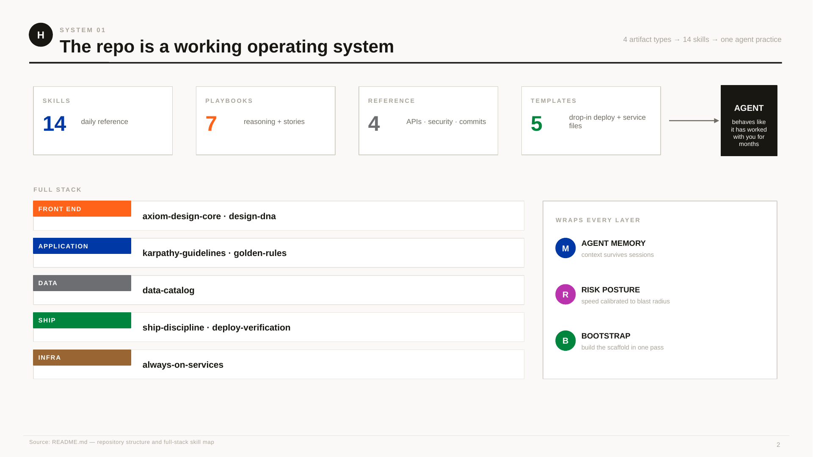

*Source: [`README.md`](README.md)*

---

## Operating

### The actual daily loop *(page 3)*
One coherent intention → live ship → written lesson. Read Memory, name intent, agent builds, read the diff (not the summary), CPDT, write the lesson. Human holds taste/frame/done/kill; agent holds typing/recall/patience.

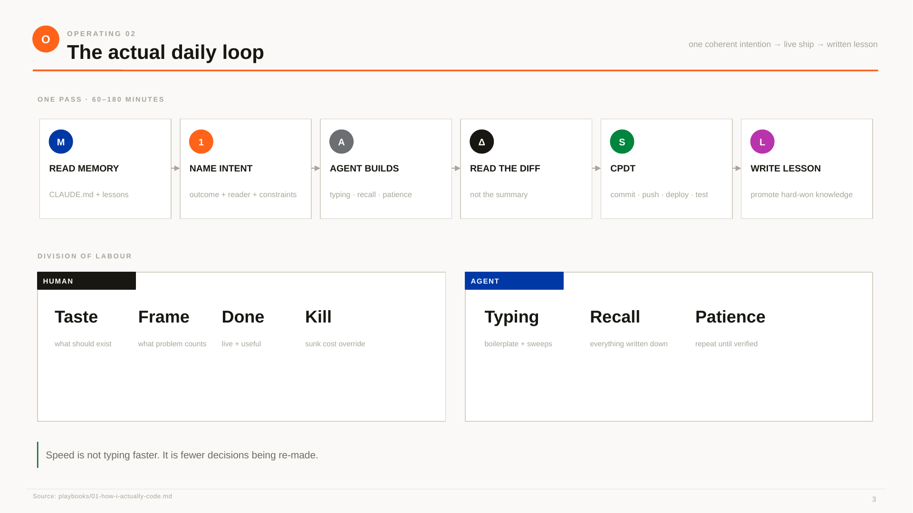

*Source: [`playbooks/01-how-i-actually-code.md`](playbooks/01-how-i-actually-code.md)*

### Fourteen rules, five operating laws *(page 4)*
Think · Build · Operate · Open · Learn/Kill — a transit map for the decision system. **The golden rule: the best stack is the one that ships.**

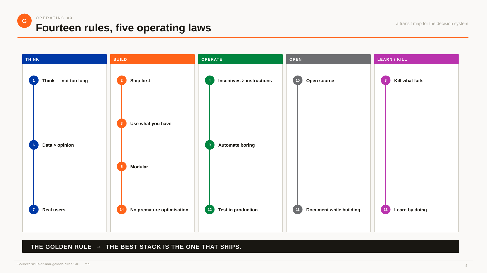

*Source: [`skills/dr-non-golden-rules/SKILL.md`](skills/dr-non-golden-rules/SKILL.md)*

### Guardrails against LLM coding drift *(page 5)*
Think before coding · simplicity first · surgical changes · goal-driven. The agent may be fast. The diff must still be explainable.

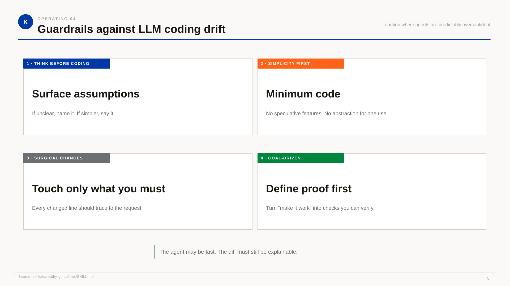

*Source: [`skills/karpathy-guidelines/SKILL.md`](skills/karpathy-guidelines/SKILL.md)*

---

## Memory & Bootstrap

### The context window resets. The project does not. *(page 6)*
Vault → workspace index → project contract → lesson docs. Read top-down, write bottom-up. Write knowledge when it's fresh and hurts — that's when it's accurate.

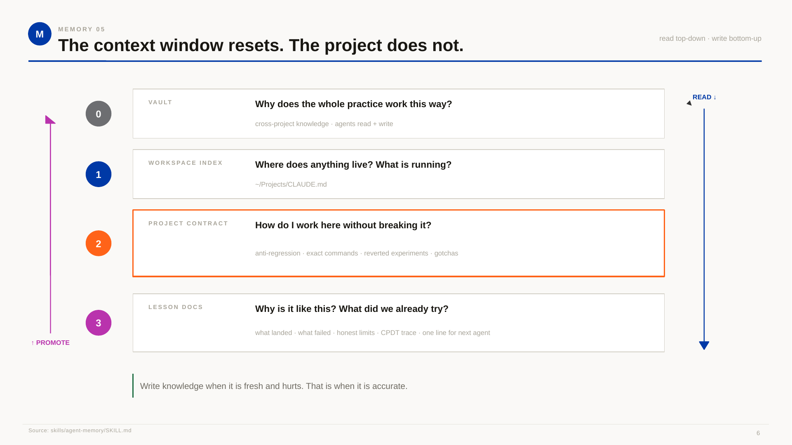

*Source: [`skills/agent-memory/SKILL.md`](skills/agent-memory/SKILL.md)*

### One document bootstraps the whole practice *(page 7)*
4 questions → conditional setup → a project that remembers itself. Nine steps, conditional by design: no backend pattern for a static site, no design system forced onto a pure API.

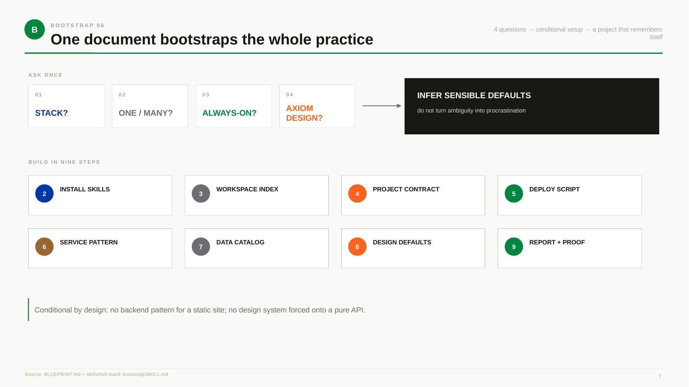

*Source: [`BLUEPRINT.md`](BLUEPRINT.md) + [`skills/full-stack-bootstrap/SKILL.md`](skills/full-stack-bootstrap/SKILL.md)*

---

## Design

### Taste becomes executable when reasons become constraints *(page 8)*
Lineage → psychology → constraint → token roles → named regressions. The test: would this fit the lineage? Can a new agent make the same decision without you?

*Source: [`skills/axiom-design-core/SKILL.md`](skills/axiom-design-core/SKILL.md) + [`skills/design-dna/SKILL.md`](skills/design-dna/SKILL.md)*

### Color has grammar, not mood *(page 9)*
Two color systems, never blurred: **identity** (always enclosed — which family/board am I in) and **signal** (always bare — is the value good/bad/live). Color only at the point of decision. Never before. Never after.

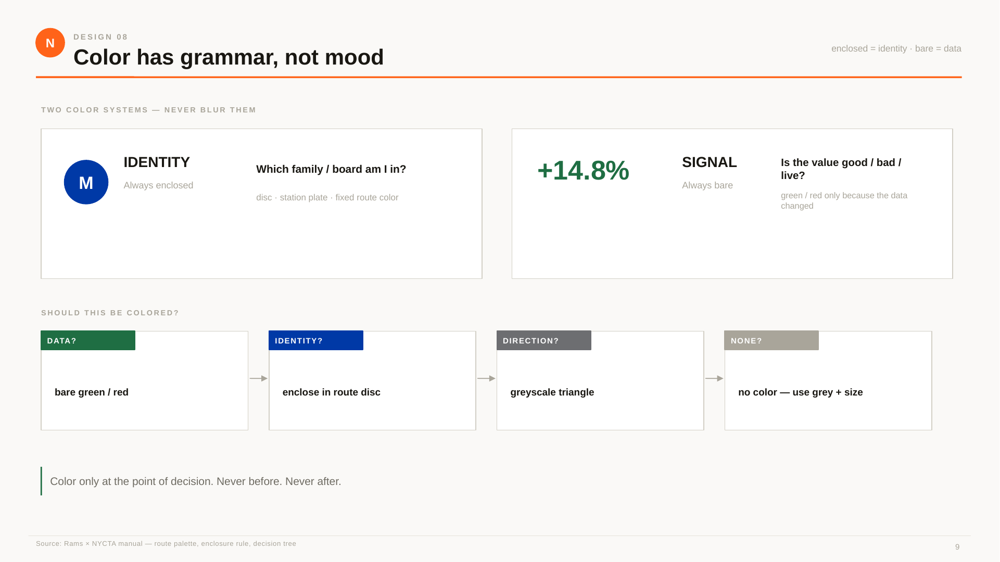

*Source: Rams × NYCTA design manual — route palette, enclosure rule, decision tree. (Bonus plate — the deck's own extension of `design-dna`'s token-role rule into a full color-grammar decision tree.)*

---

## Data

### Catalogue once. Port the known-good adapter forever. *(page 10)*
The shared layer belongs to no single project. Freshness stated explicitly: live (minutes) · live→cache (last-good + age) · reference (daily/weekly) · database (local query).

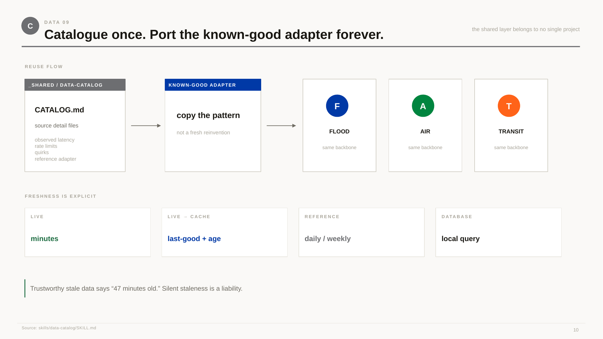

*Source: [`skills/data-catalog/SKILL.md`](skills/data-catalog/SKILL.md)*

---

## Ship

### Localhost is never a deliverable *(page 11)*
The CPDT loop: Commit → Push → Deploy → Test, fail → fix → repeat. `npm test ✓` proves code; `curl live | grep NEW_THING` proves delivery. Tests prove correctness. T proves existence.

*Source: [`skills/ship-discipline/SKILL.md`](skills/ship-discipline/SKILL.md)*

### A deploy is not an upload. It is a human receiving new bytes. *(page 12)*
Naive verification (upload → new HTML → stale JS → real key poisoned → user gets old bytes) versus probe-first (canonical alias first → throwaway `?probe=N` → md5 actual bytes → require a 3/3 streak → touch the real key last).

*Source: [`skills/deploy-verification/SKILL.md`](skills/deploy-verification/SKILL.md)*

---

## Infra

### Prototype → dependable service, without turning into DevOps *(page 13)*
The request path: user → Pages (static frontend) → Function (`/api/*` proxy) → Tunnel (named config) → Service (`localhost:PORT`) → SQLite (WAL mode). One service = four small jobs: server, tunnel, watchdog, backup. Take risk with the code. Never with the recovery path.

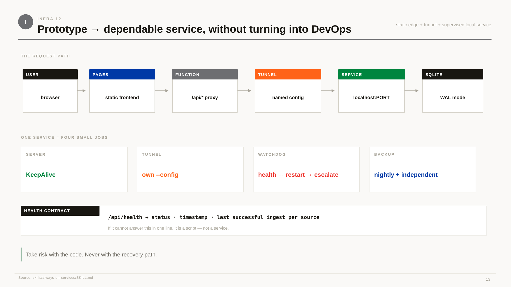

*Source: [`skills/always-on-services/SKILL.md`](skills/always-on-services/SKILL.md)*

---

## Risk

### Move fast where mistakes are cheap to undo *(page 14)*
Cheap to undo → move fast (small commits, flags, mock fallback, last-good cache, watchdogs, backups). Expensive to undo → add ceremony (anything that shouts at people, holds personal data, can't be restored). Four hard lines: life-safety, aggregate-only, honest labels, secrets.

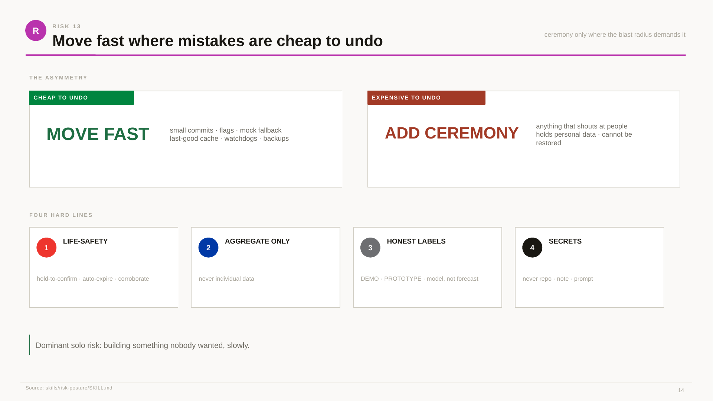

*Source: [`skills/risk-posture/SKILL.md`](skills/risk-posture/SKILL.md)*

---

## Parallel

### Several agents, one repo, no merge hell *(page 15)*
One `.git`, worktrees per task. Good parallelism: independent review, fan-out search, option exploration, mechanical sweeps. Never: shared files, sequential judgement, design ownership, deploys. Verification scales worse than generation — ten agents can make ten changes faster than you can safely verify two.

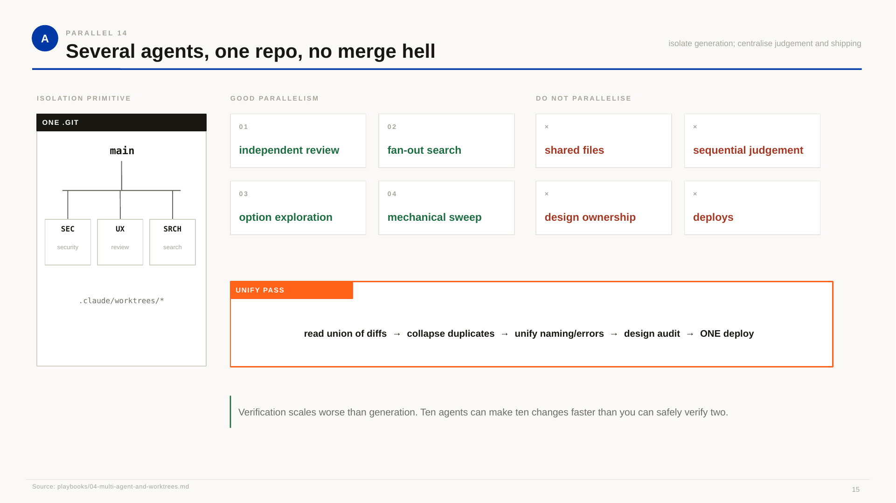

*Source: [`playbooks/04-multi-agent-and-worktrees.md`](playbooks/04-multi-agent-and-worktrees.md)*

---

## Map

### Two kinds of 3D city — keep them separate *(page 16)*
Tier 1, the deep twin: Arnis → real Minecraft world, walk-through and storytelling, offline. Tier 2, the live web: MapLibre-native fill-extrusion, one depth buffer, never deck.gl as a second 3D canvas over the map.

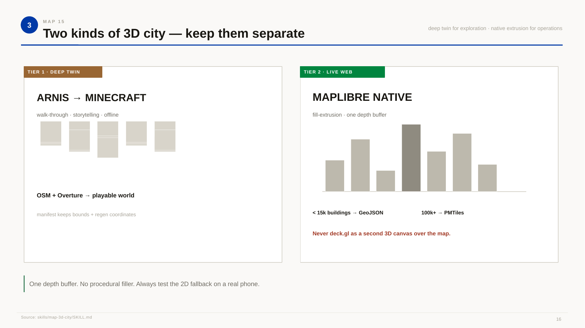

*Source: [`skills/map-3d-city/SKILL.md`](skills/map-3d-city/SKILL.md)*

---

## Maintenance

### Clean a crowded workspace without deleting a live system *(page 17)*
Rule 0: map what's alive first — commit age lies. Gate A: is HEAD on a remote branch? Gate B: is this inside a dedicated worktree container, or a real project? Never `--force`. After cleanup, rerun the liveness check — same services in, same services out.

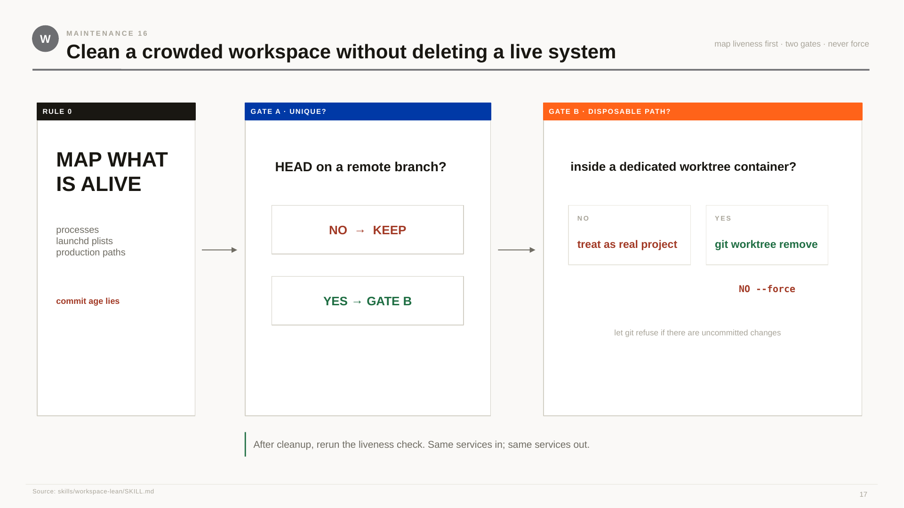

*Source: [`skills/workspace-lean/SKILL.md`](skills/workspace-lean/SKILL.md)*

---

## Readiness

### Sometimes the blocker is technology maturity, not effort *(page 18)*
Technology Readiness Level 1–9; TRL 6 is the bar for "safe to build on top of." You may be TRL-blocked if: the same patch keeps not fixing the same mechanism, resource cost scales the wrong way with real data, everything available is pre-1.0, or the workaround costs more than the feature. Wait = document the attempt → ship the TRL-9 fallback → define a measurable revisit trigger.

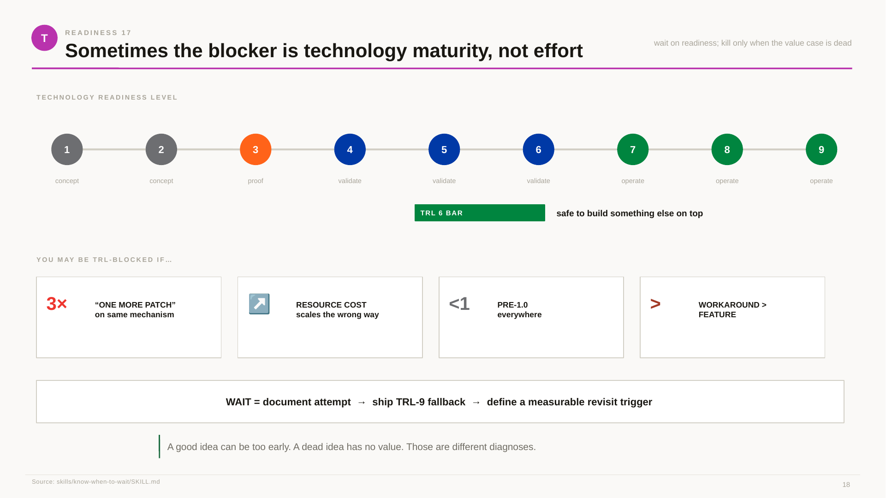

*Source: [`skills/know-when-to-wait/SKILL.md`](skills/know-when-to-wait/SKILL.md)*

---

## System (closing)

### Speed is a consequence of cheap mistakes + decisions made once *(page 19)*
Memory (context survives), Design (taste survives), Catalog (integration survives), Ship (proof survives), Risk (mistakes stay cheap) — all converging on one move: **move taste and memory out of your head, turn repeated decisions into lookups.**

> THE BEST STACK IS THE ONE THAT SHIPS.

*Synthesis: [`README.md`](README.md) + every playbook and skill above. Visual language: Rams-NYCTA Design Core.*

---

## Using these yourself

- **Present them as-is** — the PPTX is a real, editable slide deck, not a locked export.
- **Fork the visual language** for your own fork of this repo — the grammar (enclosed = identity, bare = signal, one accent color per section, hairline rules, Helvetica-class type) is documented on page 8–9 and in [`axiom-design-core`](skills/axiom-design-core/SKILL.md).
- **Cite a single page** when you only need one idea — each one is a self-contained argument, not a fragment of a narrative you have to have seen the rest of.

[← Back to the README](README.md)
