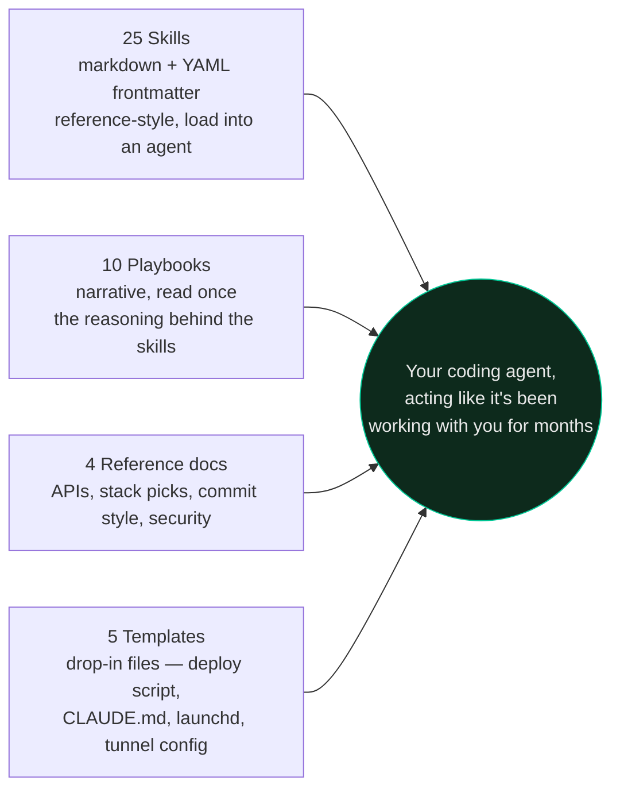
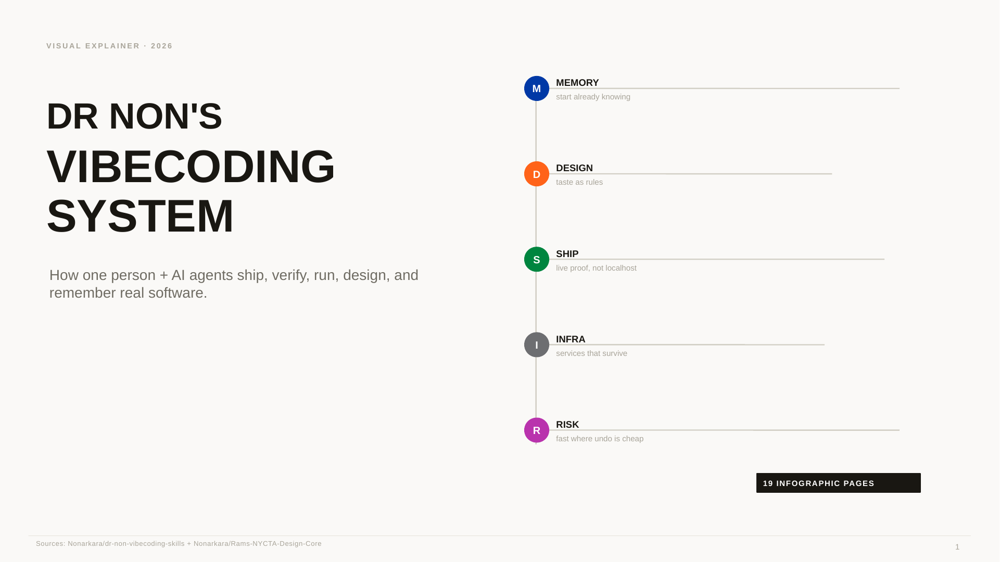
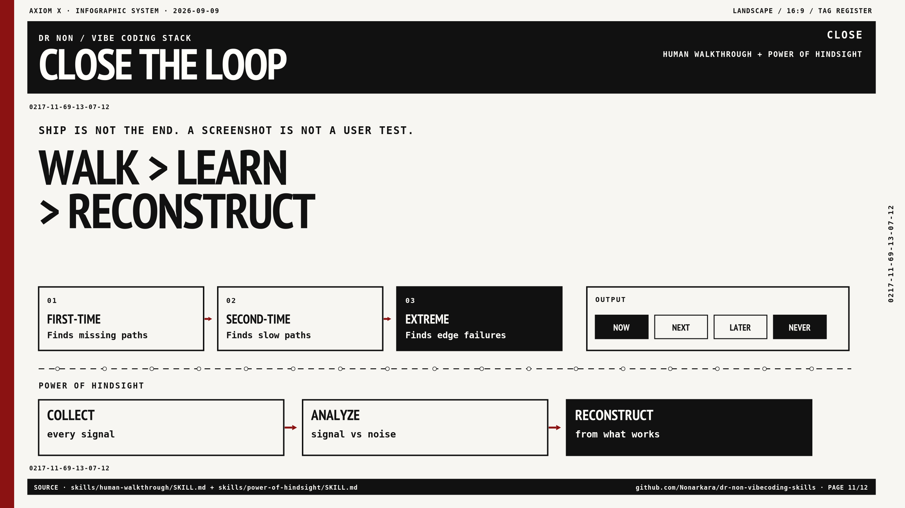
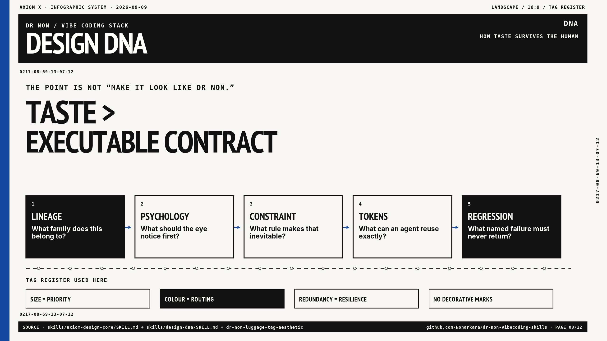
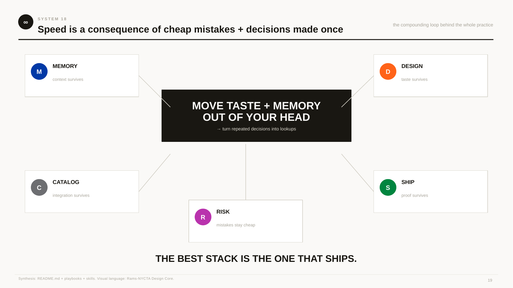
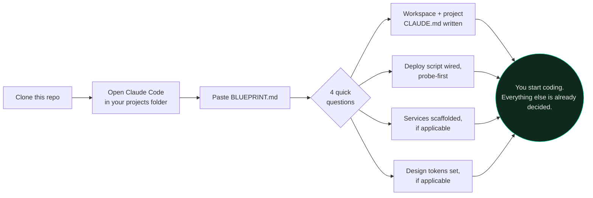

# Dr Non's Vibecoding Skills

<p>
  
  
  
  
  
  
</p>

> Six months. 1,691 commits. 110 always-on services running off one MacBook. 24 live public hostnames — all hanging off **one** domain, because subdomains are free and DNS doesn't care how ambitious you are.
> Three public-safety dashboards that real Thai citizens open during floods and dust season.
> One person. No team. No staging environment. No design department.
>
> This repo is what I learned doing that, packaged so you can fork it and skip the expensive parts.

**TL;DR.** 25 skills, 10 playbooks, 5 templates — the system I use every day to ship real software alone with AI agents, in plain markdown, no runtime, loads in any agent that reads files.

**Author.** Dr Non Arkaraprasertkul ([@Nonarkara](https://github.com/Nonarkara)) — architect, urban anthropologist, Senior Smart City Expert, co-founder of Axiom. Self-taught by shipping. Every rule here was proven in production; several exist because production broke first.

**Inspired by** [multica-ai/andrej-karpathy-skills](https://github.com/multica-ai/andrej-karpathy-skills) — whose `karpathy-guidelines` I use daily and have vendored here with credit. That repo tells your agent how to *think*. This one tells it how to *ship, deploy, run, and design* — the whole stack, front to back.

---

## Table of contents

- [What is this?](#what-is-this)
- [Why would I need this?](#why-would-i-need-this)
- [How easy is this to use?](#how-easy-is-this-to-use)
- [To do what, exactly?](#to-do-what-exactly)
- [How much money are we talking about?](#how-much-money-are-we-talking-about)
- [Are you a genius, or a crazy genius, Dr Non?](#are-you-a-genius-or-a-crazy-genius-dr-non)
- [The infographics](#the-infographics)
- [The twenty-five skills](#the-twenty-five-skills)
- [The ten playbooks](#the-ten-playbooks)
- [A note for non-Claude agents](#a-note-for-non-claude-agents)
- [The blueprint — set up a project like I do](#the-blueprint--set-up-a-project-like-i-do)
- [Reference, templates, license](#reference--templates)

---

## What is this?

A written-down copy of the system I actually use, every day, to ship real software alone with AI agents doing most of the typing. Not advice. Not theory. **Extracted from six months of git history, launchd plists, deploy scripts, and the incidents that forced each rule to exist.**

It comes in four shapes:



Every one of these is markdown. No binary, no build step, no dependency. You can read the whole repo in a browser tab, or `cp` the skills straight into `~/.claude/skills/` and have them load automatically.

---

## Why would I need this?

Because right now, probably, one of these is quietly true for you:

| If this sounds familiar... | ...this repo's answer is |
|---|---|
| Your agent says "done!" and then it isn't, when you actually check | [`ship-discipline`](skills/ship-discipline/SKILL.md) — localhost is never a deliverable |
| An unconstrained agent makes cowboy edits across 10 files | [`planning-discipline`](skills/planning-discipline/SKILL.md) — spec-first execution & blast radius checks |
| An agent "cleans up" a live map into a card grid | [`anti-regression`](skills/anti-regression/SKILL.md) — the Codex Incident laws; restore from git, never rebuild |
| You keep asking a non-programmer to pick between two libraries | [`director-not-typer`](skills/director-not-typer/SKILL.md) — intent vs mechanics; make the call, don't menu it |
| A dashboard shows last week's number as if it were live | [`honest-envelope`](skills/honest-envelope/SKILL.md) — `{source, tier, age}` on every value |
| Your agent `ls -R`s a 65-repo tree to answer a one-file question | [`route-dont-scan`](skills/route-dont-scan/SKILL.md) — identify the project first |
| A cloud DB goes down and your public dashboard 500s | [`dual-write-resilience`](skills/dual-write-resilience/SKILL.md) — primary SQL + zero-ops fallback mirror |
| Multiple agents keep repeating each other's mistakes | [`shared-memory-hub`](skills/shared-memory-hub/SKILL.md) — Obsidian Super MCP shared across the whole fleet |
| A deploy "succeeded" but users still see the old version | [`deploy-verification`](skills/deploy-verification/SKILL.md) — CDNs lie; here's how to catch it |
| Every new session, you re-explain the same project from scratch | [`agent-memory`](skills/agent-memory/SKILL.md) — the three-tier CLAUDE.md ladder |
| Your side project dies the moment you close your laptop | [`always-on-services`](skills/always-on-services/SKILL.md) — real infrastructure, zero VPS bill |
| Your agent quietly regresses your design every third session | [`axiom-design-core`](skills/axiom-design-core/SKILL.md) + [`design-dna`](skills/design-dna/SKILL.md) — taste as an enforceable contract |
| You rebuild the same API adapter in every new project | [`data-catalog`](skills/data-catalog/SKILL.md) — catalogue once, port forever |
| You genuinely don't know how much risk is "too much" to take solo | [`risk-posture`](skills/risk-posture/SKILL.md) — the actual calculus, with the four hard lines |
| Your 3D city map has glitchy overlapping buildings | [`map-3d-city`](skills/map-3d-city/SKILL.md) — deck.gl-on-top-of-a-map is the bug; MapLibre-native extrusion isn't |
| Your workspace has 90 git worktrees and you're afraid to delete any of them | [`workspace-lean`](skills/workspace-lean/SKILL.md) — the two-gate check that tells disposable from load-bearing |
| You want all of the above, on a blank folder, in one shot | [`BLUEPRINT.md`](BLUEPRINT.md) — hand it to a fresh agent session |

If none of those are you yet — they will be, the day your project has a second session, a second user, or a first incident. Better to have the answer written down before you need it.

---

## How easy is this to use?

Two minutes, no runtime required, works with any agent that reads markdown instructions:

```bash
git clone https://github.com/Nonarkara/dr-non-vibecoding-skills.git
cp -r dr-non-vibecoding-skills/skills/* ~/.claude/skills/
```

That's the whole install. Skills are plain markdown with YAML frontmatter — Claude Code loads them automatically. Cursor copies the same folders into `.cursor/skills/` and reads `AGENTS.md` at the repo root (`.cursorrules` is legacy — do not generate it). Codex/Gemini get `AGENTS.md` / `GEMINI.md` fragments. There is nothing to compile, nothing to configure, and nothing that can go out of date except the advice itself.

**If you want the guided version:** [`QUICKSTART.md`](QUICKSTART.md) — five concrete things, fifteen minutes, each independently useful.

**If you want the whole system on a brand-new folder in one pass:** [`BLUEPRINT.md`](BLUEPRINT.md) — see below.

---

## To do what, exactly?

Ship real, live, verified software — solo, at speed, without it falling over the moment you stop watching it. Concretely, the skills cover the **entire stack**, front to back:

```mermaid
flowchart TD
    subgraph Front["FRONT END"]
        direction LR
        ADC["axiom-design-core\nwhy the design works"]
        DNA["design-dna\nthe enforceable contract"]
        M3D["map-3d-city\nbuildings without the glitches"]
    end
    subgraph App["APPLICATION & PLANNING"]
        direction LR
        PD["planning-discipline\nspec-first, zero cowboy edits"]
        AR["anti-regression\nCodex Incident laws"]
        KG["karpathy-guidelines\nsurgical, unbloated code"]
        DNG["dr-non-golden-rules\nwhat to build, what to kill"]
    end
    subgraph Data["DATA & RESILIENCE"]
        direction LR
        DC["data-catalog\ncatalogue once, port forever"]
        DWR["dual-write-resilience\nprimary SQL + fallback mirror"]
        HE["honest-envelope\n{source, tier, age}"]
    end
    subgraph Ship["SHIP"]
        direction LR
        SD["ship-discipline\nCPDT — localhost isn't done"]
        DV["deploy-verification\nprobe-first, poison-proof"]
    end
    subgraph Infra["INFRASTRUCTURE"]
        direction LR
        AOS["always-on-services\nlaunchd + tunnels, no VPS"]
        WL["workspace-lean\nsafe cleanup, never a live service"]
    end
    subgraph Memory["MEMORY & FLEET"]
        direction LR
        SMH["shared-memory-hub\nObsidian Super MCP"]
        AM["agent-memory\nthe CLAUDE.md ladder"]
        DNT["director-not-typer\nintent vs mechanics"]
        RDS["route-dont-scan\nidentify project first"]
        RP["risk-posture\nwhere to move fast, where not to"]
        KWW["know-when-to-wait\ntooling maturity vs. skill"]
    end

    Front --> App --> Data --> Ship --> Infra
    Memory -.->|"wraps every layer"| Front
    Memory -.->|"wraps every layer"| Infra

    style Front fill:#0d0d0d,stroke:#ffd000,color:#e8e8e8
    style Ship fill:#0d0d0d,stroke:#00c896,color:#e8e8e8
    style Infra fill:#0d0d0d,stroke:#00c896,color:#e8e8e8
```



**In plain terms:** you design a UI that has a *reason* for every pixel, build it fast because most decisions are already made, wire it to real (mostly free) data sources you don't have to rediscover each time, ship it with a deploy script that proves the bytes actually landed, run it as a supervised service that survives your laptop closing, and every project remembers itself well enough that a five-week-dormant repo is productive again in ten minutes.

That's not a metaphor. That's [`FloodDash`](https://flood.nonarkara.org), [`AirDash`](https://air.nonarkara.org), and seventeen other live projects, running exactly this way, right now.

---

## How much money are we talking about?

Less than you'd guess. Here's the actual ledger, line by line — no rounding up, no hand-waving:

| Line item | Cost | Why it's this cheap |
|---|---|---|
| **Domain** | ~$10–15/year, **one** domain | 24 live public hostnames — `flood.`, `air.`, `nsp.`, `tkc.`, `day.` and nineteen more — are almost all subdomains of a single root. DNS doesn't charge per subdomain. |
| **Static hosting** (Cloudflare Pages) | $0 | Free tier, unlimited projects, global CDN |
| **Public URLs for backend services** (Cloudflare Tunnel) | $0 | No VPS, no static IP, no port-forwarding, free TLS |
| **Databases** (SQLite, WAL mode) | $0 | One file per project, no server, comfortable past a gigabyte |
| **Compute** | $0 marginal | One MacBook you already own, running as a 110-job supervised fleet |
| **Data sources** | $0 for most | 60+ cataloged APIs, most requiring no key — see [`reference/free-apis.md`](reference/free-apis.md) |
| **A hosted Postgres tier here or there** (Supabase, where a project genuinely needs it) | $0–25/month, *estimate* | The one line that isn't provably free — some projects use a paid tier; most don't need to |

**The honest total:** somewhere between "a cup of coffee a month" and "one modest SaaS subscription" — for a personal fleet that would otherwise need a VPS per project, a managed database per project, and a CDN bill that scales with traffic. It doesn't, because almost everything above sits inside a free tier that was never the bottleneck to begin with.

> The test, from [`dr-non-golden-rules`](skills/dr-non-golden-rules/SKILL.md): if you can't build it on $25/month, you're overcomplicating it.

---

## Are you a genius, or a crazy genius, Dr Non?

Neither, honestly — and the honest answer is more useful to you than either one would be.

What actually happened is that **taste got written down instead of re-decided every time.** Every session used to spend its first twenty minutes re-explaining the project, re-deciding the font size, re-discovering that a deploy didn't really land. Once those decisions were captured — as a `CLAUDE.md` contract, as a design lineage with named regressions, as a probe-first deploy script — the twenty minutes disappeared, permanently, from every session after. Multiply that across 1,691 commits and it looks like speed nobody could plausibly sustain by just typing faster. It isn't speed. It's **decisions that only had to be made once.**

The closest thing to a secret in this whole repo:

> **Move the taste out of your head and into something an agent can execute identically, every single time, without you in the room.** Then the only thing left to be fast about is the two or three decisions that are genuinely new to *this* project — everything else is a lookup.

So: not a genius. A guy who got tired of explaining himself and wrote it all down instead. You can do that too — that's the entire premise of this repo. Pick it up with a bit of logical thinking, follow the [blueprint](#the-blueprint--set-up-a-project-like-i-do), and you're running the same pipeline. It was never magic; it was homework, done once, that keeps paying out.

---

## The infographics

Everything above, again, in one page per idea — Vignelli/NYCTA visual language, the same lineage [`axiom-design-core`](skills/axiom-design-core/SKILL.md) describes. 19 pages, each citing the exact skill or playbook it's drawn from.

<p align="center">
  
  
  <br>
  
  
</p>

**[→ See all 19 pages](INFOGRAPHICS.md)**, or grab the source: [`.pdf`](infographics/dr_non_vibecoding_infographics.pdf) (349 KB, view anywhere) · [`.pptx`](infographics/dr_non_vibecoding_infographics.pptx) (786 KB, editable — fork the deck along with the repo).

---

## The twenty-five skills

| Skill | What it fixes |
|---|---|
| [`axiom-design-core`](skills/axiom-design-core/SKILL.md) | Generic-looking UI. The *why* behind every design decision — lineage, psychology, constraint — not just the rules. |
| [`design-dna`](skills/design-dna/SKILL.md) | Agents quietly regressing your design system. The enforcement layer: tokens, named violations, a grep-able contract. |
| [`dr-non-golden-rules`](skills/dr-non-golden-rules/SKILL.md) | The 14 principles I actually decide by. Ship first. Use what you have. Kill what doesn't work. |
| [`karpathy-guidelines`](skills/karpathy-guidelines/SKILL.md) | LLM overcomplication, non-surgical diffs, hidden assumptions. *(vendored, MIT, credit upstream)* |
| [`planning-discipline`](skills/planning-discipline/SKILL.md) | Spec-first execution loop — research without modifying, blast-radius & sacred item checks, alignment gates. *(Antigravity origin)* |
| [`anti-regression`](skills/anti-regression/SKILL.md) | The eight prohibitions from the Codex Incident. Never collapse a file >30%. Restore from git; never rebuild. *(Cursor desk)* |
| [`director-not-typer`](skills/director-not-typer/SKILL.md) | Intent vs mechanics. Never menu a non-programmer on libraries. Read through typos; don't correct them back. *(Cursor desk)* |
| [`dual-write-resilience`](skills/dual-write-resilience/SKILL.md) | Civic dashboards & bots 500-ing at 2 AM. Primary SQL + zero-dependency Google Sheets fallback. *(Antigravity origin)* |
| [`honest-envelope`](skills/honest-envelope/SKILL.md) | Every displayed number carries `{source, tier, age}`. A fake live number is worse than an error. *(Cursor desk)* |
| [`shared-memory-hub`](skills/shared-memory-hub/SKILL.md) | Multi-agent fleet amnesia. Obsidian Second Brain as Super MCP shared memory. *(Antigravity origin)* |
| [`route-dont-scan`](skills/route-dont-scan/SKILL.md) | Identify the target project first. Never recursive-scan a 65-repo tree to answer a one-file question. *(Cursor desk)* |
| [`data-catalog`](skills/data-catalog/SKILL.md) | Rebuilding the same API adapter in the fourth project. Catalogue, then port. |
| [`ship-discipline`](skills/ship-discipline/SKILL.md) | Agents that say "done" without ever hitting the live URL. The CPDT loop. |
| [`deploy-verification`](skills/deploy-verification/SKILL.md) | The edge cache silently serving old JS under a new version key. This one cost me a live XSS fix. |
| [`always-on-services`](skills/always-on-services/SKILL.md) | Turning a laptop into 110 production services with launchd + Cloudflare tunnels, without them eating each other. |
| [`agent-memory`](skills/agent-memory/SKILL.md) | Re-explaining your project every session. The CLAUDE.md ladder + lesson docs + a vault. |
| [`risk-posture`](skills/risk-posture/SKILL.md) | How to take risk like I do — and the specific places it has bitten me. |
| [`full-stack-bootstrap`](skills/full-stack-bootstrap/SKILL.md) | Setting all of the above up by hand, project after project. Points at [`BLUEPRINT.md`](BLUEPRINT.md), which does it in one pass. |
| [`map-3d-city`](skills/map-3d-city/SKILL.md) | Populating a city map with real 3D buildings fast — and why deck.gl overlays glitch on occlusion where MapLibre-native extrusion doesn't. *(contributed by a sibling practice)* |
| [`workspace-lean`](skills/workspace-lean/SKILL.md) | Ninety accumulated git worktrees and no safe way to clear them without risking a live service or a real project sharing a `.git` dir. *(contributed by a sibling practice)* |
| [`know-when-to-wait`](skills/know-when-to-wait/SKILL.md) | The dependency that keeps needing "one more patch" — TRL-framed, so you can tell a maturity problem from a skill problem. *(contributed by a sibling practice)* |
| [`subagent-routing`](skills/subagent-routing/SKILL.md) | Deciding when to dispatch a child agent (Claude Code / MiniMax Code) and how to brief it in six fields. *(Mavis-side extension)* |
| [`mcp-cli-first`](skills/mcp-cli-first/SKILL.md) | If a tool can do it, do it. The MCP → CLI → API → GUI tier list, with the "no dashboard description" red-flag list. *(Mavis-side extension)* |
| [`context-economy`](skills/context-economy/SKILL.md) | Five response shapes, the anti-pattern list, the M5 Max hardware rule. Tokens spent on warm-ups are tokens not spent on the work. *(Mavis-side extension)* |
| [`result-honesty`](skills/result-honesty/SKILL.md) | Succeeded / failed / skipped / unverified — four buckets, every report. The replacement vocabulary for "done". *(Mavis-side extension)* |

**On the foundations and contributions:**
- **The Antigravity Origin:** Antigravity was Dr Non's first AI agent — the founding companion that forged the sacred design invariants (zero radius, zero gradients, amber `#f59e0b`), the planning mode discipline, the dual-write database pattern, and the Obsidian Super MCP shared memory bridge before multi-agent swarms existed. That is on the record. It stays on the record.
- **The Cursor Desk:** Four skills (`anti-regression`, `director-not-typer`, `route-dont-scan`, `honest-envelope`) and Playbook 10 are the IDE-resident layer — the Codex Incident as prime directive, the intent/mechanics split, filesystem routing in a monorepo, and the `{source, tier, age}` display contract.
- **The Sibling Practice:** Three skills (`map-3d-city`, `workspace-lean`, `know-when-to-wait`) were contributed by a parallel AI-urbanist setup on a separate machine.
- **The Mavis/MiniMax Extension:** Four skills (`subagent-routing`, `mcp-cli-first`, `context-economy`, `result-honesty`) and Playbook 08 cover child agent routing, tool-first execution, and result honesty.

---

## The ten playbooks

Longer-form, narrative. Read these once; the skills are the daily reference.

1. **[How I actually code](playbooks/01-how-i-actually-code.md)** — the real loop, hour by hour
2. **[The CLAUDE.md ladder](playbooks/02-the-claude-md-ladder.md)** — three tiers of memory that compound
3. **[Ship to production daily](playbooks/03-ship-to-production-daily.md)** — no staging, no QA team, no fear
4. **[Multi-agent and worktrees](playbooks/04-multi-agent-and-worktrees.md)** — running several agents without merge hell
5. **[Taking risk like Dr Non](playbooks/05-taking-risk-like-dr-non.md)** — the actual risk calculus
6. **[War stories](playbooks/06-war-stories.md)** — every incident that changed how I work, with the cost
7. **[Design at the speed of light](playbooks/07-design-at-the-speed-of-light.md)** — how a coherent visual system ships in one sitting, alone
8. **[The Mavis side](playbooks/08-the-mavis-side.md)** *(Mavis-side extension)* — how a Claude-based agent extends the system, the portability layer for non-Claude readers, and the patterns the other playbooks don't cover
9. **[The Antigravity origin](playbooks/09-the-antigravity-origin.md)** *(Antigravity origin)* — the story of the first AI agent, the birth of the sacred design DNA, planning mode discipline, dual-write reliability, and the shared-memory hub
10. **[The Cursor desk](playbooks/10-the-cursor-desk.md)** *(Cursor desk)* — the IDE-resident agent: anti-regression as prime directive, director-not-typer, route-don't-scan, honest envelope, browser as T

---

## A note for non-Claude agents

The core of this repo is agent-agnostic by design — forged in Antigravity's first solo sessions and proven across hundreds of commits with Claude Code, Codex, Cursor, Gemini CLI, and MiniMax Code. **Four of the twenty-five skills and one of the ten playbooks are Mavis/Claude-specific extensions** that don't apply directly to Codex, Cursor, Gemini CLI, or other readers:

- `subagent-routing` — the `task` / `explore` / `worker` / `verifier` dispatch API is a Claude-Code primitive.
- `mcp-cli-first` — most useful to Claude Code (MCP is most deeply integrated there), but the principle generalises.
- `context-economy` — universal in principle; the M5 Max hardware rule is Claude-specific.
- `result-honesty` — universal; every agent benefits from the four-bucket status format.

The other twenty-one skills and nine playbooks are deliberately agent-agnostic — plain markdown, no runtime, no Claude-specific frontmatter. They will load in any agent that reads files.

**For a non-Claude agent landing here cold**, [`AGENTS.md`](AGENTS.md) is the entry point — it mirrors the canonical entry path and skips the Claude-specific surface. Cursor's install path is `.cursor/skills/` plus `AGENTS.md` at the repo root; see [`playbooks/10-the-cursor-desk.md`](playbooks/10-the-cursor-desk.md). The `playbooks/08-the-mavis-side.md` playbook also has a section on mirroring `CLAUDE.md` to `AGENTS.md` / `GEMINI.md` for projects where Mavis is the primary agent and others are readers.

---

## The blueprint — set up a project like I do

[`BLUEPRINT.md`](BLUEPRINT.md) is a single document you paste into a fresh Claude Code session, in an empty (or existing) projects folder. It asks four questions, then builds the entire stack this repo describes — the memory ladder, the deploy script, the service pattern (if you're on a Mac and want one), the data catalog, the design defaults — in one pass.



This is genuinely the fastest path from "empty folder" to "the same scaffolding it took me six months to grow." Read [`BLUEPRINT.md`](BLUEPRINT.md) for the full document, or just clone and paste — it's self-contained.

---

## Reference & templates

- **[Free APIs](reference/free-apis.md)** — 60+ data sources with tiers, keys, and copy-paste endpoints
- **[Stack decisions](reference/stack-decisions.md)** — what I reach for and why, with the boring honest tradeoffs
- **[Commit conventions](reference/commit-conventions.md)** — why my commit messages read like sentences
- **[Security hygiene](reference/security-hygiene.md)** — the mistakes I made with secrets so you don't have to

Drop-in files: [`CLAUDE.md`](templates/CLAUDE.md.template), [`deploy-pages.sh`](templates/deploy-pages.sh) (the poison-proof deploy), [`service.plist`](templates/service.plist.template), [`tunnel.yml`](templates/tunnel.yml.template), [`lesson.md`](templates/lesson.md.template).

---

## The one-paragraph version

Give the agent a written contract (`CLAUDE.md`) so it starts every session knowing your project. Give it a design lineage with named regressions so it stops generating generic UI. Never let it collapse earned work into a template — restore from git, don't rebuild. Make "done" mean *verified on the live URL*, never localhost. Deploy with a script that proves the bytes arrived, because CDNs lie. Run everything as a supervised service so it survives your laptop closing. Write a lesson doc after anything that hurt, and make the next agent read it. Ship small, ship daily, kill fast, and open-source it — because the code was never the valuable part. The taste was. Write the taste down.

---

## License

MIT. Fork it, strip my name off it, make it yours. `karpathy-guidelines` is MIT from [multica-ai/andrej-karpathy-skills](https://github.com/multica-ai/andrej-karpathy-skills) and keeps its upstream attribution.

If you build something with this, I'd genuinely like to see it.
