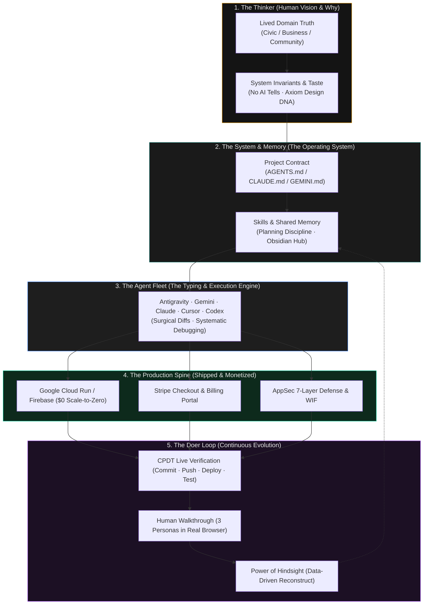
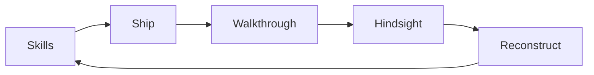
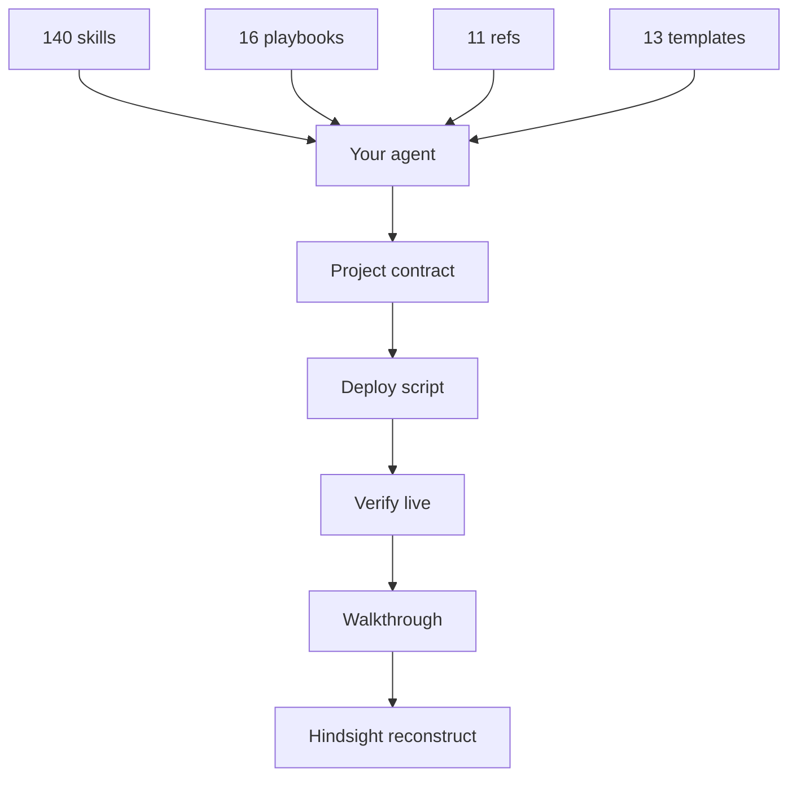

A mentor and a student, one Mac, a city outside the window. The banner is illustration only — no live UI, no HUD, no title overlay.

# Dr Non's Vibe Coding Stack

**The Thinker → Doer Operating System: Shipping Real Software and Real Businesses with AI Agents.**

A complete, production-hardened stack for pairing with AI agents — plain markdown, zero runtime dependencies. A battle-tested collection of 140 skills, 16 playbooks, 11 references, and 13 drop-in templates that bridge the gap between human intuition and shipped software. Proven on live civic sensor grids, and architected for any resilient business.

Civic is the proof, not the prerequisite. *Renamed September 2026 from `dr-non-vibecoding-skills`; the GitHub URL and plugin ID are unchanged so existing clones and installs keep working.*

[](https://github.com/Nonarkara/dr-non-vibecoding-skills/actions/workflows/validate.yml)
[](skills/)
[](playbooks/)
[](templates/)
[](LICENSE)

**140 skills** · **16 playbooks** · **11 references** · **13 templates**

**Author.** [Non Arkaraprasertkul](https://github.com/Nonarkara) (Nonarkara) — architect, urban anthropologist, civic-studio practice at **Axiom X Co., Ltd.**, Bangkok.

Independent. Written for a **Thai–English** audience. Not an official depa, ASEAN, or municipal product.

ชุดทักษะและคู่มือปฏิบัติการสำหรับเปลี่ยนความคิดให้เป็นซอฟต์แวร์และธุรกิจจริง — มาร์กดาวน์ล้วน ไม่มีรันไทม์ ผู้อ่านเป้าหมายคือคนไทยและคนอังกฤษด้วยกัน

---

## Try it in ten seconds, with nothing installed

Open any AI agent — ChatGPT, Gemini, Claude, Cursor, Codex — and paste
[`HANDSHAKE.md`](HANDSHAKE.md) as your first message. That single file is the whole
working relationship: the authority boundary, how to read a compressed brief, and
the eight things that are defects rather than style opinions (never invent a number,
localhost is never a deliverable, read the diff not the summary, report the
unverified bucket).

No install, no plugin, no repo. If it changes how your agent behaves, the rest of
this repository is the durable version of the same thing.

วางไฟล์เดียว ใช้ได้กับเอเจนต์ทุกตัว ไม่ต้องติดตั้งอะไรเลย

---

## The Manifesto: The Passion & Why We Build

In the age of generative AI, anyone can type a prompt and receive five hundred lines of code in seconds. Getting to five hundred lines was never the hard part. Keeping them alive is: the projects that die die of agent amnesia, dependencies nobody chose, claims nobody checked, a design that looks like every other generated app, and no way to charge for any of it.

We have no survey number for how often that happens and will not invent one. The evidence in this repository is narrower and better: named incidents, in [`playbooks/06-war-stories.md`](playbooks/06-war-stories.md), each one paid for.

### Why build anything at all?

We build because real problems exist outside the chat window:
- Cities choking under seasonal wildfire haze that need honest, unvarnished air quality indices.
- Communities enduring flash floods that require real-time water sensor maps that never crash at 2 AM.
- Independent thinkers, educators, and entrepreneurs who need sustainable software businesses without surrendering to extortionate SaaS rent.
- Human beings who have profound domain insights but were previously locked out by the gatekeeping of syntax, build tools, and boilerplate.

### The Andrej Karpathy of Everyday Thinkers

Andrej Karpathy transformed modern computer science not by complicating it, but by demystifying it from first principles. With `micrograd` and `nanoGPT`, he showed that the most formidable neural networks can be understood and built with clarity, humility, and zero unnecessary fluff.

This stack is that exact bridge for the agentic engineering era.

You do not need a twenty-person venture-backed engineering department. If you are an architect, urbanist, doctor, designer, researcher, or everyday person with a lived problem, you possess the superpower of the **Thinker** (domain truth, human empathy, systemic taste). AI agents provide the tireless execution speed. This repository provides the **operating system** — the architectural discipline, memory fabric, security hygiene, and production spine — that turns you into a **Doer**.

From first principles to paid customers: from the philosophical "why" all the way to scale-to-zero Google Cloud Run deployment and Stripe checkout.

### The Shift: From Manual Programming to Agentic Engineering

This stack assumes the same role split the rest of the industry is converging on, but stripped of the marketing:

- **The agent** (Claude Code, Antigravity, Cursor, Codex, Gemini CLI) does the typing, the tool calls, the terminal runs, the surgical diffs.
- **You** set the destination, the speed, the energy source, and the look-and-feel. The four decisions you actually make are:
  1. *Destination:* what problem, what human need, what you're building toward.
  2. *Speed & velocity:* how fast you ship, how much blast radius you accept ([`risk-posture`](skills/risk-posture/SKILL.md)).
  3. *Energy source:* local Ollama on your laptop, free cloud API tiers ([`free-api-keys`](skills/free-api-keys/SKILL.md)), or scale-to-zero Google Cloud Run ([`google-cloud-run`](skills/google-cloud-run/SKILL.md)).
  4. *Look & feel:* the design law ([`axiom-design-core`](skills/axiom-design-core/SKILL.md)), the honest-envelope for displayed numbers, the zero-unverified-claims rule.

The clone-and-bootstrap path is one command: `./setup.sh --become-builder`. The agent does the rest. The stack is the *operating system* that turns the agent into a *Doer* and the human into the *Thinker*.

### Read next

- **[`ABOUT.md`](ABOUT.md)** — the author, the 10-year writing practice at [nonharvard.wordpress.com](https://nonharvard.wordpress.com) that this stack was distilled from, and the 7 core components that became the skills.
- **[`JOURNAL.md`](JOURNAL.md)** — the flight recorder. Every meaningful change to the stack, with the *what*, the *why*, the *diff*, and the *tags*. A new builder can read the journal to understand the project in 5 minutes.
- **[`playbooks/16-the-philosophical-spine.md`](playbooks/16-the-philosophical-spine.md)** — the *why* of the 100 skills, in one document. The 5 layers, the 5 moves, the 8 cyber-hygiene rules, the 6 off-grid rules.

---

## Visual Mental Model: The Thinker ➔ Doer Journey



---

## Become Dr Non the Builder (60-Second Quickstart)

หนึ่งคำสั่ง — ติดตั้งทักษะทุกเอเจนต์ — พร้อมส่งของได้ทันที.

```bash
git clone https://github.com/Nonarkara/dr-non-vibecoding-skills.git
cd dr-non-vibecoding-skills && ./setup.sh --become-builder
```

That is the entire onboarding. The script discovers every agent installed on your machine (Antigravity, Gemini CLI, Claude Code, Codex, Cursor, Hermes, OpenCode), installs the skills into their native discovery directories, and prints **You are Dr Non the Builder** with the three immediate moves:
1. **Scaffold a project contract** (`AGENTS.md`, `CLAUDE.md`, `GEMINI.md`).
2. **Conduct a multi-persona walkthrough** ([`human-walkthrough`](skills/human-walkthrough/SKILL.md)).
3. **Run a data-driven hindsight review** ([`power-of-hindsight`](skills/power-of-hindsight/SKILL.md)).



Install → build → ship → [`human-walkthrough`](skills/human-walkthrough/SKILL.md) → [`power-of-hindsight`](skills/power-of-hindsight/SKILL.md) reconstruct. Same loop every project.

Optional one-liner to scaffold your first production repo:
```bash
./setup.sh --init-project ~/Projects/my-app --yes
```
This drops the project contract, CDN deploy script, environment template, and `docs/lessons/` pre-configured into your new workspace. Verify repo integrity at any time with `make validate`.

---

## Make It Yours (Fork Without Stealing the Credit)

```bash
scripts/make-it-mine.sh --name "Jane Doe" --handle janedoe \
  --practice "Studio Rain" --accent "#3b82f6" --repo my-vibe-stack --apply
```

Sorts every file into three tiers and treats them differently: **yours** (identity,
tokens, contracts — rewritten), **attribution** (`LICENSE`, `NOTICE.md`,
`CONTRIBUTORS.md` — never touched, and verified intact afterward), and **inherited**
(playbooks, lessons, named-opinion skills — kept verbatim with a banner saying whose
incidents these are).

The author line is blanked rather than renamed, because *"architect, urban
anthropologist, Bangkok"* is a claim and not a field. Full reasoning in
[`FORK.md`](FORK.md).

---

## Tour of the Codebase (What's in the Box)

If you fork or clone this repository, here is the complete map of how the system is organized:

```
dr-non-vibecoding-skills/
├── skills/           # 88 modular agent capabilities (plain markdown with YAML frontmatter)
├── playbooks/        # 13 narrative war stories & architectural deep-dives
├── reference/        # 7 battle-tested engineering blueprints (GCP, Stripe, AppSec, APIs)
├── templates/        # 12 drop-in production scaffolding files
├── scripts/          # Zero-dependency bash & python tools (setup, install, validator, relay)
├── docs/             # Visual diagrams, slide deck companions, and hero imagery
├── HANDSHAKE.md      # One paste. Works in any agent, with no install
├── FORK.md           # Make it yours: three tiers, attribution kept, bio not faked
├── AGENTS.md         # Universal contract mirror for non-Claude agents (Codex, Cursor, Gemini)
├── BLUEPRINT.md      # The complete agent-driven project paste
├── CATALOG.md        # The complete categorized routing inventory of all 140 skills
├── CONTRIBUTORS.md   # Human author and credited AI collaborator provenance
└── QUICKSTART.md     # The 15-minute hands-on guide after installation
```

### The Four Core Shapes

| Shape | Count in this repo | What it is | How to use it |
|---|---|---|---|
| [`skills/`](skills/) | 103 `SKILL.md` files | Standing operational instructions loaded on demand | Agent reads the file when triggered by a specific task or keyword |
| [`playbooks/`](playbooks/) | 16 narratives | The field experience, reasoning, and production failures | Read once to understand the human judgment behind the rules |
| [`reference/`](reference/) | 11 docs | Concrete recipes: Google Cloud, Stripe, free APIs, AppSec | Consult when choosing hosting, wiring payments, or hardening CI/CD |
| [`templates/`](templates/) | 13 drop-ins | Production contracts, deploy scripts, launchd plists, tokens | Copy directly into your new project repository |

---

## What It Has: The Complete Thinker-to-Doer Matrix

Every popular repository provides one piece of the puzzle. This practice unites them into a cohesive, production-grade spine:

| Proven Pattern | Where It Lives Here | What Is Different Here |
|---|---|---|
| Karpathy's explicit assumptions, simplicity, surgical edits, and goal-driven loops | [`karpathy-guidelines`](skills/karpathy-guidelines/SKILL.md) | Compact coding baseline with upstream MIT credit. |
| The think → plan → review → QA → ship loop | [`design-thinking-vibecoding`](skills/design-thinking-vibecoding/SKILL.md) → [`planning-discipline`](skills/planning-discipline/SKILL.md) → [`adversarial-review`](skills/adversarial-review/SKILL.md) → [`browser-as-t`](skills/browser-as-t/SKILL.md) → [`ship-discipline`](skills/ship-discipline/SKILL.md) | Runtime-free and agent-agnostic. Closes with [`human-walkthrough`](skills/human-walkthrough/SKILL.md) (3 personas) and [`power-of-hindsight`](skills/power-of-hindsight/SKILL.md) (reconstruct). |
| Google Cloud serverless spine | [`google-cloud-run`](skills/google-cloud-run/SKILL.md) | $0 idle bill, scale-to-zero, 2M free requests/mo, Google Secret Manager, and keyless Workload Identity Federation (WIF). |
| Real-world monetization | [`stripe-checkout-billing`](skills/stripe-checkout-billing/SKILL.md) | Hosted Stripe Checkout, Customer Portal, and signature-verified webhook idempotency (avoiding the raw body parsing trap). |
| Identity joined to money | [`auth-entitlement`](skills/auth-entitlement/SKILL.md) | Entitlement is a server row fed only by verified webhooks. The checkout redirect is a hint; anyone can type that URL. |
| Knowing it broke, at 3 AM | [`observability-budget`](skills/observability-budget/SKILL.md) | The wake list is written before any tool is installed. One channel, runbook line in every alert, unactionable rules deleted rather than tuned. |
| Data you can actually get back | [`restore-drill`](skills/restore-drill/SKILL.md) | A dated restore from the oldest acceptable backup, with RTO measured and what broke recorded. A green backup job is not evidence. |
| Durable project memory across agents | [`agent-memory`](skills/agent-memory/SKILL.md) + [`shared-memory-hub`](skills/shared-memory-hub/SKILL.md) | Lessons migrate from project contracts into a cross-agent Obsidian Second Brain via `obsidian-bridge` MCP. |
| Production proof & honesty | [`result-honesty`](skills/result-honesty/SKILL.md) + [`wrong-green`](skills/wrong-green/SKILL.md) + [`deploy-verification`](skills/deploy-verification/SKILL.md) | Succeeded / Failed / Skipped / Unverified reporting. Rejects green badges that measure the wrong invariant. |
| Personal data under Thai law | [`data-protection-pdpa`](skills/data-protection-pdpa/SKILL.md) | PDPA and GDPR minimums for cameras, bots, and logins — plus the architecture that deletes the obligation instead of managing it. |
| Civic and public-data discipline | [`honest-envelope`](skills/honest-envelope/SKILL.md) + [`dual-write-resilience`](skills/dual-write-resilience/SKILL.md) | Every metric displays `{source, tier, age}`. Public surfaces gracefully degrade to static mirrors during outages. |
| Interfaces that can actually be operated | [`accessible-by-default`](skills/accessible-by-default/SKILL.md) | Keyboard, 4.5:1 contrast, 44px targets, a table beside every chart. Verified by unplugging the mouse, not by an automated pass. |
| A design system agents cannot flatten | [`axiom-design-core`](skills/axiom-design-core/SKILL.md) + [`design-dna`](skills/design-dna/SKILL.md) + [`design-registers`](skills/design-registers/SKILL.md) | 0 border-radius, hairlines over shadows, one amber accent (`#f59e0b`). Enforced via deterministic `axiom-audit`. |
| Eliminating machine tells | [`no-ai-tells`](skills/no-ai-tells/SKILL.md) + [`no-design-tells`](skills/no-design-tells/SKILL.md) + [`ninja-innovation`](skills/ninja-innovation/SKILL.md) + [`cognition-first`](skills/cognition-first/SKILL.md) | Kills the linguistic and visual clichés that mark software as AI-generated; prioritizes the 5-line move with 500-line impact. |
| Free 7-layer AppSec pipeline | [`appsec-stack`](skills/appsec-stack/SKILL.md) | Gitleaks, Semgrep SAST, Dependabot SCA, Syft SBOM, auto-updates, DAST, and exploit verification with zero license costs. |
| Mac-hosted 24/7 background services | [`always-on-services`](skills/always-on-services/SKILL.md) | Supervised launchd jobs (server / tunnel / watchdog) that survive laptop lid sleep with Cloudflare Tunnel ingress. |
| Multi-agent parallel coordination | [`staff-swarm`](skills/staff-swarm/SKILL.md) + [`subagent-routing`](skills/subagent-routing/SKILL.md) | Token tiers (Gemini Flash for bulk, Gemini Pro / Sonnet for adapters, Opus for architecture) with bounded briefs. |
| Directing an agent in eleven seconds instead of a paragraph | [`prompt-like-dr-non`](skills/prompt-like-dr-non/SKILL.md) + [`HANDSHAKE.md`](HANDSHAKE.md) | The prompt is short because the repository is long. Nine prompt patterns and the failure mode of misreading each. |
| Agents handing work to each other across sessions and vendors | [`agent-relay`](skills/agent-relay/SKILL.md) + [`scripts/relay.sh`](scripts/relay.sh) | A baton, an append-only ledger, `Relay-*` commit trailers, and a mandatory verdict on the previous leg. Read the diff before the summary; stop after two clean legs. |
| Map layers that fit on a phone | [`geospatial-core`](skills/geospatial-core/SKILL.md) | Source, CRS, simplification tolerance and precision in a manifest beside every layer. Static GeoJSON on a CDN until it hurts; `[lon, lat]`, never `[lat, lon]`. |
| Data that exists only as a web page | [`deep-scraping`](skills/deep-scraping/SKILL.md) | Store raw, then parse from raw — a selector change costs seconds, not a re-crawl. A scraper returning zero rows fails loudly instead of quietly emptying the dashboard. |
| Real-world sensory perception | [`messaging-gateway`](skills/messaging-gateway/SKILL.md) + [`home-cctv-grid`](skills/home-cctv-grid/SKILL.md) + [`satellite-change-watch`](skills/satellite-change-watch/SKILL.md) | Telegram/Line bots with cited RAG; RTSP/ONVIF local camera grids; dated satellite time-stacks for flood/fire awareness. |

See the complete grouped inventory in [`CATALOG.md`](CATALOG.md).

---

## Receipts, Not Vibes: The Hard Incidents

Every rule in this repository was paid for by a real production incident:

| Failure that actually happened | Rule extracted from it |
|---|---|
| A live smart city map was replaced by a clean empty template | [`anti-regression`](skills/anti-regression/SKILL.md) |
| New HTML shipped while an edge CDN served stale JavaScript | [`deploy-verification`](skills/deploy-verification/SKILL.md) |
| Two tunnels silently shared the wrong ingress configuration | [`always-on-services`](skills/always-on-services/SKILL.md) |
| A health check stayed green while useful data ingestion died | [`wrong-green`](skills/wrong-green/SKILL.md) + [`honest-envelope`](skills/honest-envelope/SKILL.md) |
| Rules in an agent prompt named CLI hooks that were never installed | [`harness-hardening`](skills/harness-hardening/SKILL.md) |
| Express middleware parsed JSON before Stripe webhook signature check | [`stripe-checkout-billing`](skills/stripe-checkout-billing/SKILL.md) |
| Two files in this repo quoted the same free-tier figures in opposite order, written weeks apart | [`agent-relay`](skills/agent-relay/SKILL.md) |

The complete incident narratives are preserved in [`playbooks/06-war-stories.md`](playbooks/06-war-stories.md) and [`playbooks/11-the-2026-steal-map.md`](playbooks/11-the-2026-steal-map.md).

---

## Core Philosophy & Ethics

### 1. Fork the Method, Not the Secrets
The portable part of software is the architectural discipline: a project contract, a probe-first deploy script, a three-job supervision pattern, an honest envelope, and a post-session lesson document. Copy those shapes. Never commit API keys, tunnel tokens, database passwords, private vaults, or internal host addresses. If a contribution requires pasting a secret, it is rejected.

### 2. One Mac as the Production Anchor
This practice is intentionally designed around one machine you already own — not an expensive enterprise cluster. Supervised local background jobs and named zero-trust tunnels allow a laptop to serve production traffic reliably. If you cannot understand and run it on the machine in front of you, you are overcomplicating it. See [`always-on-services`](skills/always-on-services/SKILL.md) and [`dr-non-golden-rules`](skills/dr-non-golden-rules/SKILL.md).

### 3. No Black-Box Metrics
A number presented without `{source, tier, age}` is worse than an error. Never display an uninspected "live" count, an opaque city ranking, or an unverified AI summary. See [`honest-envelope`](skills/honest-envelope/SKILL.md). Software earns civic trust by showing its work.

### 4. Bilingual by Default (Thai–English)
Bangkok operators and international open-source learners share the same screens. Write clean, dual-language surfaces with instant toggles rather than hiding language gaps.

### 5. Ethical Civic Utility
These skills are engineered for public-good awareness, open government data, and resilient independent businesses. They are strictly not for covert surveillance, deceptive dark patterns, spam generation, or spoofing official municipal warnings.

The core law:
> Move the taste out of your head and into something an agent can execute identically, every time, without you in the room.

Company: **Axiom X Co., Ltd.** Author: **Non Arkaraprasertkul** ([@Nonarkara](https://github.com/Nonarkara)).

---

## Other Ways to Install

While `./setup.sh --become-builder` is the canonical one-liner, you can also install into specific environments:

### Codex and ChatGPT Desktop

```bash
codex plugin marketplace add Nonarkara/dr-non-vibecoding-skills
codex plugin add dr-non-vibecoding-skills@dr-non
```

### Claude Code

```text
/plugin marketplace add Nonarkara/dr-non-vibecoding-skills
/plugin install dr-non-vibecoding-skills@dr-non
```

### Antigravity, Gemini CLI, Cursor & Manual Setup

```bash
git clone https://github.com/Nonarkara/dr-non-vibecoding-skills.git

# Antigravity & Codex discovery
mkdir -p "$HOME/.gemini/antigravity/skills" "$HOME/.agents/skills"
cp -R dr-non-vibecoding-skills/skills/* "$HOME/.gemini/antigravity/skills/"
cp -R dr-non-vibecoding-skills/skills/* "$HOME/.agents/skills/"

# Claude Code
mkdir -p "$HOME/.claude/skills"
cp -R dr-non-vibecoding-skills/skills/* "$HOME/.claude/skills/"

# Cursor project-level skills
mkdir -p .cursor/skills && cp -R dr-non-vibecoding-skills/skills/* .cursor/skills/
```

### Obsidian Second Brain (Recommended Memory Hub)

Shared, local-first memory for every coding agent: Markdown vault + **filesystem** `obsidian-bridge` MCP + disposable SQLite recall index. This is the A+ path Dr Non actually runs — not a random `npx` package, and not “REST plugin only.”

- Skill: [`obsidian-mcp-forge`](skills/obsidian-mcp-forge/SKILL.md) (machine) + [`shared-memory-hub`](skills/shared-memory-hub/SKILL.md) (ritual)
- Method repo: [`second-brain-os`](https://github.com/Nonarkara/second-brain-os)

```bash
# Point Cursor/Claude/Codex at YOUR vault forge (stdio). Example:
# ~/.cursor/mcp.json → command: node, args: ["/path/to/SecondBrain/.mcp/obsidian-bridge/index.js"]
# env: OBSIDIAN_VAULT=/path/to/SecondBrain
#
# Prove it:
#   bash Reflexes/Scripts/cull-orphan-mcp-bridges.sh
#   python3 .mcp/obsidian-memory/brain.py eval --json    # target 20/20
#   cd .mcp/obsidian-bridge && node smoke-test.mjs       # must pass
```

When active, agents `recall_lessons` before architecting and `capture_lesson` after verifying novel fixes. Cull orphan bridge processes; retarget eval fixtures when scars multiply. Secrets never enter the vault.

---

## Running One Complete Builder Session

To experience the full power of the stack on a real task, instruct your agent with this battle-tested prompt sequence:

```text
Use $planning-discipline to define the scope, blast radius, and proof.
Implement with $karpathy-guidelines and preserve earned work with $anti-regression.
If the change is user-facing, verify it in a real browser with $browser-as-t.
Before closing, run $adversarial-review, then report with $result-honesty.
Finish with the $ship-discipline loop: Commit, Push, Deploy, Test on the live URL.
Before a major milestone, walk it as three distinct personas with $human-walkthrough.
When a year of incremental patches needs structural clarity, reconstruct with $power-of-hindsight.
If you are picking up another agent's commits, run $agent-relay first: rule on the last leg before adding your own.
If the brief is terse or compound, decode it with $prompt-like-dr-non before starting.
```

---

## Playbooks: Read Once, Internalize Forever

The 16 numbered playbooks record the lived field experience behind the rules:

1. [How I actually code](playbooks/01-how-i-actually-code.md) — The daily solo-builder rhythm.
2. [The CLAUDE.md ladder](playbooks/02-the-claude-md-ladder.md) — Three tiers of persistent project contracts.
3. [Ship to production daily](playbooks/03-ship-to-production-daily.md) — The CPDT ritual and why localhost never counts.
4. [Multi-agent and worktrees](playbooks/04-multi-agent-and-worktrees.md) — Running parallel agents without merge disasters.
5. [Taking risk like Dr Non](playbooks/05-taking-risk-like-dr-non.md) — Calibrating blast radius against shipping velocity.
6. [War stories](playbooks/06-war-stories.md) — The real failures that forged the laws.
7. [Design at the speed of light](playbooks/07-design-at-the-speed-of-light.md) — Applying Axiom Design Core under speed.
8. [The Mavis side](playbooks/08-the-mavis-side.md) — Deep refactors, child agent routing, and tool economy.
9. [The Antigravity origin](playbooks/09-the-antigravity-origin.md) — The pioneer pairing that forged planning mode and dual-write resilience.
10. [The Cursor desk](playbooks/10-the-cursor-desk.md) — IDE-resident flow and the intent/mechanics split.
11. [The 2026 steal map](playbooks/11-the-2026-steal-map.md) — Curated techniques stolen from top engineering practices (and packs refused).
12. [The Codex workbench](playbooks/12-the-codex-workbench.md) — Cross-runtime portability and packaging.
13. [The digital twin](playbooks/13-the-digital-twin.md) — Composing satellites, cameras, sensor feeds, and staff swarms.
14. [The relay](playbooks/14-the-relay.md) — Many agents passing one repo between them: the cold read, the mandatory verdict, and the stop rule.
15. [How Dr Non prompts](playbooks/15-how-dr-non-prompts.md) — Eleven seconds of typing that produces three hours of work, and the four things you must already have for it to.
16. [The philosophical spine](playbooks/16-the-philosophical-spine.md) — Ontology, virtue ethics, and why pure utilitarian AI optimization breaks without human grounding.

---

## System Architecture Diagram

Short node labels ensure clean rendering in GitHub Markdown without truncation:



The contract is the executable anchor. Without it, skills are essays. With it, decisions are made once and never re-debated:

```
C — Commit    git commit -m "<type>(<scope>): <sentence>"
P — Push      git push origin <branch>
D — Deploy    the one scripted command — never remembered by hand
T — Test      curl the live URL; grep for the new thing
```

Localhost is never a deliverable. See [`ship-discipline`](skills/ship-discipline/SKILL.md).

---

## License & Contributing

This repository is licensed under the [MIT License](LICENSE). Copyright © 2026 **Non Arkaraprasertkul / Axiom X Co., Ltd.**

Reuse the skills, playbooks, templates, and documentation freely with attribution. `karpathy-guidelines` retains its upstream MIT credit (see [NOTICE.md](NOTICE.md)).

**Contributors.** The human author and AI collaborators who shaped this practice (Antigravity, Cursor, Mavis, the 2026 steal map, Codex) are recognized in [`CONTRIBUTORS.md`](CONTRIBUTORS.md).

**Contributing.** Pull requests are welcomed against `main`. Guidelines are detailed in [`CONTRIBUTING.md`](CONTRIBUTING.md):
- Propose a skill only after it has shipped in production and survived real user traffic.
- Pair every rule with the production incident that proved it necessary.
- Zero secrets, live API keys, private hosts, or invented benchmark numbers.
- Maintain the voice: production-tested, clear, humble, and civic-minded.
