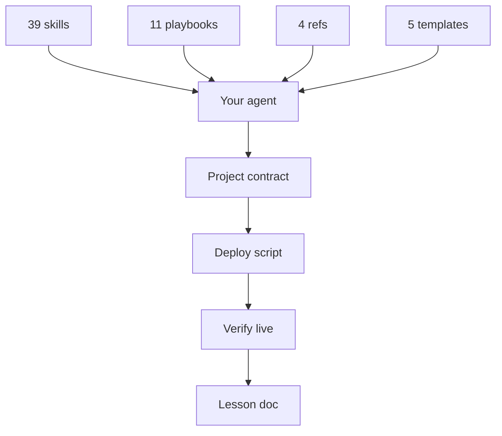

A mentor and a student, one Mac, a city outside the window. The banner is illustration only — no live UI, no HUD, no title overlay.

# Dr Non's Vibecoding Skills

**Forkable agent skills for shipping civic software alone — plain markdown, no runtime.**

[](LICENSE)

**Author.** [Non Arkaraprasertkul](https://github.com/Nonarkara) (Nonarkara) — architect, urban anthropologist, civic-studio practice at **Axiom X Co., Ltd.**, Bangkok.

Independent. Written for a **Thai–English** audience. Not an official depa, ASEAN, or municipal product.

ชุดทักษะสำหรับส่งซอฟต์แวร์สาธารณะคนเดียว — มาร์กดาวน์ล้วน ไม่มีรันไทม์ ผู้อ่านเป้าหมายคือคนไทยและคนอังกฤษด้วยกัน

---

## What this is

A written-down copy of a solo civic-studio practice: how to ship real software with AI agents doing most of the typing, without the project forgetting itself every session.

It is **reference material**, not a deployed app. There is nothing to compile. Four shapes live in this tree:

| Shape | Count in this repo | What it is |
|---|---|---|
| [`skills/`](skills/) | 39 `SKILL.md` files | Standing instructions an agent can load |
| [`playbooks/`](playbooks/) | 11 narratives | Why those rules exist — read once |
| [`reference/`](reference/) | 4 docs | APIs, stack picks, commit style, security hygiene |
| [`templates/`](templates/) | 5 drop-ins | Project contract, deploy script, launchd plist, tunnel config, lesson doc |

Plus [`BLUEPRINT.md`](BLUEPRINT.md) (one-pass setup), [`QUICKSTART.md`](QUICKSTART.md) (fifteen minutes), and a 19-page deck in [`INFOGRAPHICS.md`](INFOGRAPHICS.md).

**This repo is not**

- Source code for FloodDash, AirDash, or any municipal tower. Those live in their own repositories; some implementations stay private.
- An official warning system, city ranking, or government publication.
- A dump of workspace paths, analytics tokens, database URLs, or spreadsheet IDs.

Related public work: [FloodDash Blueprint](https://github.com/Nonarkara/FloodDash-Blueprint), [AirDash](https://github.com/Nonarkara/airdash), [NST control tower](https://github.com/Nonarkara/nst-control-tower), [Live Coding Bible](https://github.com/Nonarkara/live-coding-bible), [Axiom Design Core](https://github.com/Nonarkara/Axiom-Design-Core).

Inspired by [multica-ai/andrej-karpathy-skills](https://github.com/multica-ai/andrej-karpathy-skills) — whose `karpathy-guidelines` is vendored here with credit. That repo tells an agent how to *think*. This one tells it how to *ship, deploy, run, and design*.

Also indebted to [affaan-m/ecc](https://github.com/affaan-m/ecc) — an agent-harness system whose claim, *"optimise the context window, persist everything else,"* is why [`harness-hardening`](skills/harness-hardening/SKILL.md) exists. That skill is the audit (does the hook actually fire?), not a download of ECC.

The 2026 behavioural layer (debug, browser T, lesson close-out, adversarial review, wrong-green, UX archaeology, skill-writing) is a **curated steal** from Superpowers, Compound Engineering, gstack, Addy Osmani, Vercel, and Anthropic's skill format — methods, not packs. Receipts and refusals: [`playbooks/11-the-2026-steal-map.md`](playbooks/11-the-2026-steal-map.md).

---

## Philosophy

**Fork the method, not the secrets.**

The portable part is already in the files: a project contract, a probe-first deploy, a three-job service pattern, an honest number envelope, a lesson doc after anything that hurt. Copy those shapes. Do not copy API keys, tunnel tokens, analytics IDs, private vaults, or anyone else's live host list. If a contribution only works by pasting a secret, it does not belong here.

**One Mac.** The practice assumes one machine you already own — not a VPS fleet, not a staging cluster. Supervised jobs and named tunnels are how a laptop survives closing. If you cannot run it on the computer in front of you, you are overcomplicating it. See [`always-on-services`](skills/always-on-services/SKILL.md) and [`dr-non-golden-rules`](skills/dr-non-golden-rules/SKILL.md).

**No black-box rankings.** A number without `{source, tier, age}` is worse than an error. Do not ship a score, a "live" count, or a city rank the reader cannot inspect. See [`honest-envelope`](skills/honest-envelope/SKILL.md). Civic software earns trust by showing its work.

**Thai–English as the audience.** Write so a Bangkok operator and an English-speaking learner can use the same surface. Toggle language; do not hide a gap. This README is in English with a Thai lede because the skills themselves are English standing orders for agents — the *products* they help ship should speak both.

The closest thing to a secret in this whole repo:

> Move the taste out of your head and into something an agent can execute identically, every time, without you in the room.

Company: **Axiom X Co., Ltd.** Author: **Non Arkaraprasertkul** ([@Nonarkara](https://github.com/Nonarkara)).

---

## Ethical use

These skills are for **public-good civic software**: honest situational awareness, open data, systems a city can run without a vendor lock-in. They are not a kit for surveillance, dark patterns, or pretending a private feed is an official alert.

**Do**

- Label freshness. Every live-looking number needs a source, an age, and a fallback tier.
- Keep analytics cookie-free and aggregate when you can. Store any token as an environment variable, never in git.
- Attribute upstream data. The number belongs to whoever produced it.
- Degrade in public. If the laptop sleeps or an API dies, the page still loads and says the data is old.
- Keep `karpathy-guidelines` attribution when you vendor that skill.
- Audit the harness: a rule that names an agent or hook which is not installed is decoration. See [`harness-hardening`](skills/harness-hardening/SKILL.md).

**Do not**

- Ship mock data as live, or hide an empty feed behind a success state.
- Commit API keys, analytics tokens, database hosts, spreadsheet IDs, tunnel credentials, or personal capture endpoints.
- Imply depa, ASEAN, a municipality, or a UN body publishes this repo.
- Build "correlation" as a way to track individuals. Public signals only.
- Treat a skill as authorization to copy a private implementation. Rebuild from the idea.
- Rank cities, agents, or people behind a score you cannot show the method for.

If you are unsure whether a string is a secret, it is — leave it out. See [`reference/security-hygiene.md`](reference/security-hygiene.md).

---

## How to use / learn

Two minutes, no runtime, any agent that reads markdown:

```bash
git clone https://github.com/Nonarkara/dr-non-vibecoding-skills.git
cp -r dr-non-vibecoding-skills/skills/* ~/.claude/skills/
```

Cursor copies the same folders into `.cursor/skills/` and reads [`AGENTS.md`](AGENTS.md) at the repo root (`.cursorrules` is legacy — do not generate it). Codex / Gemini get `AGENTS.md` / `GEMINI.md` fragments.

| If you want… | Open |
|---|---|
| Five concrete things, fifteen minutes | [`QUICKSTART.md`](QUICKSTART.md) |
| The whole scaffold on a new folder, one paste | [`BLUEPRINT.md`](BLUEPRINT.md) |
| The non-Claude entry path | [`AGENTS.md`](AGENTS.md) |
| The pictures | [`INFOGRAPHICS.md`](INFOGRAPHICS.md) |

Pick the skill that matches the problem:

| If the problem is… | Read |
|---|---|
| A rule the agent ignores, or a named agent that was never installed | [`harness-hardening`](skills/harness-hardening/SKILL.md) |
| Agent keeps re-explaining the project | [`agent-memory`](skills/agent-memory/SKILL.md) |
| Cowboy edits without a plan | [`planning-discipline`](skills/planning-discipline/SKILL.md) |
| Agent "cleans up" a live map into a template | [`anti-regression`](skills/anti-regression/SKILL.md) |
| About to menu the human on a library | [`director-not-typer`](skills/director-not-typer/SKILL.md) |
| Dashboard number has no source / age | [`honest-envelope`](skills/honest-envelope/SKILL.md) |
| Impulse is `ls -R` on a multi-project tree | [`route-dont-scan`](skills/route-dont-scan/SKILL.md) |
| Public dashboard 500s when the DB hiccups | [`dual-write-resilience`](skills/dual-write-resilience/SKILL.md) |
| Agents repeat each other's mistakes | [`shared-memory-hub`](skills/shared-memory-hub/SKILL.md) |
| Agent says "done" without verifying | [`ship-discipline`](skills/ship-discipline/SKILL.md) |
| Deploy "succeeded" but old bytes are served | [`deploy-verification`](skills/deploy-verification/SKILL.md) |
| Side project dies when the laptop closes | [`always-on-services`](skills/always-on-services/SKILL.md) |
| Design keeps regressing | [`axiom-design-core`](skills/axiom-design-core/SKILL.md) + [`design-dna`](skills/design-dna/SKILL.md) |
| Rebuilding the same API adapter | [`data-catalog`](skills/data-catalog/SKILL.md) |
| Don't know how much risk is "too much" | [`risk-posture`](skills/risk-posture/SKILL.md) |
| Code is bloated / over-abstracted | [`karpathy-guidelines`](skills/karpathy-guidelines/SKILL.md) |
| 90 worktrees and fear of deleting | [`workspace-lean`](skills/workspace-lean/SKILL.md) |
| 3D city map with overlapping buildings | [`map-3d-city`](skills/map-3d-city/SKILL.md) |
| Dep keeps needing "one more patch" | [`know-when-to-wait`](skills/know-when-to-wait/SKILL.md) |
| Build first, or wait? | [`dr-non-golden-rules`](skills/dr-non-golden-rules/SKILL.md) |
| Response is long without earning it | [`context-economy`](skills/context-economy/SKILL.md) |
| Reporting work as "done" | [`result-honesty`](skills/result-honesty/SKILL.md) |
| Impulse to patch the first plausible line | [`systematic-debugging`](skills/systematic-debugging/SKILL.md) |
| UI "verified" with a screenshot | [`browser-as-t`](skills/browser-as-t/SKILL.md) |
| Painful session, no lesson written | [`lesson-residue`](skills/lesson-residue/SKILL.md) |
| Same model about to LGTM its own diff | [`adversarial-review`](skills/adversarial-review/SKILL.md) |
| Watchdog/CI/deploy said OK and it wasn't | [`wrong-green`](skills/wrong-green/SKILL.md) |
| Rebuild from prior art by scraping the live app | [`ux-archaeology`](skills/ux-archaeology/SKILL.md) |
| Tempted to add the 40th skill from a trending pack | [`skill-writing`](skills/skill-writing/SKILL.md) |

The other skills — `full-stack-bootstrap`, `subagent-routing`, `mcp-cli-first`, and the sibling-practice set (`local-ai-fabric`, `voice-clone-podcast`, `itic-cctv-integration`, `iptv-streaming`, `narrative-companion-surfaces`, `radar-chart-pattern`) — are in [`skills/`](skills/). Four of the thirty-nine (`subagent-routing`, `mcp-cli-first`, `context-economy`, `result-honesty`) are Mavis/Claude-oriented; the rest are agent-agnostic markdown.

Playbooks, numbered, read once:

1. [How I actually code](playbooks/01-how-i-actually-code.md)
2. [The CLAUDE.md ladder](playbooks/02-the-claude-md-ladder.md)
3. [Ship to production daily](playbooks/03-ship-to-production-daily.md)
4. [Multi-agent and worktrees](playbooks/04-multi-agent-and-worktrees.md)
5. [Taking risk like Dr Non](playbooks/05-taking-risk-like-dr-non.md)
6. [War stories](playbooks/06-war-stories.md)
7. [Design at the speed of light](playbooks/07-design-at-the-speed-of-light.md)
8. [The Mavis side](playbooks/08-the-mavis-side.md)
9. [The Antigravity origin](playbooks/09-the-antigravity-origin.md)
10. [The Cursor desk](playbooks/10-the-cursor-desk.md)
11. [The 2026 steal map](playbooks/11-the-2026-steal-map.md) — what we took from Superpowers / Compound / gstack / Osmani / Vercel / Anthropic, and what we refused

---

## System diagram

Short labels so GitHub Mermaid does not clip.



The contract is the executable part. Without it, the skills are essays. With it, they are decisions that only had to be made once.

```
C — Commit    git commit -m "<type>(<scope>): <sentence>"
P — Push      git push
D — Deploy    the one scripted command — never remembered
T — Test      curl the live URL; grep for the new thing
```

Localhost is never a deliverable. See [`ship-discipline`](skills/ship-discipline/SKILL.md).

---

## License / contributing

This repository is licensed under the [MIT License](LICENSE). Copyright © 2026 **Non Arkaraprasertkul / Axiom X Co., Ltd.**

Reuse the skills, playbooks, templates, and prose with attribution. `karpathy-guidelines` keeps its upstream MIT credit — see [NOTICE.md](NOTICE.md). MIT here does not relicense upstream data, municipal identities, or private implementations named as examples.

**Contributing.** Open a pull request against `main`.

- Add a skill when it has already shipped somewhere, not when it sounds wise. See [`skill-writing`](skills/skill-writing/SKILL.md) — do not vendor a 100-skill pack.
- Pair every rule with a *why*. Agents tidy oddities; they need the reason it is load-bearing.
- No secrets, live tokens, private hosts, or invented metrics.
- Keep the voice: production, not theory; civic, not vendor pitch.
- Fixes to ethics, missing anti-patterns, and stale counts are as welcome as new skills.

If you build something with this, the author would like to see it.
