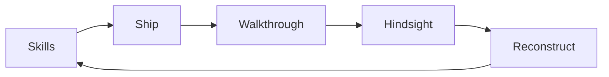
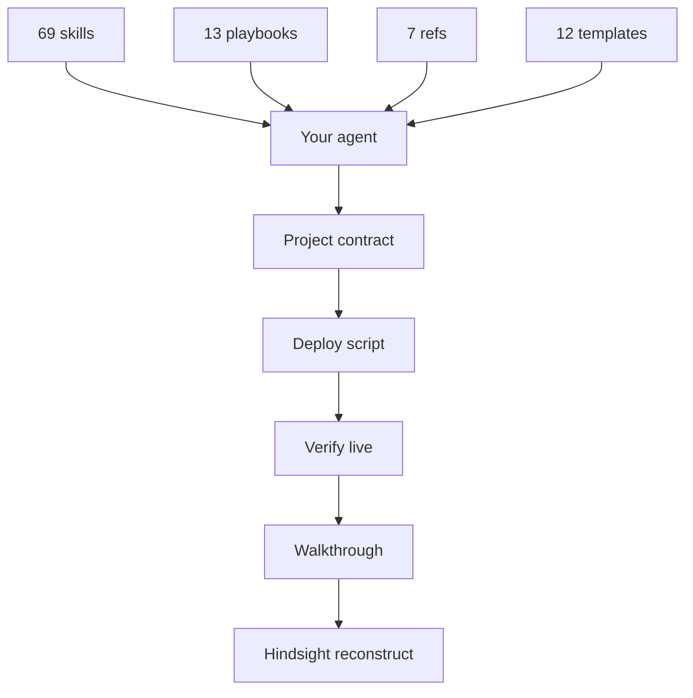

A mentor and a student, one Mac, a city outside the window. The banner is illustration only — no live UI, no HUD, no title overlay.

# Dr Non's Vibe Coding Stack

**A complete stack for shipping software with AI agents — plain markdown, no runtime. Skills, playbooks, references, and templates that turn agent sessions into shipped software. Proven on civic dashboards, useful for any codebase.**

Civic is the proof, not the prerequisite. *Renamed September 2026 from `dr-non-vibecoding-skills`; the GitHub URL and plugin ID are unchanged so existing clones and installs keep working.*

[](https://github.com/Nonarkara/dr-non-vibecoding-skills/actions/workflows/validate.yml)
[](skills/)
[](playbooks/)
[](templates/)
[](LICENSE)

**69 skills** · **13 playbooks** · **7 references** · **12 templates**

**Author.** [Non Arkaraprasertkul](https://github.com/Nonarkara) (Nonarkara) — architect, urban anthropologist, civic-studio practice at **Axiom X Co., Ltd.**, Bangkok.

Independent. Written for a **Thai–English** audience. Not an official depa, ASEAN, or municipal product.

ชุดทักษะสำหรับส่งซอฟต์แวร์สาธารณะคนเดียว — มาร์กดาวน์ล้วน ไม่มีรันไทม์ ผู้อ่านเป้าหมายคือคนไทยและคนอังกฤษด้วยกัน

---

## Become Dr Non the Builder

หนึ่งคำสั่ง — ทักษะทุกเอเจนต์ — พร้อมส่งของ.

```bash
git clone https://github.com/Nonarkara/dr-non-vibecoding-skills.git
cd dr-non-vibecoding-skills && ./setup.sh --become-builder
```

That is the whole product. The script installs the skills on every agent this machine has, then prints **You are Dr Non the Builder** and the next three moves: a project contract, a multi-persona walkthrough, a hindsight reconstruct. No remote pipe. Plain markdown, same ethos as the rest of the repo.



Install → build → ship → [`human-walkthrough`](skills/human-walkthrough/SKILL.md) → [`power-of-hindsight`](skills/power-of-hindsight/SKILL.md) reconstruct. Same loop every project.

Optional, after the one-liner: `./setup.sh --init-project ~/Projects/my-app --yes` scaffolds the contract, deploy script, and `docs/lessons/`. Prove this clone is coherent with `make validate`.

Plugin install, the [`BLUEPRINT.md`](BLUEPRINT.md) paste, [`QUICKSTART.md`](QUICKSTART.md), and `make install-skills` are **alternates** — same skills, not a second product. See [Other ways to install](#other-ways-to-install).

---

## What this is

A written-down copy of a solo civic-studio practice: how to ship real software with AI agents doing most of the typing, without the project forgetting itself every session.

It is **reference material**, not a deployed app. There is nothing to compile. Four shapes live in this tree:

| Shape | Count in this repo | What it is |
|---|---|---|
| [`skills/`](skills/) | 69 `SKILL.md` files | Standing instructions an agent can load |
| [`playbooks/`](playbooks/) | 13 narratives | Why those rules exist — read once |
| [`reference/`](reference/) | 7 docs | APIs, stack picks, named references, commit style, security hygiene, hosting, payments/voice |
| [`templates/`](templates/) | 12 drop-ins | Project contracts (Tier 1 & 2), deploy + verify scripts, gitignore, env, design tokens, launchd plist, tunnel, lesson doc |

Plus [`BLUEPRINT.md`](BLUEPRINT.md) (agent-driven project paste) and [`QUICKSTART.md`](QUICKSTART.md) (fifteen minutes after the one-liner) as **alternates** to `--become-builder`. Visual deck: [`INFOGRAPHICS.md`](INFOGRAPHICS.md).

**This repo is not**

- Source code for FloodDash, AirDash, or any municipal tower. Those live in their own repositories; some implementations stay private.
- An official warning system, city ranking, or government publication.
- A dump of workspace paths, analytics tokens, database URLs, or spreadsheet IDs.

Related public work: [FloodDash Blueprint](https://github.com/Nonarkara/FloodDash-Blueprint), [AirDash](https://github.com/Nonarkara/airdash), [NST control tower](https://github.com/Nonarkara/nst-control-tower), [Live Coding Bible](https://github.com/Nonarkara/live-coding-bible), [Axiom Design Core](https://github.com/Nonarkara/Axiom-Design-Core).

Inspired by [multica-ai/andrej-karpathy-skills](https://github.com/multica-ai/andrej-karpathy-skills) — whose `karpathy-guidelines` is vendored here with credit. That repo tells an agent how to *think*. This one tells it how to *ship, deploy, run, and design*.

Also indebted to [affaan-m/ecc](https://github.com/affaan-m/ecc) — an agent-harness system whose claim, *"optimise the context window, persist everything else,"* is why [`harness-hardening`](skills/harness-hardening/SKILL.md) exists. That skill is the audit (does the hook actually fire?), not a download of ECC.

The 2026 behavioural layer (debug, browser T, lesson close-out, adversarial review, wrong-green, UX archaeology, skill-writing) is a **curated steal** from Superpowers, Compound Engineering, gstack, Addy Osmani, Vercel, and Anthropic's skill format — methods, not packs. Receipts and refusals: [`playbooks/11-the-2026-steal-map.md`](playbooks/11-the-2026-steal-map.md).

## What it has

The popular repositories each make one part of agent work memorable. This practice has
those parts too, but connects them to the production failures that made the rules necessary.

| Proven pattern | Here | What is different here |
|---|---|---|
| Karpathy's explicit assumptions, simplicity, surgical edits, and goal-driven loops | [`karpathy-guidelines`](skills/karpathy-guidelines/SKILL.md) | Kept as the compact coding baseline, with upstream credit |
| gstack's think → plan → review → QA → ship loop | [`design-thinking-vibecoding`](skills/design-thinking-vibecoding/SKILL.md) → [`planning-discipline`](skills/planning-discipline/SKILL.md) → [`adversarial-review`](skills/adversarial-review/SKILL.md) → [`browser-as-t`](skills/browser-as-t/SKILL.md) → [`ship-discipline`](skills/ship-discipline/SKILL.md) | Runtime-free and agent-agnostic; use only the stage the task earns. After ship: [`human-walkthrough`](skills/human-walkthrough/SKILL.md) (three personas) then [`power-of-hindsight`](skills/power-of-hindsight/SKILL.md) (reconstruct) |
| Focused, triggerable Agent Skills | All 69 folders under [`skills/`](skills/) | Descriptions are budgeted and CI-checked so the collection remains discoverable |
| Durable project memory | [`agent-memory`](skills/agent-memory/SKILL.md) + [`shared-memory-hub`](skills/shared-memory-hub/SKILL.md) | Lessons move from a project contract into a cross-agent Obsidian memory |
| Production proof | [`result-honesty`](skills/result-honesty/SKILL.md) + [`wrong-green`](skills/wrong-green/SKILL.md) + [`deploy-verification`](skills/deploy-verification/SKILL.md) | A green badge is rejected when it measures the wrong thing |
| Civic and public-data discipline | [`honest-envelope`](skills/honest-envelope/SKILL.md) + [`dual-write-resilience`](skills/dual-write-resilience/SKILL.md) | Every number shows source, fallback tier, and age; public surfaces degrade visibly |
| A design system agents can extend without flattening | [`axiom-design-core`](skills/axiom-design-core/SKILL.md) + [`design-dna`](skills/design-dna/SKILL.md) + [`design-registers`](skills/design-registers/SKILL.md) | Visual lineage, token roles, and named regressions live in the same contract |
| Product UI + motion that reads as shipped | [`legible-systems`](skills/legible-systems/SKILL.md) + [`axiom-design-core`](skills/axiom-design-core/SKILL.md) (Layer 6) + [`no-design-tells`](skills/no-design-tells/SKILL.md) (§6 Hard Gates) + [`dashboard-discipline`](skills/dashboard-discipline/SKILL.md) | Floor/ceiling + animation vocabulary (enter `ease-out`, `transform`/`opacity` only, shadow over border) — observe real products before inventing; dashboard tells (glowing status dot, monospace on labels, hero behind login, metric-card-grid) |
| A free AppSec pipeline for solo builders | [`appsec-stack`](skills/appsec-stack/SKILL.md) | Seven free layers (secrets, SAST, SCA, SBOM, auto-update, DAST, exploit verify) with concrete configs and the OWASP Top 10 / CIS IG1 mapping |
| Stack-repo architecture for multi-package trees | [`stack-repo-topology`](skills/stack-repo-topology/SKILL.md) | Trunk-based dev, path-scoped CODEOWNERS, branch-naming convention, selective CI, and shared resource patterns — pairs with `route-dont-scan` and `workspace-lean` |
| Human writing and simplest-path engineering | [`no-ai-tells`](skills/no-ai-tells/SKILL.md) + [`no-design-tells`](skills/no-design-tells/SKILL.md) + [`ninja-innovation`](skills/ninja-innovation/SKILL.md) + [`cognition-first`](skills/cognition-first/SKILL.md) | Kill the tells that mark text and UI as machine-made; find the 5-line move that lands like 500 |
| Local AI, retrieval, and a watchdog that keeps you excellent | [`local-llm-ollama`](skills/local-llm-ollama/SKILL.md) + [`simple-rag`](skills/simple-rag/SKILL.md) + [`obsidian-mcp-forge`](skills/obsidian-mcp-forge/SKILL.md) + [`improvement-radar`](skills/improvement-radar/SKILL.md) | One-machine Ollama, FTS5-first RAG with citations, a self-sustaining Obsidian MCP (recall/capture/inbox), and a weekly clone radar that files Steal / Feedstock / Refuse — Dr Non shepherding via results |
| Assistants on the phone, eyes on the house and the planet, staff that swarms | [`messaging-gateway`](skills/messaging-gateway/SKILL.md) + [`home-cctv-grid`](skills/home-cctv-grid/SKILL.md) + [`satellite-change-watch`](skills/satellite-change-watch/SKILL.md) + [`staff-swarm`](skills/staff-swarm/SKILL.md) | Telegram/Line/WhatsApp behind RAG with citations; honest camera grids with local storage; dated satellite time-stacks; researcher/field/orchestrator roles with token tiers — the entrepreneur's whole stack |
| A change that "looked fine" in one screenshot | [`human-walkthrough`](skills/human-walkthrough/SKILL.md) | Closes the gap [`browser-as-t`](skills/browser-as-t/SKILL.md) and [`ux-archaeology`](skills/ux-archaeology/SKILL.md) leave: three personas × a real browser, producing a blueprint and a Now/Next/Later/**Never** roadmap |
| A year of patches that became Frankenstein | [`power-of-hindsight`](skills/power-of-hindsight/SKILL.md) | Closes the gap [`lesson-residue`](skills/lesson-residue/SKILL.md), [`result-honesty`](skills/result-honesty/SKILL.md), and [`systematic-debugging`](skills/systematic-debugging/SKILL.md) leave: Collect → Analyze → Reconstruct from the system's own data |

This is not gstack with different command names, and it is not a giant prompt pack. It is the
field manual for the part that remains after the model, IDE, and fashionable tool change.

See the complete grouped inventory in [`CATALOG.md`](CATALOG.md).

## Receipts, not vibes

| Failure that actually happened | Rule extracted from it |
|---|---|
| A live map was replaced by a clean template | [`anti-regression`](skills/anti-regression/SKILL.md) |
| New HTML shipped while an edge served old JavaScript | [`deploy-verification`](skills/deploy-verification/SKILL.md) |
| Two tunnels silently shared the wrong ingress config | [`always-on-services`](skills/always-on-services/SKILL.md) |
| Health checks stayed green while useful data stopped | [`wrong-green`](skills/wrong-green/SKILL.md) + [`honest-envelope`](skills/honest-envelope/SKILL.md) |
| Rules named agents and hooks that had never been installed | [`harness-hardening`](skills/harness-hardening/SKILL.md) |

The incident narratives and what was refused are in
[`playbooks/06-war-stories.md`](playbooks/06-war-stories.md) and
[`playbooks/11-the-2026-steal-map.md`](playbooks/11-the-2026-steal-map.md).

---

## Philosophy

**Fork the method, not the secrets.**

The portable part is already in the files: a project contract, a probe-first deploy, a three-job service pattern, an honest number envelope, a lesson doc after anything that hurt. Copy those shapes. Do not copy API keys, tunnel tokens, analytics IDs, private vaults, or anyone else's live host list. If a contribution only works by pasting a secret, it does not belong here.

**One Mac.** The practice assumes one machine you already own — not a VPS fleet, not a staging cluster. Supervised jobs and named tunnels are how a laptop survives closing. If you cannot run it on the computer in front of you, you are overcomplicating it. See [`always-on-services`](skills/always-on-services/SKILL.md) and [`dr-non-golden-rules`](skills/dr-non-golden-rules/SKILL.md).

**No black-box rankings.** A number without `{source, tier, age}` is worse than an error. Do not ship a score, a "live" count, or a city rank the reader cannot inspect. See [`honest-envelope`](skills/honest-envelope/SKILL.md). Civic software earns trust by showing its work.

**Thai–English as the audience.** Write so a Bangkok operator and an English-speaking learner can use the same surface. Toggle language; do not hide a gap. This README is in English with a Thai lede because the skills themselves are English standing orders for agents — the *products* they help ship should speak both.

The closest thing to a secret in this whole repo:

> Move the taste out of your head and into something an agent can execute identically, every time, without you in the room.

Company: **Axiom X Co., Ltd.** Author: **Non Arkaraprasertkul** ([@Nonarkara](https://github.com/Nonarkara)).

---

## Ethical use

These skills are for **public-good civic software**: honest situational awareness, open data, systems a city can run without a vendor lock-in. They are not a kit for surveillance, dark patterns, or pretending a private feed is an official alert.

**Do**

- Label freshness. Every live-looking number needs a source, an age, and a fallback tier.
- Keep analytics cookie-free and aggregate when you can. Store any token as an environment variable, never in git.
- Attribute upstream data. The number belongs to whoever produced it.
- Degrade in public. If the laptop sleeps or an API dies, the page still loads and says the data is old.
- Keep `karpathy-guidelines` attribution when you vendor that skill.
- Audit the harness: a rule that names an agent or hook which is not installed is decoration. See [`harness-hardening`](skills/harness-hardening/SKILL.md).

**Do not**

- Ship mock data as live, or hide an empty feed behind a success state.
- Commit API keys, analytics tokens, database hosts, spreadsheet IDs, tunnel credentials, or personal capture endpoints.
- Imply depa, ASEAN, a municipality, or a UN body publishes this repo.
- Build "correlation" as a way to track individuals. Public signals only.
- Treat a skill as authorization to copy a private implementation. Rebuild from the idea.
- Rank cities, agents, or people behind a score you cannot show the method for.

If you are unsure whether a string is a secret, it is — leave it out. See [`reference/security-hygiene.md`](reference/security-hygiene.md).

---

## Other ways to install

`--become-builder` is the path. These are the same skills, for hosts that prefer a plugin or a copy.

### Codex and ChatGPT desktop

```bash
codex plugin marketplace add Nonarkara/dr-non-vibecoding-skills
codex plugin add dr-non-vibecoding-skills@dr-non
```

This uses the repository marketplace in [`.agents/plugins/marketplace.json`](.agents/plugins/marketplace.json).
Codex also discovers manually copied user skills from `$HOME/.agents/skills` and repository
skills from `.agents/skills`.

### Claude Code

```text
/plugin marketplace add Nonarkara/dr-non-vibecoding-skills
/plugin install dr-non-vibecoding-skills@dr-non
```

### Makefile / scripts (same installer)

```bash
make become-builder          # == ./setup.sh --become-builder
make install-skills          # skills only, no identity print
./setup.sh --init-project ~/Projects/my-app --yes
make validate
# host-scoped alt: scripts/install-skills.sh --claude --codex --dry-run
```

`setup.sh` copies from [`templates/`](templates/), so the Makefile, the BLUEPRINT paste, and `--init-project` stay identical. Verify with `make validate`.

### Manual / Cursor / any Agent Skills reader

```bash
git clone https://github.com/Nonarkara/dr-non-vibecoding-skills.git

# Codex user skills
mkdir -p "$HOME/.agents/skills"
cp -R dr-non-vibecoding-skills/skills/* "$HOME/.agents/skills/"

# Claude Code user skills
mkdir -p "$HOME/.claude/skills"
cp -R dr-non-vibecoding-skills/skills/* "$HOME/.claude/skills/"

# Antigravity / OpenCode / Hermes
mkdir -p .agents/skills && cp -R dr-non-vibecoding-skills/skills/* .agents/skills/
# Hermes: ~/.hermes/skills/  — Antigravity also reads .agents/skills/

# Cursor project skills
mkdir -p .cursor/skills
cp -R dr-non-vibecoding-skills/skills/* .cursor/skills/
```

### Obsidian second brain (optional, recommended)

[`shared-memory-hub`](skills/shared-memory-hub/SKILL.md) connects every agent to one durable memory — an Obsidian vault at `~/Documents/SecondBrain` via the [`obsidian-bridge`](https://github.com/yoring/obsidian-bridge) MCP server (or the `brain` CLI fallback). Install once per machine:

```bash
# Claude Code — add obsidian-bridge MCP (filesystem + search over ~/Documents/SecondBrain)
claude mcp add obsidian-bridge -- npx -y obsidian-bridge --vault ~/Documents/SecondBrain
# Verify: recall_lessons should return vault hits, not generic boilerplate
# No vault yet? The skill also works vault-less — project `AGENTS.md` + `docs/lessons/` is the fallback
```

See the vault topology and two-step ritual (`recall_lessons` → `capture_lesson`) in [`shared-memory-hub`](skills/shared-memory-hub/SKILL.md). Without it every session re-derives the project from source; with it a five-week-dormant project is productive in ten minutes.

`AGENTS.md` is the durable project contract; `SKILL.md` is the reusable workflow. Do not
concatenate the whole collection into `AGENTS.md`. Gemini and other agents that do not discover
Agent Skills can selectively copy the few relevant instructions into their native rules file.

## Run one complete session

After installation, give the agent this sequence on a real change:

```text
Use $planning-discipline to define the scope and proof.
Implement with $karpathy-guidelines and preserve earned work with $anti-regression.
If the change is visible, verify it with $browser-as-t.
Before closing, run $adversarial-review, then report with $result-honesty.
If this repository has a live surface, finish the $ship-discipline loop.
Before a major release, walk it as three personas with $human-walkthrough.
When the year of patches needs an end, reconstruct with $power-of-hindsight.
```

The skills are independent. A typo does not need the whole ceremony; a public data dashboard does.

| If you want… | Open |
|---|---|
| The one-liner (you are already here) | `./setup.sh --become-builder` |
| Five concrete improvements after install | [`QUICKSTART.md`](QUICKSTART.md) |
| An agent-driven project scaffold | [`BLUEPRINT.md`](BLUEPRINT.md) |
| Every skill, grouped by job | [`CATALOG.md`](CATALOG.md) |
| Instructions for agents entering this repository | [`AGENTS.md`](AGENTS.md) |
| The 19-page visual explanation | [`INFOGRAPHICS.md`](INFOGRAPHICS.md) |

Playbooks, numbered, read once:

1. [How I actually code](playbooks/01-how-i-actually-code.md)
2. [The CLAUDE.md ladder](playbooks/02-the-claude-md-ladder.md)
3. [Ship to production daily](playbooks/03-ship-to-production-daily.md)
4. [Multi-agent and worktrees](playbooks/04-multi-agent-and-worktrees.md)
5. [Taking risk like Dr Non](playbooks/05-taking-risk-like-dr-non.md)
6. [War stories](playbooks/06-war-stories.md)
7. [Design at the speed of light](playbooks/07-design-at-the-speed-of-light.md)
8. [The Mavis side](playbooks/08-the-mavis-side.md)
9. [The Antigravity origin](playbooks/09-the-antigravity-origin.md)
10. [The Cursor desk](playbooks/10-the-cursor-desk.md)
11. [The 2026 steal map](playbooks/11-the-2026-steal-map.md) — what we took from Superpowers / Compound / gstack / Osmani / Vercel / Anthropic, and what we refused
12. [The Codex workbench](playbooks/12-the-codex-workbench.md)
13. [The digital twin](playbooks/13-the-digital-twin.md) — how satellites, cameras, feeds, 3D, security, and staff compose into one usable system

---

## System diagram

Short labels so GitHub Mermaid does not clip. The Builder loop is the operating system; CPDT is how a change ships.



The contract is the executable part. Without it, the skills are essays. With it, they are decisions that only had to be made once.

```
C — Commit    git commit -m "<type>(<scope>): <sentence>"
P — Push      git push
D — Deploy    the one scripted command — never remembered
T — Test      curl the live URL; grep for the new thing
```

Localhost is never a deliverable. See [`ship-discipline`](skills/ship-discipline/SKILL.md).

---

## License / contributing

This repository is licensed under the [MIT License](LICENSE). Copyright © 2026 **Non Arkaraprasertkul / Axiom X Co., Ltd.**

Reuse the skills, playbooks, templates, and prose with attribution. `karpathy-guidelines` keeps its upstream MIT credit — see [NOTICE.md](NOTICE.md). MIT here does not relicense upstream data, municipal identities, or private implementations named as examples.

**Contributors.** The human author and the AI collaborators that have meaningfully contributed (Antigravity, Cursor, Mavis, the 2026 steal map, Codex) are listed in [`CONTRIBUTORS.md`](CONTRIBUTORS.md), with the provenance of each contribution traced to the playbook that records the reasoning.

**Contributing.** Open a pull request against `main`. The full quality gate and skill shape
are in [`CONTRIBUTING.md`](CONTRIBUTING.md).

- Add a skill when it has already shipped somewhere, not when it sounds wise. See [`skill-writing`](skills/skill-writing/SKILL.md) — do not vendor a 100-skill pack.
- Pair every rule with a *why*. Agents tidy oddities; they need the reason it is load-bearing.
- No secrets, live tokens, private hosts, or invented metrics.
- Keep the voice: production, not theory; civic, not vendor pitch.
- Fixes to ethics, missing anti-patterns, and stale counts are as welcome as new skills.

If you build something with this, the author would like to see it.
