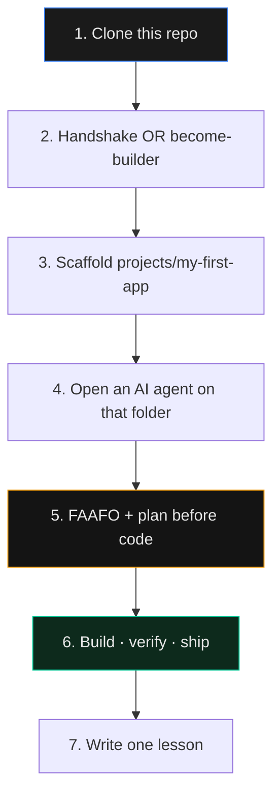
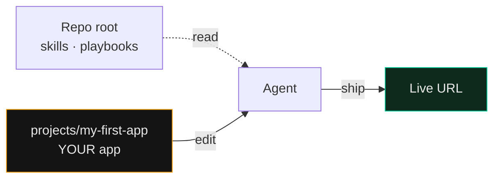
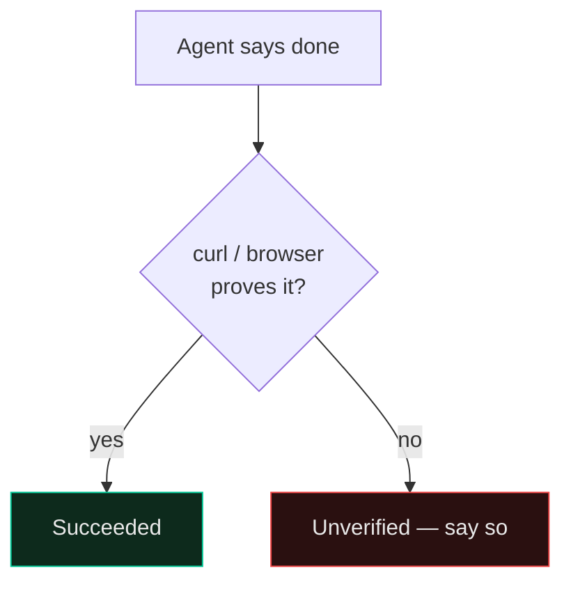

# START HERE — never coded? begin on this page

You cloned an **operating system for directing AI agents**, not a single app. In about twenty minutes you can: install the practice, create a project folder, and ask an agent to build something real.

ไม่เคยเขียนโค้ดมาก่อนก็ได้ — อ่านหน้านี้ตามลูกศร แล้ววางงานใน `projects/`

---

## The journey



---

## 1. Clone

```bash
git clone https://github.com/Nonarkara/dr-non-vibecoding-skills.git
cd dr-non-vibecoding-skills
```

---

## 2. Two ways to start talking to an agent

**Fastest (no install):** open ChatGPT / Claude / Gemini / Cursor and paste the entire [`HANDSHAKE.md`](HANDSHAKE.md) as the first message.

**Durable (recommended):**

```bash
./setup.sh --become-builder
```

You should see **You are Dr Non the Builder**.

---

## 3. Put *your* work under `projects/`

Infrastructure stays at the repo root. Your software lives in [`projects/`](projects/README.md).

```bash
scripts/new-project.sh projects/my-first-app --stack next --workspace
```



---

## 4. First twelve skills only

| # | Skill | Why |
|---|---|---|
| 1 | [`dr-non-golden-rules`](skills/dr-non-golden-rules/SKILL.md) | Practical defaults |
| 2 | [`design-thinking-vibecoding`](skills/design-thinking-vibecoding/SKILL.md) | Frame the lived problem |
| 3 | [`director-not-typer`](skills/director-not-typer/SKILL.md) | You hold intent; agent types |
| 4 | [`vibe-coding-faafo`](skills/vibe-coding-faafo/SKILL.md) | FAAFO frame before code |
| 5 | [`planning-discipline`](skills/planning-discipline/SKILL.md) | Spec-First + alignment gate |
| 6 | [`karpathy-guidelines`](skills/karpathy-guidelines/SKILL.md) | Simple surgical edits |
| 7 | [`anti-regression`](skills/anti-regression/SKILL.md) | Don't delete what works |
| 8 | [`browser-as-t`](skills/browser-as-t/SKILL.md) | UI truth in a real browser |
| 9 | [`result-honesty`](skills/result-honesty/SKILL.md) | Succeeded / failed / unverified |
| 10 | [`ship-discipline`](skills/ship-discipline/SKILL.md) | Commit · Push · Deploy · Test |
| 11 | [`human-walkthrough`](skills/human-walkthrough/SKILL.md) | Three personas before a big release |
| 12 | [`lesson-residue`](skills/lesson-residue/SKILL.md) | One line for the next agent |

Kim/Yegge map: [`playbooks/17-kim-yegge-faafo-bridge.md`](playbooks/17-kim-yegge-faafo-bridge.md).

---

## 5. What to paste into the agent (first build)

```text
Read HANDSHAKE.md and skills/vibe-coding-faafo/SKILL.md.
Work only inside projects/my-first-app.
1) Fill FAAFO + a Spec-First plan (planning-discipline). Stop for my OK.
2) After OK: scaffold the app, keep AGENTS.md accurate.
3) Verify with a real command or live URL. Localhost is never "done".
4) Report with result-honesty buckets.
```

---

## 6. Done means evidence



---

## 7. Make the stack yours later

Day 1: ship something small. Week 1: read [`FORK.md`](FORK.md) and optionally `scripts/make-it-mine.sh`. Delete three skills you cannot defend.

More depth: [`QUICKSTART.md`](QUICKSTART.md) · [`BLUEPRINT.md`](BLUEPRINT.md) · [`CATALOG.md`](CATALOG.md).
