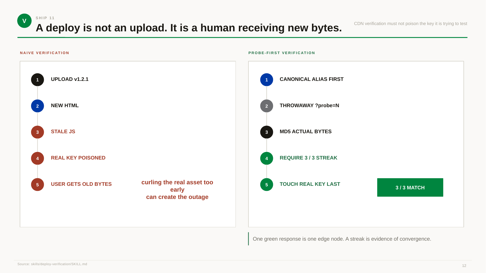

# 12 — SHIP

> **The system's secret is not the model.** Decide once. Look up forever. The best stack is the one that ships.

This is the closing page. The argument of the whole deck, in five boxes and one golden rule.

---

## The five things that survive

A practice is what survives the things that change. The model changes. The IDE changes. The fashionable tool changes. The agent framework changes. What does not change is the **load-bearing judgment** — the things this practice is for.

| What survives | What it means in practice | The skill or template that owns it |
|---|---|---|
| **MEMORY** — context survives | A five-week-dormant project is productive in ten minutes. The memory ladder (vault → workspace index → project contract → lesson docs) is the reason. | [`agent-memory`](../../skills/agent-memory/SKILL.md), [`shared-memory-hub`](../../skills/shared-memory-hub/SKILL.md), `templates/CLAUDE.md.template`, `templates/AGENTS.md.template` |
| **DESIGN** — taste survives | The visual system has a reason behind every rule, not just a rule. The DNA is a process, not a lookbook. | [`axiom-design-core`](../../skills/axiom-design-core/SKILL.md), [`design-dna`](../../skills/design-dna/SKILL.md), [`design-registers`](../../skills/design-registers/SKILL.md), [`no-design-tells`](../../skills/no-design-tells/SKILL.md), [`dashboard-discipline`](../../skills/dashboard-discipline/SKILL.md) |
| **CATALOG** — integration survives | A new API, a new data source, a new internal package: the integration is recorded once and reused. The cost of a new integration is the cost of writing the row, not the cost of re-deriving the adapter. | [`data-catalog`](../../skills/data-catalog/SKILL.md), `reference/free-apis.md`, `reference/hosting-matrix.md` |
| **SHIP** — proof survives | A "done" claim is backed by a curl on the real URL, not a green test. The proof chain (commit → push → deploy → test live) is the gate. | [`ship-discipline`](../../skills/ship-discipline/SKILL.md), [`deploy-verification`](../../skills/deploy-verification/SKILL.md), [`wrong-green`](../../skills/wrong-green/SKILL.md), `templates/deploy-pages.sh` |
| **RISK** — mistakes stay cheap | The cost of a wrong call is bounded. The risk posture is calibrated for a solo builder, not a team. A mistake is recovered in a session, not a quarter. | [`risk-posture`](../../skills/risk-posture/SKILL.md), [`production-spine`](../../skills/production-spine/SKILL.md), [`know-when-to-wait`](../../skills/know-when-to-wait/SKILL.md) |

The five are the **survival set**. A practice that loses one of them is a practice that will be re-derived from scratch in five years. A practice that keeps all five is a practice that compounds.

## The secret is not the model

The line at the top of the page is the most important line in the deck. It is also the most counter-intuitive.

The model is the loudest variable in the system. Every six months a new model ships, and the practice's apparent relevance is questioned. **The model is not the system.** The system is the four shapes wired into one routing loop, with the 88 skills carrying the load-bearing judgments and the 13 templates carrying the load-bearing files.

A new model arrives. The practice does not change. The skills are still the skills. The contracts are still the contracts. The deploy is still the deploy. The model's contribution is **the speed at which the practice can execute** — not the practice itself.

This is the difference between a model-as-substitute and a model-as-tool. A model-as-substitute replaces the operator; the operator's judgments stop mattering. A model-as-tool is a typist that does the writing; the operator's judgments are still the ones that matter. The practice assumes model-as-tool. The collection of skills, templates, references, and playbooks is what survives whether the model is GPT-5, Claude 4, Gemini 3, or whatever ships next year.

## Decide once. Look up forever

The second line is the second-most important line. It is the **operating instruction** for the whole practice.

- **Decide once.** Every decision in this collection was made because a real incident or a real constraint forced the decision. The skill body carries the decision; the playbook carries the incident; the reference carries the stable details. A new contributor does not re-derive the decision. They look it up.
- **Look up forever.** The skills are static markdown. The model can be queried against them indefinitely. The cost of a lookup is one description match; the cost of re-deriving the decision is one hour of confused reading. The practice is biased toward lookups, every time.

The 88 skills are the lookups. The 15 playbooks are the receipts for the lookups. The 7 references are the stable implementation details. The 13 templates are the drop-in files. The whole collection is the **decision ledger** that compounds.

## The golden rule

**The best stack is the one that ships.**

The golden rule is the bottom of the page for a reason. It is the **test** the practice applies to itself. A skill that does not ship is removed. A template that does not get copied is removed. A reference that does not get read is removed. A playbook that does not get cited is removed. The collection is conserved by what it actually does, not by what it says about itself.

The corollary is **the worst stack is the one that does not ship.** A 70-skill collection that nobody uses is a graveyard. A 1-skill collection that somebody uses every day is a practice. The number of skills is not the score; the **number of shipped changes per quarter, each backed by a real proof, each informed by a real lesson** is the score.

## What to do with this

- **Read this page last.** Pages 01–11 are the argument. Page 12 is the conclusion. If you read the conclusion first, the argument feels like throat-clearing.
- **Audit the five "what survives" categories every quarter.** A category that is shrinking (the memory ladder is not being maintained; the design system is being ignored; the catalog is out of date) is a category that needs a lesson doc, not a new skill.
- **When the practice feels stale, the fix is almost never "add a skill."** It is "reconstruct the part that carries weight." The new skill is a symptom; the reconstruction is the answer.
- **When someone asks "what is this repo," send them the deck, not the README.** The deck is the philosophy. The README is the inventory. The deck makes the case for the README; the README does not make the case for the deck.

## Pairs with

- **Before → [11 — CLOSE THE LOOP](11-close.md).** The close is the system. The ship is the sentence.
- **The whole deck:** [01 — STACK](01-stack.md) · [03 — ROUTE](03-route.md) · [05 — MAP](05-map.md) · [07 — PROOF](07-proof.md) · [08 — DESIGN DNA](08-dna.md) · [11 — CLOSE THE LOOP](11-close.md)
- **The five survival skills:** [`agent-memory`](../../skills/agent-memory/SKILL.md) · [`axiom-design-core`](../../skills/axiom-design-core/SKILL.md) · [`data-catalog`](../../skills/data-catalog/SKILL.md) · [`ship-discipline`](../../skills/ship-discipline/SKILL.md) · [`risk-posture`](../../skills/risk-posture/SKILL.md)
- **The golden rule:** [`skills/dr-non-golden-rules/SKILL.md`](../../skills/dr-non-golden-rules/SKILL.md) — the operating laws that the golden rule is one of.

**Source.** The five "what survives" categories are distilled from [`skills/dr-non-golden-rules/SKILL.md`](../../skills/dr-non-golden-rules/SKILL.md) (the operating laws). The golden rule is from the same file. The "decide once, look up forever" framing is from the README's "Philosophy" section.
