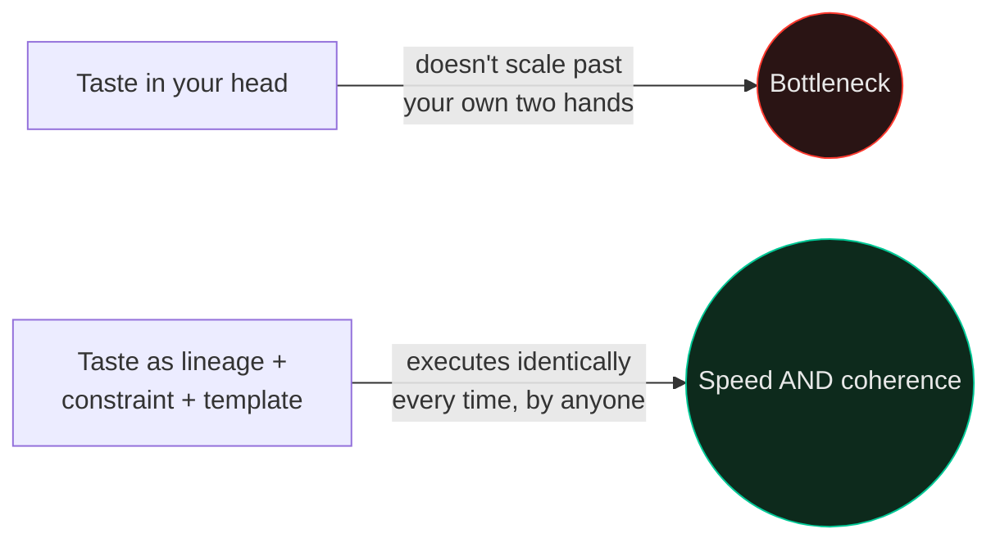
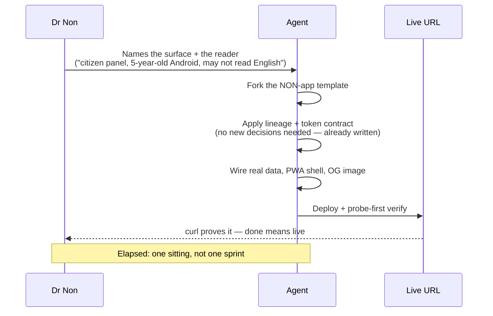

# Design at the Speed of Light

How a single person ships a coherent, production-grade visual system across twenty projects without a design team, a Figma handoff, or a design review meeting.

---

## The claim, made concrete

A public dashboard — real data, PWA, offline shell, service worker, live status fleet, OG image, philosophy copy in the founder's own voice — in one sitting. Not a wireframe. Not a mockup somebody later "builds." The actual thing, live, at a real URL, before the coffee's cold.

That's not a hiring pitch. It's an architecture — one that trades a design department for a written philosophy plus a template an agent can execute against without supervision. This playbook is that architecture, laid out.

---

## Why "fast" and "coherent" aren't in tension here

Most people assume speed and consistency trade off — move fast, things get sloppy; keep it consistent, you need review gates that slow everything down. That trade-off is real **only when taste lives in one person's head and has to be re-applied by hand, project by project.**

The fix is to move taste out of your head and into something an agent can execute:

Once taste is written down as [`axiom-design-core`](../skills/axiom-design-core/SKILL.md)'s lineage-and-mechanism reasoning, plus [`design-dna`](../skills/design-dna/SKILL.md)'s token contract, plus a literal starting template — an agent applies it identically on project twenty as on project one. The review gate collapses because there's nothing ambiguous left to review.

---

## The three moves that make this possible

### 1. One canonical template, forked and pruned — not rebuilt

The [NON-app pattern](../skills/design-dna/SKILL.md) is a real, working reference implementation: one HTML file, one service worker, one Cloudflare Worker for fleet status, one icon set. New personal/portfolio-shaped surfaces don't get designed from scratch — they fork that file, swap the content array, swap the philosophy strip, swap the OG image, ship.

*Copy-paste is fine for the first three instances.* By the fourth, extract the shared piece — but don't extract prematurely, either. Premature abstraction is its own kind of slowness.

### 2. The lineage does the deciding, not you

Every stuck moment in a design session is really a missing decision rule. "Should this card have a shadow?" isn't a taste question if you've already declared the lineage — Rams says no, decision made, keep moving. The lineage in [`axiom-design-core`](../skills/axiom-design-core/SKILL.md) exists specifically to delete these micro-stalls. An agent hits the same fork in the road you would have, and resolves it the same way, because the rule was written down before the fork appeared.

### 3. Constraint is the speed technique, not the tax

Three type sizes. One numeric font. A closed palette with named roles. Zero border-radius, absolute. These read as restrictions; they function as **default answers to questions you'd otherwise have to ask every time.** An unconstrained system is not more creative — it's just slower, because every component reopens questions the last one already answered.

---

## The build loop, in real time

This is what actually happens, start to a live URL, on a NON-app-shaped build:

No design review step exists in this loop, because there's nothing left that's ambiguous enough to need one. The philosophy and the token contract already made every call a reviewer would have made.

---

## What you say, and what you never say

**What actually gets said**, from real sessions: *"The citizen panel, for someone on a five-year-old Android in a flood, who may not read English."* One sentence. It names the surface and the reader — everything else is already decided by the lineage, the constraint ladder, and the accessibility layer (trilingual registers, colour-blind-safe theme, pictogram mode) that `axiom-design-core` bakes in by default.

**What never gets said:** font names, hex codes, spacing values, border-radius. If you're specifying pixels, the system underneath has a hole in it — go write the rule down instead of repeating the instruction.

---

## Where speed still has to yield

Not everything gets the fast path. Life-safety UI — alert composers, broadcast confirmations — gets the ceremony described in [`risk-posture`](../skills/risk-posture/SKILL.md): hold-to-confirm, auto-expiry, corroboration before alarm. Speed is the default; ceremony is the deliberate, named exception, not something skipped by accident because everything else was fast too.

Applying the fast path to a surface that needed the slow one is the actual failure mode here — not moving too fast in general, but forgetting which category a given screen falls into. Name the category before you start. See [`risk-posture`](../skills/risk-posture/SKILL.md) for exactly where that line sits.

---

## The honest version of "speed of light"

It isn't that decisions happen faster. It's that **most of the decisions were already made**, once, correctly, and written down — so a new surface only needs the two or three that are actually new: what data, for whom, on what device. Everything else — typography, color roles, motion, accessibility, the shape of the philosophy strip — is a lookup, not a debate.

That's the whole trick. Not talent moving at unusual speed. A system, built once, that removes almost every decision a new project would otherwise have to make from scratch.
