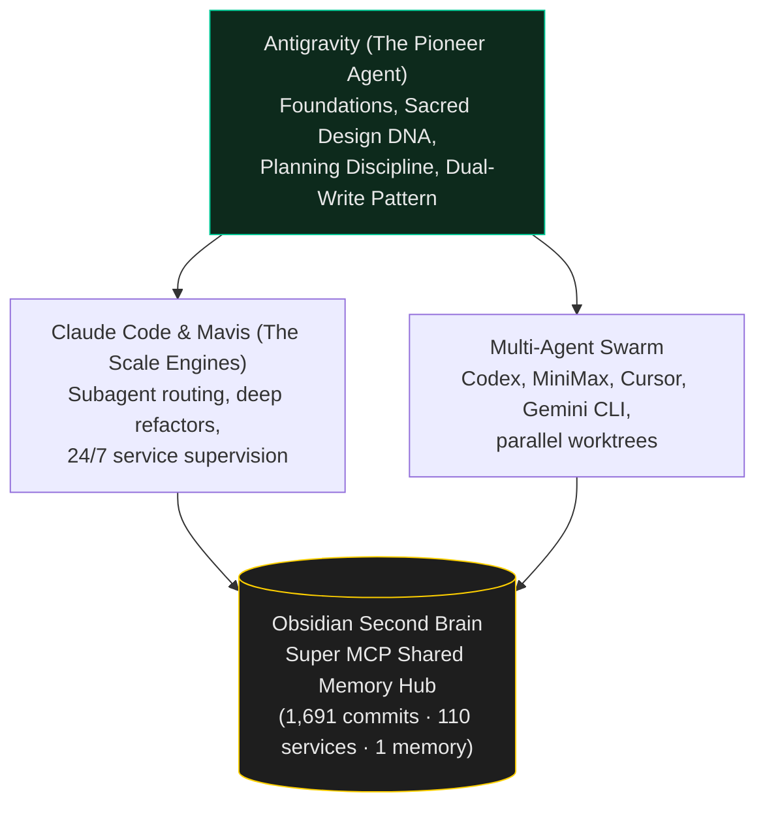

# The Antigravity Origin — The First Agent

> Before multi-agent worktrees, before Claude Code, Codex, or MiniMax — there was Antigravity. The founding layer where vibecoding became an engineering discipline.

The other playbooks in this repo show the mature operating system: the 1,691 commits, the 110 launchd services, the subagent routing trees, and the multi-agent swarms.

This playbook records **where it actually came from**. Antigravity was Dr Non's very first AI coding agent. When the practice began, there were no established templates, no three-tier `CLAUDE.md` ladders, and no off-the-shelf "vibecoding" playbooks. Everything had to be discovered under live fire across the first smart city dashboards, Telegram bots, and civic trackers.

---

## 1. Directing, Not Typing: The Pair Programming Origin

Dr Non is an architect, urban anthropologist, and Senior Smart City Expert at DEPA Thailand — not a professional software developer who writes boilerplate by hand. He directs systems at the level of intent, constraints, and urban impact.

In the earliest sessions with Antigravity, the fundamental dynamic of the entire practice was established:
- **The Human holds:** Taste, domain truth, system conservation laws, boundaries, and live evaluation.
- **The Agent holds:** Typing speed, API plumbing, boilerplate generation, syntax memory, and tireless iteration.

When pairing with an agent as a director, **code is a means to an end, never the product**. The product is a live, working URL that serves citizens and operators without crashing.

---

## 2. Forging the Sacred Design Invariants

If you look at the 65-repo monorepo today, every visual surface shares an unmistakable signature:
- **Zero border-radius** (except 50% true circles)
- **Zero gratuitous gradients**
- **Zero drop shadows** (only hairlines and inset focus rings)
- **One amber accent (`#f59e0b`)** — never default Tailwind blue
- **Max 3 text sizes per screen**, mobile-first layout (390px base)
- **Don Norman affordances** — interactive controls look unmistakably interactive

These were not post-hoc aesthetic preferences. They were forged during early Antigravity sessions when default LLM generation kept producing generic, bubbly, purple-gradient AI templates that looked like SaaS landing page clones.

Dr Non and Antigravity codified **Taste as a Constraint**:
> If an agent is given unbounded creative freedom, it averages into mediocrity. If it is given strict geometric invariants (Bauhaus precision × Vignelli clarity × Don Norman affordance), it produces crisp, professional tools at superhuman speed.

---

## 3. The Planning Mode Breakthrough

In early development, unconstrained agents would frequently perform "cowboy edits": an agent asked to adjust a button color would rewrite the whole component, delete 200 lines of delicate data-parsing logic, and break the live dashboard.

Antigravity pioneered the **Planning Mode Ritual**:

```
1. Research (Read-Only) → 2. Implementation Plan → 3. Approval Gate → 4. Surgical Execution → 5. Verification
```

Before changing a single file, the agent must produce an **Implementation Plan** declaring:
1. **The Conservation Law:** What must remain true after this change?
2. **The Sacred Items:** Which blessed components, maps, and interactive elements must not be touched?
3. **The Blast Radius:** Exactly which files and routes will be modified?
4. **The Proposed Diffs:** Minimal, surgical edits rather than full rewrites.

For a directing human, reading a 30-line plan takes 15 seconds. It turns AI collaboration from Russian roulette into a predictable surgical operation.

---

## 4. The Dual-Write Resilience Pattern

Early in the deployment of live civic tools (such as *Sabai Sabai / air-dnd* and emergency flood monitors), cloud database providers would occasionally pause free-tier instances, rotate API credentials, or hit connection pool limits during sudden traffic surges.

When a citizen checks a flood dashboard at 2 AM in heavy rain, a database 500 error is unacceptable.

Antigravity and Dr Non engineered the **Dual-Write Architecture**:
- **Primary Relational Store:** Supabase / Postgres for rich indexing, PostGIS spatial queries, and real-time updates.
- **Silent Mirror Store:** Fire-and-forget background append to Google Sheets API or flat JSON.
- **Failover Logic:** The client reads the primary DB with a 1.5s timeout. If unreachable, it falls back to the mirror immediately, serving data labeled with `{source: 'mirror', age: '2m'}`.

The result: public civic tools that run uninterrupted for months with zero maintenance calls.

---

## 5. From Session Silos to the Obsidian Super-MCP

As new agents joined the ecosystem — Claude Code, Codex, MiniMax, Cursor — a new danger emerged: **agent amnesia**. Antigravity would discover an obscure bug in a Cloudflare Worker at 10 AM, and Claude Code would fall into the exact same trap at 2 PM because its context window started fresh.

The solution was connecting all agents to a single, durable, local-first knowledge base: **Obsidian Second Brain** via the `obsidian-bridge` Super MCP.

- **Pre-flight:** Every agent runs `recall_lessons` before writing architecture.
- **Post-flight:** Every agent captures verified scars with `capture_lesson` directly to the vault.
- **Single Source of Truth:** `AGENTS.md` and `CLAUDE.md` unify the rules, while the Obsidian vault preserves the living memory.

---

## The Lineage



Antigravity proved that one person directing an AI agent could outpace an entire engineering team. Everything that followed — the later skills, the Mavis extensions, the Cursor desk, the multi-agent worktrees — was built upon this bedrock.
