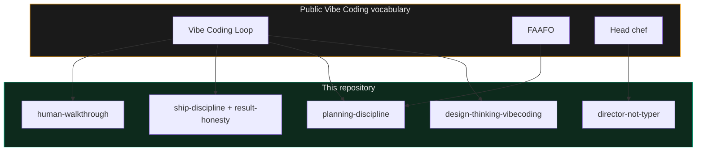
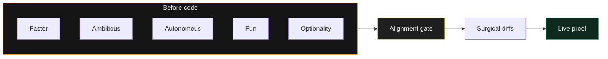
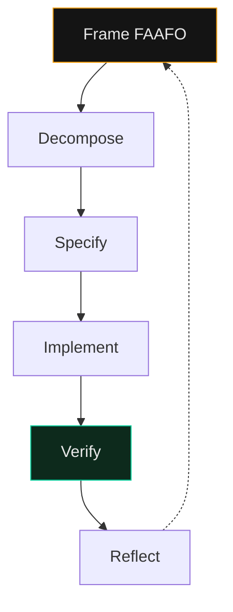
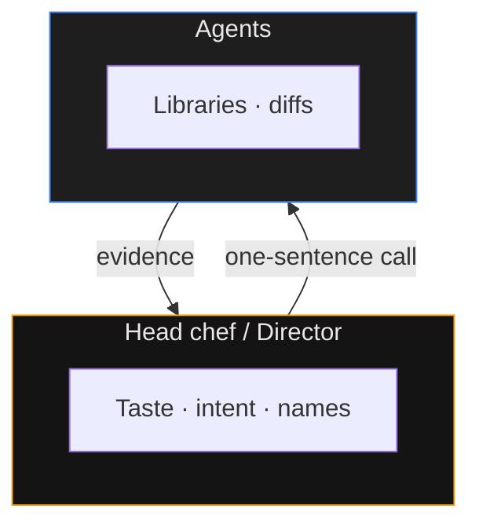

# 17 — Kim / Yegge FAAFO Bridge

> Public vocabulary from Gene Kim and Steve Yegge Vibe Coding work, wired onto **this** Thinker to Doer stack — not a second religion.

ภาษาไทยสั้น ๆ: FAAFO คือเลนส์วางแผน (เร็ว / กล้า / ทำเองได้ / สนุก / เหลือทางเลือก) — ใช้ก่อนให้เอเจนต์เขียนโค้ด แล้ววิ่งต่อด้วยสกิลเดิมของ repo นี้

**Sources (public only):**
- [The Value Of Vibe Coding (or, the Good FAAFO)](https://itrevolution.com/articles/the-value-of-vibe-coding-or-the-good-faafo/)
- [Essential Skills of a Vibe Coder](https://itrevolution.com/articles/essential-skills-of-a-vibe-coder/)
- [FAAFO Measurement Toolkit (PDF)](https://itrevolution.com/wp-content/uploads/2025/02/FAAFO-Measurement-Toolkit.pdf)

Executable skill: [`skills/vibe-coding-faafo/SKILL.md`](../skills/vibe-coding-faafo/SKILL.md).

---

## Why a bridge, not ten new skills

This repository already encodes the same operating system under local names: director / Spec-First / anti-regression / wrong-green / ship-discipline / walkthrough. Adding a parallel vibe-coding-loop pack would create catalog synonyms — a known failure mode.

FAAFO is useful as **shared language for outsiders**. The bridge maps their words to our folders.

---

## FAAFO to skills in this repo

| Dimension | Question for the director | Load here |
|---|---|---|
| **F**aster | What feedback must close in minutes? | [`browser-as-t`](../skills/browser-as-t/SKILL.md), [`canary`](../skills/canary/SKILL.md), [`ship-discipline`](../skills/ship-discipline/SKILL.md) |
| **A**mbitious | What was not worth it before agents? | [`design-thinking-vibecoding`](../skills/design-thinking-vibecoding/SKILL.md), [`ninja-innovation`](../skills/ninja-innovation/SKILL.md) |
| **A**utonomous | What can one Mac + agents finish alone? | [`director-not-typer`](../skills/director-not-typer/SKILL.md), [`full-stack-bootstrap`](../skills/full-stack-bootstrap/SKILL.md), [`staff-swarm`](../skills/staff-swarm/SKILL.md) |
| **F**un | What keeps flow? | [`prompt-like-dr-non`](../skills/prompt-like-dr-non/SKILL.md), [`caveman`](../skills/caveman/SKILL.md), playbook 01 |
| **O**ptionality | Which paths stay open until evidence? | [`planning-discipline`](../skills/planning-discipline/SKILL.md) FAAFO block, [`ponytail`](../skills/ponytail/SKILL.md), [`subagent-routing`](../skills/subagent-routing/SKILL.md) |

---

## Vibe Coding Loop to Spec-First

| Loop beat | Here |
|---|---|
| Frame objective | FAAFO block + [`design-thinking-vibecoding`](../skills/design-thinking-vibecoding/SKILL.md) |
| Decompose | [`planning-discipline`](../skills/planning-discipline/SKILL.md) step 2 |
| Specify | Alignment gate — stop before edits |
| Implement | [`karpathy-guidelines`](../skills/karpathy-guidelines/SKILL.md) |
| Verify | [`browser-as-t`](../skills/browser-as-t/SKILL.md), [`wrong-green`](../skills/wrong-green/SKILL.md), [`result-honesty`](../skills/result-honesty/SKILL.md) |
| Reflect | [`lesson-residue`](../skills/lesson-residue/SKILL.md), [`human-walkthrough`](../skills/human-walkthrough/SKILL.md) |

---

## Head chef vs line cook

Matches [`director-not-typer`](../skills/director-not-typer/SKILL.md):

---

## Essential skills map

| Public essential skill | Primary home here |
|---|---|
| Fast / frequent feedback | `browser-as-t`, `canary`, `deploy-verification` |
| Modularity | `ponytail`, `stack-repo-topology`, `karpathy-guidelines` |
| Deliberate learning | `lesson-residue`, `learn`, `improvement-radar` |
| Craft mastery | `prompt-like-dr-non`, `adversarial-review`, playbook 15 |

Risk surface: [`reference/vibe-coding-failure-patterns.md`](../reference/vibe-coding-failure-patterns.md).

---

## How a first-timer uses this

1. Read [`START_HERE.md`](../START_HERE.md).
2. Scaffold under [`projects/`](../projects/README.md).
3. Ask the agent to use `$vibe-coding-faafo` then `$planning-discipline` before any edit.
4. Ship with `$ship-discipline`. Never call localhost done.

This playbook is the **why**. The skill is the **checklist**. The rest of the repo is the **proof**.
