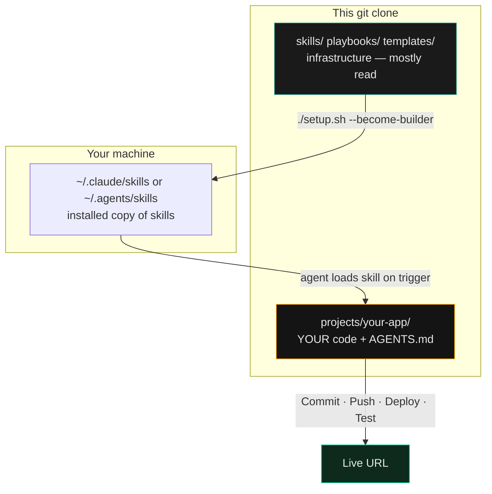
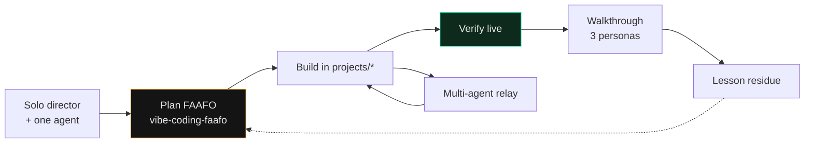

# `projects/` — where your software lives

This folder is empty on purpose. The rest of the repository is **infrastructure** (skills, playbooks, templates). **Your apps go here.**

สำหรับคนที่ไม่เคยเขียนโค้ด: อย่าแก้โฟลเดอร์ `skills/` เป็นโปรเจกต์แรก — สร้างแอปใต้ `projects/` แล้วให้เอเจนต์ทำงานที่นั่น

---

## Mental model



| Layer | Role |
|---|---|
| Repo root skills | How agents behave (reusable) |
| `projects/<name>/` | What you are shipping (product) |
| Host skill install | Same skills available in every chat tool |

Do **not** commit secrets into either layer. See `reference/security-hygiene.md`.

---

## Create your first app (no coding required to scaffold)

From the **repo root**:

```bash
./setup.sh --become-builder
scripts/new-project.sh projects/my-first-app --stack next --workspace
```

That writes, inside `projects/my-first-app/`:

- `AGENTS.md` / `CLAUDE.md` / `GEMINI.md` — project contract
- `.gitignore`, `.env.example`
- `docs/lessons/`
- `scripts/deploy.sh`, `scripts/verify.sh`
- starter `README.md` and git init

Then open any AI agent **in that project folder** and paste `HANDSHAKE.md`. Ask it to fill the contract and scaffold the real app.

---

## Workflows this shape unlocks



- **Solo vibe coding** — Spec-First plans.
- **Relay** — several agents; see playbook 14.
- **Walkthrough / hindsight** — needs a live URL under `projects/`.
- **Many apps** — `--workspace` adds Tier-1 index at `projects/CLAUDE.md`.

## What not to do

- Don't treat the skills repo root as your Next.js app root.
- Don't skip the project contract.
- Personal rename later: `FORK.md`.

Next: `START_HERE.md`.
