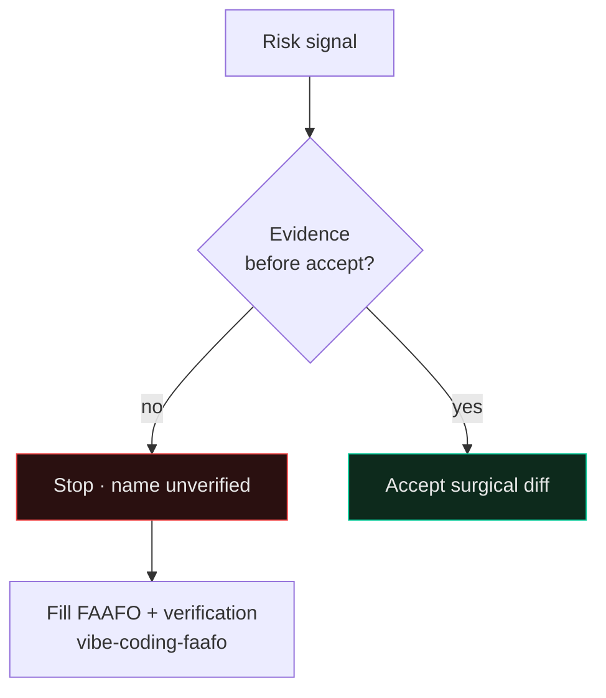

# Vibe Coding Failure Patterns → This Stack

Public framing from Gene Kim & Steve Yegge's *Vibe Coding* materials (FAAFO / essential skills articles and toolkit). **Patterns only** — not book text. Mitigations point at skills in this repository that were paid for by real incidents.

| Failure pattern | What it looks like | Mitigate with |
|---|---|---|
| Silent test / guard deletion | Agent "simplifies" by removing checks under pressure | [`anti-regression`](../skills/anti-regression/SKILL.md), [`careful`](../skills/careful/SKILL.md), [`adversarial-review`](../skills/adversarial-review/SKILL.md) |
| Haunted codebase | Nobody understands the generated tree; edits are guesswork | [`power-of-hindsight`](../skills/power-of-hindsight/SKILL.md), [`lesson-residue`](../skills/lesson-residue/SKILL.md), playbook 16 |
| Context saturation | Long chats; agent forgets invariants; invents APIs | [`context-economy`](../skills/context-economy/SKILL.md), [`context-save`](../skills/context-save/SKILL.md) / [`context-restore`](../skills/context-restore/SKILL.md), [`agent-memory`](../skills/agent-memory/SKILL.md) |
| Blind diff acceptance | "Looks fine" without running or curling | [`result-honesty`](../skills/result-honesty/SKILL.md), [`browser-as-t`](../skills/browser-as-t/SKILL.md), [`wrong-green`](../skills/wrong-green/SKILL.md), [`ship-discipline`](../skills/ship-discipline/SKILL.md) |
| False green | CI/health OK while the product is dead | [`wrong-green`](../skills/wrong-green/SKILL.md), [`deploy-verification`](../skills/deploy-verification/SKILL.md), [`canary`](../skills/canary/SKILL.md) |
| Over-ambition without modules | One mega-prompt → unmaintainable blob | [`planning-discipline`](../skills/planning-discipline/SKILL.md), [`ponytail`](../skills/ponytail/SKILL.md), [`stack-repo-topology`](../skills/stack-repo-topology/SKILL.md) |

See also [`playbooks/06-war-stories.md`](../playbooks/06-war-stories.md) and [`playbooks/17-kim-yegge-faafo-bridge.md`](../playbooks/17-kim-yegge-faafo-bridge.md).
