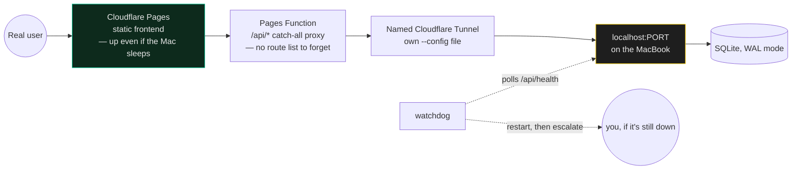
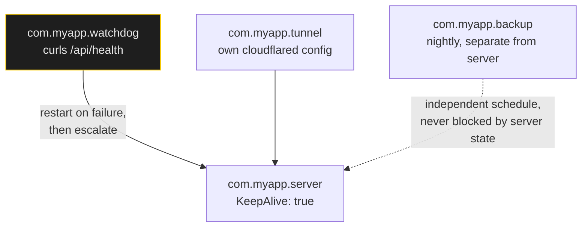

# Always-On Services

> 110 launchd services and 24 public hostnames run from one MacBook. No VPS, no Kubernetes, no monthly bill beyond a domain.

This is the infrastructure layer of solo vibecoding. It's how a prototype becomes something a city can actually depend on, without becoming a DevOps job.

*Visual summary: [`INFOGRAPHICS.md`](../../INFOGRAPHICS.md), page 13.*

---

## The stack

| Layer | Tool | Why this one |
|---|---|---|
| Process supervision | **launchd** (macOS) | Native, survives reboot and logout, restarts on crash, no daemon to babysit |
| Public URL | **Cloudflare Tunnel** | No open ports, no static IP, free TLS, works behind any NAT |
| Static frontend | **Cloudflare Pages** | Free, global, decoupled from your laptop being awake |
| Local store | **SQLite** (WAL mode) | One file, no server, handles a 1.2 GB dataset without complaint |
| Node process manager | **pm2** (only where launchd is awkward) | Log rotation is genuinely nice |

**The shape that works:** static frontend on Pages → Pages Function proxies `/api/*` → named tunnel → `localhost:PORT` on the Mac.

If the laptop sleeps, the site still loads; only live data goes stale. That degradation is graceful, and it's why the frontend never lives on the laptop.



---

## The service pattern

Every service gets **three** launchd jobs, not one:

| Job | Label | Does |
|---|---|---|
| Server | `com.myapp.server` | The process itself, `KeepAlive: true` |
| Tunnel | `com.myapp.tunnel` | `cloudflared` with its **own** config file |
| Watchdog | `com.myapp.watchdog` | Periodically curls the health endpoint; restarts and escalates on failure |

Plus a nightly `com.myapp.backup`. Four small jobs beat one clever one.



One job trying to be all four is the version that silently stops restarting, stops backing up, and stops telling you, all at once, the day it needed to do all three.

Template: [`templates/service.plist.template`](../../templates/service.plist.template).

The commands you'll use constantly:

```bash
launchctl bootstrap gui/$(id -u) ~/Library/LaunchAgents/com.myapp.server.plist   # install
launchctl kickstart -k gui/$(id -u)/com.myapp.server                             # restart
launchctl print gui/$(id -u)/com.myapp.server | head -30                         # status + last exit
```

Put the restart line in your project's `CLAUDE.md`. Agents cannot guess your label.

---

## Give every tunnel its own config file — this is not optional

`cloudflared tunnel run <name>` with no `--config` flag silently falls back to `~/.cloudflared/config.yml`. If two tunnels both fall back, **they overwrite each other's ingress routing** and two unrelated products go down together, with no error anywhere.

That happened. The fix is structural:

```yaml
# ~/.cloudflared/config.yml — deliberately inert
# Every tunnel has its own config, loaded via an explicit --config flag in its plist.
# Do not add ingress here. Give any new tunnel its own file.
ingress:
  - service: http_status:404
```

Then per-service `~/.cloudflared/myapp.yml`, referenced explicitly in `ProgramArguments`. Template: [`templates/tunnel.yml.template`](../../templates/tunnel.yml.template).

---

## Watchdogs, and what they must actually check

A watchdog that checks the wrong thing is worse than none — it manufactures confidence.

Real example: a disk watchdog monitored `/` and reported healthy for weeks while the service crash-looped on a full disk. On macOS the data volume is `/System/Volumes/Data`. The watchdog was checking a read-only snapshot that is never full.

**Rules:**
- Check the thing that actually fails, not the thing that's easy to check.
- Watchdog escalates: restart once → restart again → notify a human. Infinite silent restarts hide a real outage.
- Log every restart with a timestamp. "How long has this been flapping?" must be answerable.
- Rotate logs. `ENOSPC` from unrotated logs will take down the service *and* everything else on the machine.

---

## Disk is the failure mode nobody plans for

A SQLite DB growing 10–30 MB/day is invisible until the volume fills. Then **every** service ENOSPC-crash-loops simultaneously, including the ones that would have told you.

- Give services an explicit archive path on external storage; make it configurable via env (`APP_DB_PATH`).
- Nightly backup job, separate from the server job.
- A disk watchdog that alerts at 85%, not 99%.
- Biggest safe reclaims on a dev Mac: `~/.npm/_cacache`, `~/Library/Caches/`, Playwright/Chrome browser caches.

---

## Health endpoints are a contract

Every service exposes `/api/health` returning JSON: status, timestamp, last successful ingest per source. That endpoint is what the watchdog polls, what the deploy script verifies, and what you `curl` when someone says "is it down?".

```bash
curl -sS https://api-myapp.example.org/api/health | python3 -m json.tool
```

If your service can't answer that in one line, you don't have a service. You have a script that happens to still be running.

---

## What this buys you

Personal projects with the operational properties of production systems: they survive reboots, restart on crash, hold public HTTPS URLs, back themselves up, and tell you when they're sick.

Cost: a domain, some `.plist` files, and about an hour the first time.
