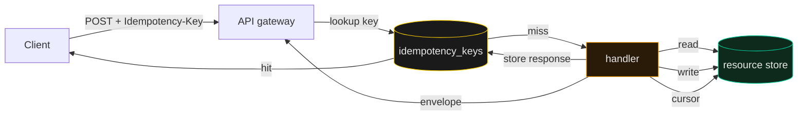

# API Design

> A good REST API is a vocabulary, not a procedure — clients should compose calls the way they compose sentences, not call a custom method per screen.

Most API pain comes from one of three mistakes: verbs in the URL where nouns belong, no pagination contract until the table overflows, and mutation endpoints that double-charge on retry. This skill gives you the small set of rules that prevent all three, plus the GraphQL escape hatch you should keep in your back pocket for genuinely fan-in reads.

The discipline is older than any framework. Roy Fielding's thesis gave us the verbs (GET / POST / PUT / PATCH / DELETE); the rest is conventions built by the teams that paid for skipping them — Stripe for idempotency, GitHub for cursor pagination, Heroku for the error envelope. You do not need to reinvent any of it; you need to apply it.

---

## The core claim

Nouns in URLs, HTTP verbs as verbs, and one error shape across every endpoint. If a client can retry a failed POST by sending the same idempotency key, you have done your job. If they cannot, the API is fragile and the burden of dedupe silently shifted to whoever writes the next integration.

The fastest way to lose a customer is not a missing feature — it is an API that double-charges, returns a 200 with a stack trace in the body, or silently skips rows because the offset shifted between pages. None of these are hard to prevent; all of them are easy to ship if nobody on the team had a list. This skill is that list.

Pagination is not a feature you add later. A list endpoint with `?page=2` will fall over the moment a row is inserted between page 1 and page 2, and a client somewhere is going to miss a record because of it. Cursor pagination is two extra lines of code today; it is a six-month migration the day your table crosses 100k rows.

Idempotency, pagination, the error envelope — none of these are interesting when you draw them on a whiteboard. They are the kind of "boring" infrastructure that pays for itself the first time you have a customer in production and a network blip retries a charge. The teams that skip them always pay later; the teams that adopt them forget they exist.

---

## When to load

- Sketching a new public or partner API before writing the first route handler.
- Reviewing an OpenAPI / Swagger spec for an existing service.
- Choosing between REST and GraphQL for a new read-heavy surface (dashboards, feeds, search).
- Designing a webhook-style callback contract or a long-running job status endpoint.
- Picking an error envelope after the third team has already rolled their own.
- Adding pagination, sorting, or filtering to a list endpoint that is about to be public.
- Migrating from offset to cursor pagination because the table grew past 100k rows.

## The moves

### Resource modeling — nouns, not verbs

URLs describe **what**, methods describe **what to do with it**. `POST /orders` creates; `GET /orders/123` reads; `PATCH /orders/123` mutates a subset. If your URL contains `createOrder` / `runReport`, you have reinvented RPC over HTTP and lost the cache, retry, and tooling that come free with verbs.

```http
POST /v1/orders
GET   /v1/orders?cursor=eyJ0IjoxNzE...&limit=50
PATCH /v1/orders/ord_123 { "status": "shipped" }
```

### Idempotency keys on every mutating POST

`POST /v1/charges` with an `Idempotency-Key: <uuid>` header means "this exact payload, applied at most once, in a 24-hour window." If the client times out and retries, the second request returns the original response from a short-lived store keyed by `(account_id, idempotency_key)`. Stripe proved this works at scale; the implementation is `INSERT ... ON CONFLICT DO NOTHING` plus a row in an `idempotency_keys` table.

```bash
# Pseudocode — never charge twice for the same client retry
INSERT INTO idempotency_keys (key, response_body, status, expires_at)
VALUES ($1, $2, $3, now() + interval '24 hours')
ON CONFLICT (key) DO NOTHING
RETURNING response_body;
```

### Cursor pagination, not offset

`?limit=50&cursor=<opaque>` — cursors are base64-encoded `(timestamp, id)` tuples or `(sort_key, id)`. Clients never construct them; they only echo back whatever the previous page returned. Offset pagination is a footgun for any table where rows can be inserted between requests, and for any table past 100k rows it gets slow because the DB still scans the skipped rows.

```bash
# Edge case — never use a numeric page number for an infinite feed
SELECT * FROM events WHERE (ts, id) < ($cursor_ts, $cursor_id)
ORDER BY ts DESC, id DESC LIMIT 50;
```

### One error envelope, everywhere

```json
{ "error": { "code": "order_not_found", "message": "...", "request_id": "req_abc" } }
```

Stable `code` string for programmatic handling; human `message` for logs; `request_id` for cross-system grep. Same shape for 400, 401, 403, 404, 409, 422, 429, 500. Do not put the HTTP status text in `code` — clients should branch on the code, not parse English.

### When GraphQL is the right answer

GraphQL wins when **one client** (a SPA, a mobile app) needs to compose reads from **many resources** into **one screen**, and the cost of N+1 round trips is real. Dashboards, feed views, complex admin tables. GraphQL loses when you have many small clients, or when the data is mostly write-shaped, or when you can pre-aggregate server-side. The 80% case is REST with a thin `?include=order.items,customer` expander; reach for GraphQL when that stops being enough.

### Versioning without breaking clients

Two patterns, both valid. **URL versioning** (`/v1/orders`, `/v2/orders`) is loud and easy to grep, costs you a duplicate router, and is what Stripe and GitHub do. **Header versioning** (`Accept: application/vnd.acme.v2+json`) keeps URLs clean but makes cache keys harder and surprises the next developer. For a solo builder, URL versioning wins on debuggability. The rule is the same in both: never break a contract; ship v2 alongside v1 and deprecate the old one on a date, not a hope.

### Rate-limit headers are part of the contract

If you return `X-RateLimit-Limit`, `X-RateLimit-Remaining`, and `X-RateLimit-Reset` (or the RFC 9239 / draft `RateLimit-*` headers) on every response, polite clients can back off before they 429 and angry clients can debug their own misbehavior from the headers alone. Hiding the limit is hiding the API. See [`../rate-limiting/SKILL.md`](../rate-limiting/SKILL.md) for the algorithm side.

### Filter and sort belong in the query string

`GET /v1/orders?status=open&created_after=2026-01-01&sort=-created_at` is the convention. Reserved keys: `cursor`, `limit`, `include`. Anything else is a free-form filter the handler parses against a whitelist — never pass arbitrary keys to a query builder, that is how SQL injection sneaks past an ORM. Validate against a known schema; reject unknown fields with 400.

### Write the OpenAPI before the handler

A short OpenAPI 3.1 document is the cheapest contract you will ever sign. Generate request/response types from it (openapi-typescript, oapi-codegen, FastAPI's own generation), then write handlers that satisfy those types. The cost is one YAML file; the payoff is clients that can ship without ever asking you "what does this endpoint return on error?" Generate it in CI, lint it with `spectral`, publish it on every release.

## Anti-patterns to refuse on principle

- **Verbs in the URL.** `/createOrder`, `/runReport` — call `POST /orders` and `POST /reports` instead.
- **`?page=2` on any list that can grow during iteration.** Use a cursor from day one.
- **Stack traces in `message`.** Clients should never see file paths or library names; log them server-side, ship a `request_id` to the client.
- **HTTP status as the only signal.** Always return the envelope body — many HTTP clients swallow non-2xx bodies.
- **Returning arrays at the root.** Always wrap in `{ "data": [...], "cursor": "..." }` so you can add metadata without breaking every consumer.
- **DELETE returning 200 with a body.** Convention: 204 No Content, or 200 with the deleted resource if the client needs to confirm what was removed. Pick one and stick to it.
- **Per-endpoint error shapes.** If two endpoints return two different error formats, the contract has already rotted. The envelope is one JSON path deep — keep it boring.

## The architecture



A single idempotency-store lookup sits between the gateway and every mutating handler. Hit → replay the stored response, no work. Miss → handler runs, writes to the store atomically with the resource write, returns the envelope. The store is the same shape regardless of which resource the URL points at — that uniformity is the point.

Read flow is simpler: cacheable GET hits an edge layer first, falls through to the handler, which reads from the resource store with the cursor it received. The shape of the diagram is intentionally boring — the discipline is in the contracts (cursor, idempotency key, error envelope), not in exotic infrastructure.

## Connects to

- [`../honest-envelope/SKILL.md`](../honest-envelope/SKILL.md) — error envelope is the same shape, success and failure.
- [`../dual-write-resilience/SKILL.md`](../dual-write-resilience/SKILL.md) — idempotency keys are a dual-write cousin; both rely on the same `INSERT ... ON CONFLICT` discipline.
- [`../risk-posture/SKILL.md`](../risk-posture/SKILL.md) — public APIs raise the blast radius; design to that posture, not the internal one.
- [`../data-catalog/SKILL.md`](../data-catalog/SKILL.md) — the resource model is the catalog; keep them in sync.
- [`../appsec-stack/SKILL.md`](../appsec-stack/SKILL.md) — auth, rate limit, and input validation live at the gateway layer this skill assumes.
- [`../webhooks-reliable/SKILL.md`](../webhooks-reliable/SKILL.md) — outbound webhooks use the same idempotency contract, just inverted (server is the client).

## For the full thing

- *RESTful Web APIs* (Richardson, Amundsen, Ruby, 2013) — the book that made the rules mainstream.
- Stripe API docs — the canonical idempotency-key reference implementation.
- The GitHub REST API — cursor pagination and error envelope in production.
