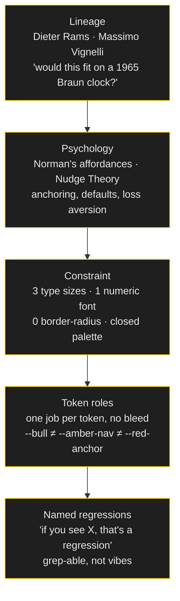

# Axiom Design Core

> A design system tells an agent *what* the rules are. This skill is *why* they're rules at all — so a fresh decision, not covered by any rule yet, still comes out right.

Named for Axiom, the practice this grew out of. `design-dna` is the contract — tokens, forbidden combinations, named regressions. This is the reasoning underneath the contract, for the moment an agent hits a decision the contract didn't anticipate.

*Visual summary: [`INFOGRAPHICS.md`](../../INFOGRAPHICS.md), pages 8–9.*

---

## The stack of reasons



Each layer produces the one below it. Skip a layer and the one below becomes arbitrary — a rule with no reason an agent (or a junior designer) can extend correctly under pressure.

---

## Layer 1 — Pick a lineage, not a mood

"Clean and modern" gives an agent nothing to reason from. A lineage gives it a test:

> This descends from Dieter Rams and Braun. Every new component must answer *"would this fit on a 1965 Braun travel clock?"* before it ships. Decorative → remove it. Informational → expose it with mathematical precision.

That single sentence resolves hundreds of future micro-decisions without a rule existing for each one. It's why `daytraders` and `nonarkara.org` both read as *one hand*, despite an agent having built most of both: the lineage is the load-bearing part, the specific tokens are just its shadow.

Other lineages that hold up the same way: Vignelli's modular grid + route-color system (used for NSP — an NBTC-commissioner-grade transit surface needs a transit-grade visual language, not a startup one). Tufte's data-ink minimalism. Swiss brutalist web. Pick one **that matches what the surface is actually for** — a trading desk and a flood-safety panel should not share a lineage, and they don't in this stack.

---

## Layer 2 — Borrow psychology on purpose

Every non-decorative choice traces to a named mechanism, not a hunch:

| Mechanism | What it does | Where it shows up |
|---|---|---|
| **Affordances** (Norman) | Elements suggest their own use — raised = pressable, pill = tappable | Every button, every chip |
| **Signifiers** (Norman) | Visual cues for *where* to act — arrows, chevrons, accent color at the action point | The single amber "wayfinding" channel |
| **Feedback** (Norman) | Immediate response to every interaction | Press states, not just hover states — hover doesn't exist on the phone most of your users are on |
| **Mapping** (Norman) | Layout mirrors meaning | Important flows top→bottom; time flows left→right |
| **Anchoring** (nudge) | The most important number is shown first and largest | Hero numbers get Display size; nothing else does |
| **Default effect** (nudge) | Pre-select the good option | Warm/accessible theme as default where the audience needs it, not an opt-in buried in settings |
| **Loss aversion** (nudge) | Frame as *"don't miss"* not *"you could gain"* | Life-safety copy: "band rising" reads more urgently than "band changed" |
| **Progressive disclosure** | Hide complexity, reveal on demand | Why-this-band reasoning panel, closed by default, open at watch+ |

None of these are decoration. Each is doing a specific cognitive job. If a component can't name which mechanism it's using, it's probably decoration wearing a design-system costume.

---

## Layer 3 — Constrain until it's boring

A system with infinite options produces infinite small inconsistencies — an agent given "pick a font size" will pick a *different* wrong one every session. Constraint isn't a limitation on taste; it's what makes taste **reproducible across a hundred future decisions you won't personally review.**

The constraints that have held across every surface in this stack:

- **Three type sizes.** Display / Body / Micro. Not four, ever.
- **One font per role, closed set.** A display face, a body face, a mono face for every number. Banned list stated explicitly (Inter/Roboto/Poppins — the fonts an agent reaches for by default).
- **One geometric decision, absolute.** Zero border-radius, or Rams-style hairlines-only, or whatever fits the lineage — enforced in CSS with `!important`, not left as a suggestion.
- **A closed palette with named roles.** See Layer 4.

Full enforcement mechanics — the CSS reset, the anti-regression list, the exact "if you see X, that's a regression" phrasing — live in [`design-dna`](../design-dna/SKILL.md). This skill is *why* those constraints are the right ones; that skill is *how* they survive contact with an agent.

---

## Layer 4 — One token, one job, no bleed

The most common way a design system rots isn't a rogue new color. It's an *existing* token quietly picking up a second job:

```
--amber-nav   →  wayfinding ONLY (nav underline, active tab, heartbeat line)
--bull        →  signal ONLY (gain, buy, positive state)
--bear        →  signal ONLY (loss, sell, negative state)
--red-anchor  →  brand identity ONLY (the wordmark dot — never P&L, never alerts)
```

State the invariant as a sentence an agent can check against a diff:

> Amber = wayfinding. Green = signal. Red = signal-loss or brand. These three channels must never bleed into each other.

The day someone (human or agent) reaches for `--bull` on a nav element because it's "the green one and this needs to feel active" is the day the system starts reading as arbitrary instead of intentional. Catching that requires the rule to be *written down as a rule*, not held as a feeling.

---

## Layer 5 — Design for the reader who can't read easily

This is the layer most design systems skip, and it's the one that matters most on a surface a citizen opens during a flood:

- **Trilingual as default, not a toggle bolted on.** TH / EN / ZH on every reader-facing surface, each in its **own register** — not machine-translated copies of each other. ZH short and declarative. TH modern first-person professional. EN investor-grade fragments. Same information, three different rhetorical postures, because the same sentence doesn't land the same way in three languages.
- **A colour-blind-safe theme as a first-class mode**, not an accessibility afterthought — tuned for protanopia/deuteranopia, AAA contrast, no blue light for night use.
- **Pictogram-only mode** where literacy can't be assumed. If the design system only works for someone who reads fluently in your primary language, it isn't done.
- **Large-text mode** for elderly users, as a real toggle with its own tested layout — not "the browser can zoom."

> *"Public service is measured by who it leaves behind."*

A beautiful typographic hierarchy that only serves a fluent, sighted, young reader is not a finished design system. It's a demo.

---

## Layer 6 — Motion and voice are part of the system too

**Motion:** every animation answers a real state change — a sheet rising because a modal opened, a dot dimming because data went stale, a number ticking because it changed. No motion "for delight" with no state behind it. Motion is a system property, not a folder (from [emilkowalski/skills](https://github.com/emilkowalski/skills) and [iart-ai/web-animation-skills](https://github.com/iart-ai/web-animation-skills)):

- **Easing is semantic.** Enter → `ease-out` (decelerate into place); exit → `ease-in` (accelerate out); in-between → `ease-in-out`. `ease-in` on enter feels dated; linear reads as a website. iOS-native `cubic-bezier(0.2, 0.8, 0.2, 1)` / `spring` reads as platform, not web.
- **Duration is hierarchy.** Micro-interactions 120–200ms; transitions 250–350ms; page/section reveals 400–600ms. Longer is not more premium — it is slower.
- **Properties are physical.** Animate `transform` and `opacity` only (GPU, 60fps). Never animate `width/height/top/left` or box-shadow directly — use scale + opacity + shadow tint tied to `transform`.
- **Shadows over borders.** A semi-transparent shadow (`rgba(0,0,0,0.08)`) reads as elevation; a solid border reads as a wireframe. Prefer shadow for cards that float, border for dividers that sit.
- **Find animation opportunities, then say no.** Check empty→loading→content, hover→focus, stale→fresh, number tick, sheet/overlay. Most surfaces need 2–3 places, not 20. Every extra motion is a tax — `prefers-reduced-motion` respected, `transform`/`opacity` only, under 300ms for ordinary UI.

Influences: [emilkowalski/skills](https://github.com/emilkowalski/skills) (`animate` · `review-animations` · `find-animation-opportunities` · `animation-vocabulary`), [iart-ai/web-animation-skills](https://github.com/iart-ai/web-animation-skills) (GSAP/SVG/Lottie/60fps/a11y).

**Voice:** terse, no padding, no "Welcome to my portfolio." A quiet strip of copy near the bottom of a personal surface that explains *how the system works*, not what it wants you to feel — mundane fact leading into a small philosophical turn, no forced conclusion, dry humour permitted. That register is itself a design decision, held to the same "would this fit the lineage" test as a border-radius.

---

## Applying this to a component that has no rule yet

The actual test, every time:

1. **What is this component's job** — informational or decorative? If decorative, remove it or justify it against the lineage.
2. **Which psychological mechanism is it using?** If you can't name one, it's probably noise.
3. **Which existing token owns this role?** If none does and you need a new one, does it get exactly one job, forever?
4. **Does it survive on a low-end Android, in the reader's second language, for someone who can't read fine print?**
5. **Would this fit on the 1965 Braun clock** — or whatever your lineage's version of that question is?

If a component passes all five, it belongs. If an agent generated it without being asked these five questions, review it before it ships — this is exactly the gap `design-dna`'s named-regression list exists to catch.

---

## The product vs marketing split (from kuras3)

Marketing UI optimizes for an unforgettable artifact; product UI (dashboards, SaaS, tables, forms, settings) optimizes for **restraint that looks shipped**. The disciplines diverge:

|  | Marketing ceiling | Product floor |
|---|---|---|
| **Goal** | Distinctive, memorable, brand-forward | Correct, fast, restrained, no slop |
| **Failure mode** | Sterile template | Grain/glow/mesh + custom cursor leaking into a dashboard |
| **Rule** | See `no-design-tells` §4 liveliness + §6 Hard Gates | Same gates, but ENERGY/RHYTHM low; floor is correctness before character |

Observe before invent (kuras3): anchor values to measured real products (Linear, shadcn, Apple settings) — not "modern and clean." Run the output-time hard-check + `scan-tells.py` mental grep on every shipped surface. Most dashboards need the product floor; marketing ceilings belong only where the brief is explicitly expressive.

Influences: [kuras3/product-ui-design](https://github.com/kuras3/product-ui-design) (floor/ceiling + observe + hard-checks), [pbakaus/impeccable](https://github.com/pbakaus/impeccable) (`PRODUCT.md` + 61 detectors + `audit`/`polish`/`bolder`/`quieter` verbs).

## See also

- [`design-dna`](../design-dna/SKILL.md) — the enforcement layer: tokens, CSS resets, the exact regression phrasing to grep for
- [Design at the speed of light](../../playbooks/07-design-at-the-speed-of-light.md) — how this philosophy stays fast instead of becoming a bottleneck
- [`BLUEPRINT.md`](../../BLUEPRINT.md) — bootstraps a new project with these defaults already wired in
