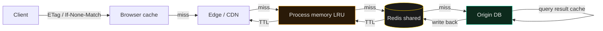

# Caching Layers

> There is no "make it faster" without choosing which layer pays for it — and the wrong layer pays back pain.

Caching is not "add Redis." Caching is a stack of four layers, each with a different hit rate, invalidation cost, and failure mode. Most "cache problems" I see are not bugs in Redis — they are layers used in the wrong order, or a single layer stretched across a job it was not designed for.

The rule: cache as close to the consumer as you can get away with. The cheapest byte served is the byte the client already has. The most expensive byte is the one that crosses the database twice on the same request.

---

## The core claim

Four layers, named in order of distance from the request: **browser/edge**, **in-process memory**, **shared (Redis/Memcached)**, **DB-result cache inside Postgres or its proxies**. Each layer answers a different question — "did this client see this already?", "did this process see this already?", "did any process see this already?", "did the DB compute this already?". Mixing them up is where the bugs live.

Thundering-herd is the failure mode every team meets the first time a popular key expires at the worst moment. The fix is not "make the TTL longer" — it is single-flight: when N requests hit a cold key, only the first one runs the loader; the rest wait on the same future.

The cost of a wrong cache is not a slow query — it is data that disappears, users who see another user's data, or a deploy that quietly served yesterday's HTML for a year. Treat cache invalidation with the same rigor as a database migration; both are state transitions you cannot undo by restarting the service.

---

## When to load

- Cutting p95 latency on a hot read path that the DB is already tired of serving.
- Designing cache invalidation for a write-heavy endpoint where stale data is a real cost.
- Picking between cache-aside, write-through, and stale-while-revalidate (SWR) for a new feature.
- Avoiding stampedes when a popular key expires and N workers all try to regenerate it at once.
- Pre-deploy review of the CDN config — the edge is the API for static clients, and "the CDN lies" is a deploy rule in itself.
- Debugging "we deployed and the old JS is still running" incidents — almost always a missing version stamp on a cache key.
- Choosing a Redis replacement (DragonflyDB, KeyDB, in-memory LRU) when Redis itself becomes the bottleneck.
- Designing cache invalidation for a write-heavy endpoint where stale data is a real product cost.
- Picking a TTL for a new key without a clear policy; this skill gives you the default short-TTL + explicit invalidate-on-write.

## The moves

### Four layers, one decision tree

```
Is the result the same for every user?      → CDN/edge, long TTL, versioned key
Is it the same within this process for ~s?  → in-process LRU, ~MBs, no shared state
Is it the same across processes for ~min?   → Redis / Memcached, network hop, OK
Is it the same expensive DB computation?    → materialised view / query result cache
```

If you cannot articulate which question your cache answers, you have an `LRUCache` instance living where a Redis lookup should be — and you will discover it the first time you scale to N>1.

The order matters for cost, not for correctness. The edge is free per request but expensive to debug. In-process memory is free per request but invisible to other processes. Redis is a network hop. DB-result caches are inside your DB. Pick the cheapest layer that satisfies the question, and only escalate when the layer below cannot keep up.

### Cache-aside vs write-through vs SWR

**Cache-aside** — read: lookup cache, miss → load from origin, write to cache. Write: invalidate (or do nothing). Default. Use for read-heavy paths where a stale read is acceptable for the TTL.

**Write-through** — write goes to cache and DB in the same transaction (or a saga). Cache is always warm. Use for hot counters, session stores, leaderboards, where a cold cache is unacceptable.

**SWR (stale-while-revalidate)** — return the stale value immediately, kick off a background refresh. Best UX, hardest to reason about. The browser already does this with `Cache-Control: max-age=600, stale-while-revalidate=86400` — copy the trick.

**Write-behind (write-back)** — write to cache, async flush to DB. Fastest writes, hardest to reason about — if the cache dies before flushing, you lose data. Use only when the data is genuinely regenerable (view counters, rate-limit counters, presence).

```bash
# Cache-aside in three lines of pseudocode
v = cache.get(key)
if v is None:
    v = origin.load(key)
    cache.set(key, v, ttl=300)
return v
```

### Single-flight, the thundering-herd fix

When a hot key expires, stampede protection collapses N concurrent misses into 1 origin load. `singleflight.Group` in Go, `asyncio.Lock` in Python, the `SETNX` lock pattern in any Redis client. Without it, your "cache" is actually an amplifier — every cold-key event generates N origin calls.

```python
# Python — single-flight via asyncio
async def get(self, key):
    if v := self.cache.get(key): return v
    async with self.locks.setdefault(key, asyncio.Lock()):
        if v := self.cache.get(key): return v  # double-check after lock
        v = await self.origin.load(key)
        await self.cache.set(key, v, ttl=300)
        return v
```

### The "CDN lies" deploy rule

When a deploy changes a JS bundle, API response, or image, **the CDN does not know** — until the cache key changes or you purge. The discipline: **version every cache key in something you control** (`/v2/static/...`, `Cache-Control: max-age=31536000, immutable` for hashed assets). For HTML / API responses, never `max-age=31536000` — that is how you ship a 500 and serve it for a year. Long-cache the *versioned* assets; short-cache or no-cache the document.

The two rules together: **cache aggressively on a content hash, cache conservatively on a semantic version, and treat the CDN config as deployable infrastructure reviewed in every PR.** A "we updated the docs page" deploy that does not bump the version key is the bug.

### Cache invalidation: TTL is a tool, not a strategy

There are two hard problems in CS: naming, cache invalidation, and off-by-one errors. The right default for shared caches is **TTL + explicit invalidation on write**, not "eventually consistent cache" hoping the TTL will save you. For write-through, the invalidation is the write itself. For everything else, set a TTL short enough that a stale read is bounded by user pain, not your hopes.

### Negative caching saves you from a hot loop

A 404 is still a lookup. If the same missing key is asked 1000 times/sec, you want a one-minute "this key does not exist" entry in the shared cache so the DB is not asked 1000 times. Same idea for empty-list queries — `WHERE x = ?` returning zero rows is a fact, and facts cache. Set the negative TTL an order of magnitude shorter than the positive TTL — a "this user exists" cache is much more expensive to be wrong about than a "this user does not exist" cache.

### Tag-based invalidation, the cheap version

If you cannot enumerate every cache key that a write should invalidate, tag them. `cache.set_with_tags(key, value, tags=["user:42", "team:7"])`. On a write to user 42, `cache.invalidate_tag("user:42")` sweeps every key tagged with it. Redis has no native tag store, so this is your application layer — `redis-py` plus a small `tag→key-set` index is enough. Use this when "delete this user's cache on profile update" needs to be one call, not a grep.

The trade-off: tags cost an extra write per `set` and an extra read per `invalidate`. They pay back the first time your invalidation policy has to handle "all caches for this tenant" without a full table scan of keys. Cloudflare's cache tags, Varnish's `BAN`, and Redis-based fan-in via pub/sub are the production-grade versions of the same idea.

## The architecture



A request walks down the stack until something answers. The first hit short-circuits everything below it; the cache fills from the origin's response and propagates up (TTL-bounded). The DB-result cache sits *inside* the origin — its job is to answer "did I run this exact query recently?" without redoing the work. Each layer is independently optional; the cheapest to add is the one furthest from the origin.

Read the diagram bottom-up when you are debugging: where does the request stop? If it stops at the browser, you have a CDN/edge problem. If at the process, you have a Redis problem. If at the DB-result cache, you have a query problem. The location of the hit tells you which layer to fix.

## Connects to

- [`../deploy-verification/SKILL.md`](../deploy-verification/SKILL.md) — the "CDN lies" rule is a deploy-time check; verify cache headers in the post-deploy smoke test.
- [`../data-catalog/SKILL.md`](../data-catalog/SKILL.md) — the cache key shape is a contract; document it the same way you document the schema.
- [`../dual-write-resilience/SKILL.md`](../dual-write-resilience/SKILL.md) — write-through caching is a dual-write cousin; both rely on the same idempotent-update discipline.
- [`../appsec-stack/SKILL.md`](../appsec-stack/SKILL.md) — never cache authenticated responses without a `Vary` key on the auth header, or you ship user-A's data to user-B.
- [`../api-design/SKILL.md`](../api-design/SKILL.md) — `Cache-Control` and `ETag` are part of the contract; design the response headers, do not let the framework default them.

## For the full thing

- *Designing Data-Intensive Applications*, Kleppmann (Ch. 5 "Replication", Ch. 9 "Consistency and Consensus") — the layered model in textbook form.
- *Caching at Reddit* (Yingyu, 2023) — single-flight and stampede protection in a real production system.
- *Web Caching* (Wessels, 2001) — the book that named the rules of HTTP caching.
- Cloudflare cache documentation — `Cache-Control`, cache tags, and edge purge in production.
- Varnish documentation — `BAN` / `PURGE` semantics, the closest thing to a reference for tag invalidation.
