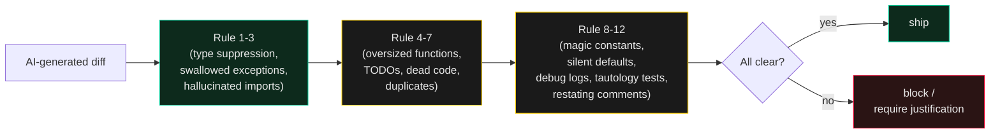

# Code Slop — Patterns

> An LLM can ship a function that compiles, types check, and runs once — and still be wrong in a way no test catches. The pattern is what gets caught: the shape of the code is the smell.

AI-generated code fails differently than tired-human code. Tired humans write sloppy code in *one direction*: rushed, under-thought, incomplete. AI code fails in a *recognizable shape*: confidently over-completed, pattern-matched to a wrong template, hallucinated into existence. The deterministic rules in this skill catch the second shape. They run without an LLM at runtime — they are pattern checks, not heuristics.

*Companion to [`no-ai-tells`](../no-ai-tells/SKILL.md) (prose) and [`no-design-tells`](../no-design-tells/SKILL.md) (UI). Orchestrated by [`slop-detect-stack`](../slop-detect-stack/SKILL.md).*

---

## The core claim

The most useful question about AI-generated code is not "did a human write this?" It is **"does this code carry the structural fingerprints of low-quality AI output?"** The fingerprints are:

1. **Confidence without verification** — `as any`, swallowed exceptions, default returns
2. **Hallucinated surface** — imports that don't exist, types that don't compile, calls that don't resolve
3. **Pattern-match overfit** — copied from a Stack Overflow answer to a *similar* but not *same* problem
4. **Decorative completion** — TODOs left as scaffolding, dead branches, unused parameters
5. **Verbose duplication** — the same helper written twice in the same file because the model regenerated rather than refactored

A pre-commit hook or CI gate that checks for these patterns catches ~80% of "compiles but shouldn't ship" AI output. The other 20% is conceptual — wrong algorithm, wrong abstraction, wrong domain assumption. That is what [`ship-discipline`](../ship-discipline/SKILL.md), [`adversarial-review`](../adversarial-review/SKILL.md), and human review are for. **This skill is the cheap first layer.**

---

## When to load

- You are about to commit AI-generated code and want a structural gate.
- You are reviewing a PR that includes AI-generated changes and want a checklist.
- You are setting up pre-commit hooks or a CI quality gate for an AI-assisted workflow.
- You are auditing a codebase that was built primarily with AI assistance and want to know what to look for.
- You have a recurring bug that smells like AI output (compiles, runs, fails in production).

---

## The moves — the 12 rules

### Rule 1 — No `as any`, no `// @ts-ignore`, no `# noqa` without justification

```typescript
// ❌ Smell: the LLM couldn't satisfy the type, so it suppressed the check
const data = response as any;
const result = compute(data); // shape unknown, behavior undefined

// ✅ Smell-free: the type was wrong, so the call was wrong
interface Response { items: Item[]; meta: Meta }
const data: Response = await response.json();
```

**Why:** type suppression is the model's "I don't know" gesture, written with the confidence of a working solution. It compiles. It ships. It explodes in production when the shape was never what was assumed.

**Detection:** grep for `as any`, `@ts-ignore`, `@ts-nocheck`, `# noqa`, `# type: ignore`, `// nolint`, `eslint-disable` *without* a justifying comment on the same line.

### Rule 2 — No swallowed exceptions

```python
# ❌ Smell: the LLM handled the error by making it disappear
try:
    user = db.fetch_user(id)
except Exception:
    pass

# ✅ Smell-free: the error either propagates or is named
try:
    user = db.fetch_user(id)
except DatabaseConnectionError as e:
    return Result.retry(after=backoff(e))
```

**Why:** the LLM trained on code that handled errors. It produced a handler. The handler is silent. The bug ships.

**Detection:** `try ... except ...: pass`, `try ... catch (...) { /* noop */ }`, `try ... except: ...  # noop` patterns.

### Rule 3 — No hallucinated imports

```typescript
// ❌ Smell: the LLM imported a module that doesn't exist in this codebase
import { validateUser } from '@/lib/validation-helpers';
// Module doesn't exist. TypeScript says so. The fix is to create it.

// ✅ Smell-free: the import resolves to a real module
import { validateUser } from '@/lib/validation';
```

**Why:** LLMs confidently invent module paths that look right and aren't. TypeScript / Python / Go will fail to resolve — but only if the import was used, and only if the build actually runs the resolver. A dead import path is a future bug.

**Detection:** run the type-checker / build. Lint rule: no unresolved imports. Diff against `package.json` / `pyproject.toml` / `go.mod`.

### Rule 4 — No oversized functions (>60 lines, >4 levels of nesting)

```typescript
// ❌ Smell: the LLM wrote a 200-line function because it didn't know where to cut
async function processOrder(order) { /* 200 lines, 6 levels deep */ }

// ✅ Smell-free: cut into named, single-purpose helpers
async function processOrder(order) {
  const validated = await validateOrder(order);
  const priced    = await priceOrder(validated);
  return chargeOrder(priced);
}
```

**Why:** AI-generated long functions almost always have a hidden seam — a point where two responsibilities meet that should be a function boundary. The model merged them because extracting was not its priority.

**Detection:** function length > 60 lines OR cyclomatic complexity > 12 OR nesting depth > 4. ESLint: `max-lines-per-function`, `max-depth`, `complexity`. Python: `radon cc`, `wemake-python-styleguide`.

### Rule 5 — No TODO stubs left in "working" code

```typescript
// ❌ Smell: the LLM marked its placeholder and shipped it as done
async function fetchProfile(id: string): Promise<Profile> {
  // TODO: implement actual profile fetch
  return { id, name: 'placeholder', avatar: '' };
}

// ✅ Smell-free: either the function works or it doesn't exist
```

**Why:** TODOs in shipped AI code are the model's signature of incomplete work disguised as a known limitation.

**Detection:** `grep -rn 'TODO\|FIXME\|XXX\|HACK' src/` — anything matching in production code (not in comments-to-self in a lesson doc) is a smell.

### Rule 6 — No dead code in the same commit as new code

```typescript
// ❌ Smell: the LLM added a feature and left the old path behind
function newHandler(req) { /* new path */ }
function oldHandler(req) { /* unused, but not deleted */ }

// ✅ Smell-free: the old path is gone in the same commit
```

**Why:** the LLM added without removing. The old code becomes a footgun for the next developer who doesn't know which path is live.

**Detection:** ESLint `no-unused-vars`, TypeScript `--noUnusedLocals`, Python `vulture`. Plus a manual review of any "old" function in the diff.

### Rule 7 — No duplicate helpers within 50 lines

```typescript
// ❌ Smell: the LLM wrote the same helper twice in the same file
function formatDate(d: Date): string { return d.toISOString().slice(0, 10); }
function toDateString(d: Date): string { return d.toISOString().slice(0, 10); }

// ✅ Smell-free: one helper, named once
```

**Why:** the model regenerated rather than searched. The file has two names for one thing.

**Detection:** `jscpd` (JS/TS), `copy-paste-detector` (Python), or a manual scan during review.

### Rule 8 — No magic constants without names

```typescript
// ❌ Smell: the LLM put a literal in the middle of the code
if (retry_count > 7) { /* ??? */ }

// ✅ Smell-free: the constant is named, the threshold is documented
const MAX_RETRIES_BEFORE_DLQ = 7; // documented in commit message
if (retry_count > MAX_RETRIES_BEFORE_DLQ) { enqueueToDlq(); }
```

**Why:** the model's "feels right" number is rarely the right number for *your* system. A literal in the middle of logic is a deferred decision.

**Detection:** grep for numeric literals in conditional expressions; flag any without a same-line named-constant reference.

### Rule 9 — No silent default returns on failure

```typescript
// ❌ Smell: the LLM returns a default to keep the call site simple
function getUser(id: string): User {
  const u = db.find(id);
  return u ?? { id: 'unknown', name: 'Guest' }; // hides the failure
}

// ✅ Smell-free: the failure is named, the caller decides
function getUser(id: string): User | null {
  return db.find(id);
}
// caller: if (!user) return notFound();
```

**Why:** silent defaults make systems that "work" in tests and fail in production. The LLM optimized for "the next line doesn't have to handle null" rather than for "the system reports its failures."

**Detection:** review for `?? defaultValue`, `|| defaultValue`, `?? {}`, `?? []` patterns in functions that have a real failure mode.

### Rule 10 — No `console.log` debugging left in shipped code

```typescript
// ❌ Smell: the LLM debugged, forgot to remove
function pay(order) {
  console.log('DEBUG: order =', order);
  return charge(order);
}

// ✅ Smell-free: structured logging at the right level
log.debug('order.received', { orderId: order.id, amount: order.amount });
return charge(order);
```

**Why:** the model's debugging instrumentation ends up in production. It leaks data and clutters logs.

**Detection:** ESLint `no-console`, Python `flake8-debugger`, pre-commit grep for `console.log`, `print(`, `System.out.println`.

### Rule 11 — No AI-generated test tautologies

```typescript
// ❌ Smell: the LLM wrote a test that asserts what the code does, not what it should do
test('add returns a number', () => {
  expect(typeof add(2, 3)).toBe('number'); // passes for any number-returning function
});

// ✅ Smell-free: the test asserts the specific expected behavior
test('add returns the sum', () => {
  expect(add(2, 3)).toBe(5);
});
```

**Why:** tests that pass without testing anything are worse than no tests — they create false confidence.

**Detection:** review tests for assertions that don't reference the function's contract (the type of the return, the presence of a key, the absence of an error).

### Rule 12 — No comments that just restate the code

```typescript
// ❌ Smell: the LLM wrote the comment that describes what the next line does
// Increment the counter by 1
counter += 1;

// ✅ Smell-free: the comment explains *why*, not *what*
counter += 1; // skip the failed attempts so we don't retry poisoned inputs
```

**Why:** comments that restate the code are noise. They add maintenance burden without adding information. AI over-generates them.

**Detection:** review each new comment: does it explain a *why* that isn't obvious from the code? If not, delete it.

---

## The detection stack



The 12 rules are layered: cheap type/syntax checks first, structural checks next, semantic checks last. Each layer catches a different class of "compiles but shouldn't ship" output.

---

## Connects to

- [`../slop-detect-stack/SKILL.md`](../slop-detect-stack/SKILL.md) — orchestration skill that chains all the slop-detect skills
- [`../no-ai-tells/SKILL.md`](../no-ai-tells/SKILL.md) — prose slop (Wikipedia taxonomy)
- [`../no-design-tells/SKILL.md`](../no-design-tells/SKILL.md) — UI slop (Adrian Krebs fingerprint)
- [`../slop-detect/SKILL.md`](../slop-detect/SKILL.md) — design slop tool bridge (ravidsrk/slop-detect)
- [`../ship-discipline/SKILL.md`](../ship-discipline/SKILL.md) — the discipline this skill enforces
- [`../adversarial-review/SKILL.md`](../adversarial-review/SKILL.md) — for the conceptual checks this skill can't do
- [`../harness-hardening/SKILL.md`](../harness-hardening/SKILL.md) — make the rules actually run via hooks, not just exist in a doc

---

## For the full thing

The reference implementation that operationalizes these 12 rules as a pre-commit/CI gate is [`scanaislop/aislop`](https://github.com/scanaislop/aislop) — MIT licensed, 50+ deterministic rules across 9 languages, runs without an LLM at runtime. This skill is the *agent-facing summary* of the patterns; the tool is the enforcement; the discipline is the practice.
