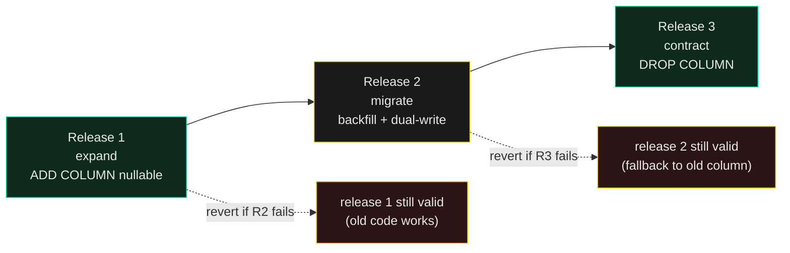

# Database Migrations

> A migration that locks the table for 30 seconds in production is a downtime event, not a deploy. A migration that runs differently in dev and prod is a P0 waiting to happen.

Migrations are the highest-stakes deploys you do. The code is easy to roll back; the data isn't. A migration that succeeds in dev (10 rows, 1 connection) can take down production (10 million rows, 50 connections). The fix is not "test better"; the fix is **a discipline that puts the change into production in three releases**, each individually reversible.

*See [`dual-write-resilience`](../dual-write-resilience/SKILL.md) for the resilience side; this skill is the schema-change side.*

---

## The core claim

Every schema change is actually three changes:

1. **Expand** — add the new column / table / index. Backwards-compatible; old code still works.
2. **Migrate** — write the new data (backfill) and update the application to read/write both old and new shapes.
3. **Contract** — remove the old column / table / index. The application no longer references it.

Each release is independently deployable and individually reversible. **You never rename a column in production in a single release** — that's the rule that prevents the 3 AM rollbacks.

---

## When to load

- You're adding a column, renaming a column, changing a column type, adding an index, or splitting a table.
- You need to backfill millions of rows without locking the table.
- You're about to run a migration that does `ALTER TABLE ... DROP COLUMN` on a live table.
- The dev migration works but production times out.
- You're choosing between ORM migrations, raw SQL, Flyway, Liquibase, Atlas, or hand-rolled.

---

## The moves

### Expand-and-contract, never rename-in-one-release

```sql
-- Release 1 (expand): add the new column, nullable, with default null
ALTER TABLE users ADD COLUMN display_name TEXT;

-- Release 2 (migrate): backfill in a background job, app writes both
UPDATE users SET display_name = name WHERE display_name IS NULL;
-- (batch: 1000 rows per loop, sleep between batches, observe replication lag)

-- Release 3 (contract): drop the old column
ALTER TABLE users DROP COLUMN name;
```

Three releases, three deploys, each independently reversible. If release 2 fails, you can ship release 3 with no migration — the new column is nullable, the app falls back to `name` if `display_name` is null. **There is no release in this sequence that cannot be reverted.**

### Backfill in batches, never in one transaction

```sql
-- ❌ One-shot backfill (locks for minutes, blows out replication)
UPDATE users SET display_name = name WHERE display_name IS NULL;

-- ✅ Batch backfill (one transaction per batch, observable)
DO $$
DECLARE batch_size INT := 1000;
        last_id BIGINT := 0;
BEGIN
  LOOP
    UPDATE users
       SET display_name = name
     WHERE id > last_id
       AND id <= (SELECT MIN(id) FROM users WHERE id > last_id ORDER BY id LIMIT 1) + batch_size - 1
       AND display_name IS NULL;
    EXIT WHEN NOT FOUND;
    last_id := last_id + batch_size;
    PERFORM pg_sleep(0.1); -- give replication a breath
  END LOOP;
END $$;
```

**Always batch. Always sleep between batches. Always log the rows-per-second so you can project the finish time.** A backfill that's still running at 3 AM is a backfill that's still blocking deploys.

### Indexes are expensive — add them concurrently

```sql
-- ❌ Blocks the table for the duration of the index build
CREATE INDEX idx_users_email ON users(email);

-- ✅ Concurrent: doesn't lock, but takes longer
CREATE INDEX CONCURRENTLY idx_users_email ON users(email);
```

`CONCURRENTLY` (Postgres) is non-blocking but **can't run inside a transaction**. Most migration tools can handle this; verify yours does. MySQL: `ALTER TABLE ... ADD INDEX` is online for InnoDB but offline for MyISAM — check the engine.

### The SQLite WAL caveat — single-writer, always

```sql
-- SQLite's WAL mode helps, but only one writer at a time.
PRAGMA journal_mode=WAL;
PRAGMA busy_timeout=5000; -- wait 5s before failing on lock
```

A migration on a busy SQLite DB can wait on `busy_timeout` and then fail. **Run SQLite migrations during a maintenance window, or accept that they may need retries.** The launchd-restart race in this project's CLAUDE.md comes from a SQLite migration hitting a busy DB; the busy_timeout=5000 is the symptom-mitigation; the proper fix is "don't migrate the live SQLite under the launchd supervisor without coordination."

### Never rename a column in one release

```sql
-- ❌ Single-release rename — no rollback path
ALTER TABLE users RENAME COLUMN name TO display_name;
```

If the rename ships but the application breaks, you can't roll back the schema without restoring from backup. The data is gone. **Always expand-and-contract.** Three releases, three deploys, three individually reversible states.

---

## The architecture



Each release is one node. The dashed arrows are the rollback paths. Solid arrows are the forward path.

---

## Connects to

- [`../data-catalog/SKILL.md`](../data-catalog/SKILL.md) — schema changes are a kind of catalog change; document them the same way
- [`../dual-write-resilience/SKILL.md`](../dual-write-resilience/SKILL.md) — the dual-write pattern is the dual-write version of expand-and-contract
- [`../local-ai-fabric/SKILL.md`](../local-ai-fabric/SKILL.md) — local SQLite migrations have the launchd-restart-race wrinkle; this skill names it
- [`../observability-budget/SKILL.md`](../observability-budget/SKILL.md) — every migration needs metrics: rows/sec, lock wait time, replication lag
- [`../risk-posture/SKILL.md`](../risk-posture/SKILL.md) — a migration that locks the table for 30 seconds is a downtime event

---

## For the full thing

The pattern is the same regardless of database engine — Postgres, MySQL, SQLite, MongoDB. What changes is the syntax for the *concurrent* operation. Postgres: `CREATE INDEX CONCURRENTLY`. MySQL: `ALTER TABLE ... ALGORITHM=INPLACE, LOCK=NONE`. SQLite: maintenance window or accept busy_timeout retries. The architectural discipline (expand-and-contract, batched backfill, never-rename-in-one-release) is what this skill encodes.
