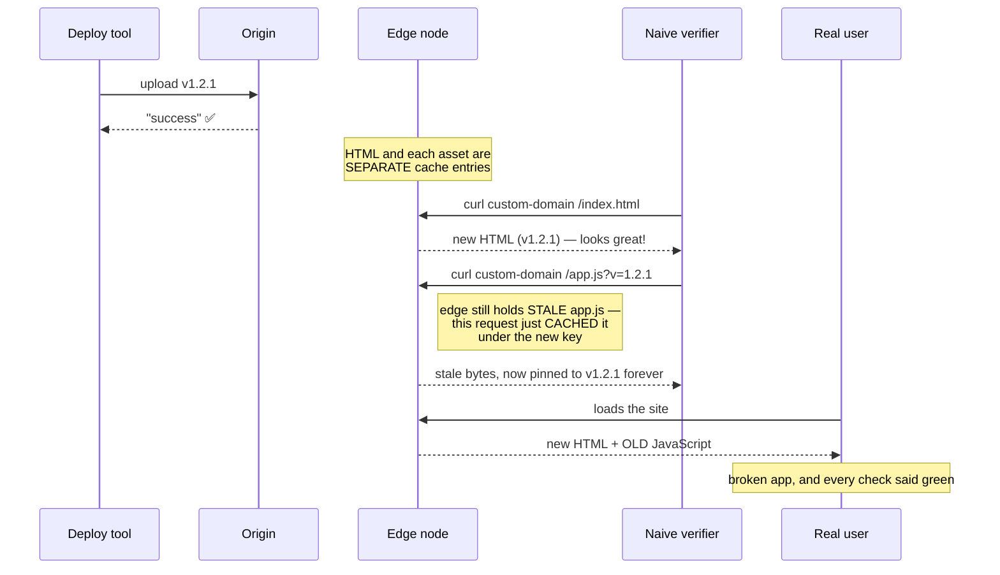
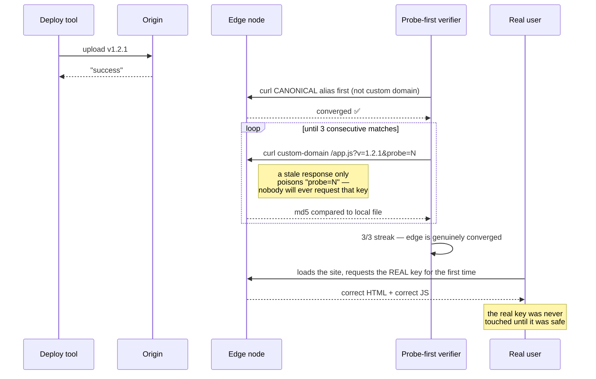

# Deploy Verification

> The CDN will tell you the deploy succeeded. That is a statement about upload, not about what a human receives.

This skill exists because a patched XSS fix sat un-served in production while every dashboard said green. The full incident is in [war stories](../../playbooks/06-war-stories.md#the-poisoned-edge-2026-08-09). What follows is the technique that came out of it.

---

## The failure mode, precisely

You deploy `js/app.js?v=1.2.0` → `?v=1.2.1`. New version key, so it must be fresh. Except:

1. Your deploy tool reports success. The origin now has new bytes.
2. Edge nodes converge **independently and on their own schedule**. HTML and each asset are separate cache entries.
3. A request arrives at an edge node that has the new HTML but stale asset bytes.
4. **That request caches the stale bytes under the new `?v=1.2.1` key.**
5. The key is now poisoned. Every subsequent visitor gets old JavaScript at the new URL, indefinitely.

Production is now running new HTML against old JS. Your version check passes. Your monitoring is green. Your users have a broken app.

**Corollary that matters most:** *curling the custom domain too early is what poisons it.* Verification, done naively, causes the bug.



---

## The four rules

### 1. Verify the canonical alias first, custom domain second

Direct-upload projects have a canonical origin (`project.pages.dev`) and your custom domain. The canonical converges first. Probe it until it's correct, and only then touch the custom domain — you cannot poison a key that already has the right bytes waiting behind it.

### 2. Check content, not just the version string

HTML carrying `v=1.2.1` proves the HTML converged. It says nothing about `app.js`. Compare an **md5 of the actual asset body** against your local file.

### 3. Probe with throwaway cache keys

Never probe the real URL while you're unsure. Append a disposable query param:

```
https://host/js/main.js?v=1.2.1&probe=7
```

A stale response can only poison `probe=7`, a key no human will ever request. The real key stays clean until you know the edge is converged.

### 4. Require a streak, not a single success

Edge nodes are plural. One good response might be one good node. Require **3 consecutive matching probes** before declaring convergence.



---

## The script

[`templates/deploy-pages.sh`](../../templates/deploy-pages.sh) implements all four. The core of it:

```bash
md5_of() { md5 -q "$@" 2>/dev/null || md5sum "$@" | cut -d' ' -f1; }

probe_asset() {   # $1=host  $2=path
  local want got i streak=0
  want=$(md5_of "public/$2")
  for i in $(seq 1 24); do
    got=$(curl -fsS --max-time 20 "$1/$2?${EXPECTED}&probe=$i" | md5_of /dev/stdin || true)
    if [[ -n "$got" && "$got" == "$want" ]]; then
      streak=$((streak+1))
      [[ $streak -ge 3 ]] && { echo "   $2 converged on $1 (probe $i)"; return 0; }
    else
      streak=0
      echo "   … $2 probe $i: stale edge — sleep 5s"
      sleep 5
    fi
  done
  echo "FAIL: $2 never converged — do NOT request its real key" >&2
  return 1
}

probe_asset "$CANONICAL" "js/main.js"
probe_asset "$CUSTOM"    "js/main.js"
probe_asset "$CUSTOM"    "css/layout.css"   # one JS + one CSS covers both pipelines
```

Distinct exit codes so CI can tell the cases apart: `2` canonical never converged, `3` custom lagging (canonical fine — leave it alone, it catches up), `4` asset content never matched.

---

## When "is it live?" is genuinely unclear

Run this ladder in order:

**1. What version is the user actually served?**
```bash
curl -sS "https://host/index.html" | grep -oE 'v=[0-9]+(\.[0-9]+)+'
```

**2. Is a service worker intercepting?** If `curl` shows new content but a browser doesn't, the SW is serving its own cache. Block it:
```js
const ctx = await browser.newContext({ serviceWorkers: 'block' })
```

**3. Is the browser cache lying?** Disable it at the protocol level — the only reliable verifier:
```js
const client = await ctx.newCDPSession(page)
await client.send('Network.setCacheDisabled', { cacheDisabled: true })
```

**4. Still stale?** Bump the version key again and redeploy. Identical content under an identical hash will not force a POP to re-fetch — **only a new key does.** One real ship required `3.8.15 → 3.8.20 → 3.8.21 → 3.8.22 → 3.8.23 → 3.8.25` inside a single session. That is not a sign you did something wrong; it's the tax.

---

## The rule to remember

> A deploy is not an upload. A deploy is a *human receiving new bytes*. Verify the second thing.
