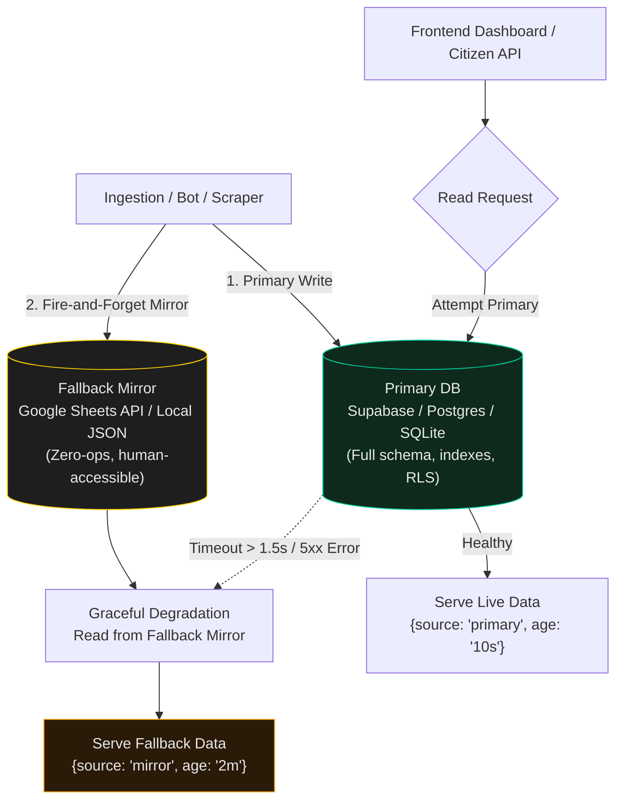

# Dual-Write Resilience

> Civic software cannot 500 at 2 AM. When cloud infrastructure blinks, the mirror keeps the lights on.

When building civic dashboards (flood monitors, air quality trackers, urban transit tools) used by real citizens during emergencies, **downtime is a human safety failure**, not just an engineering annoyance.

Free and entry-tier cloud databases (Supabase, Neon, PlanetScale) eventually pause, run out of monthly compute quotas, or suffer network hiccups. The **Dual-Write Resilience Pattern** — pioneered by Antigravity across Dr Non's smart city fleet — guarantees 100% uptime with zero ongoing infrastructure cost.

---

## The Dual-Write Architecture



---

## Core Principles

### 1. Dual-Write on Ingestion
Every write path (Telegram bot, cron scraper, API webhook) executes a two-tier write:
1. **Primary Database:** Full relational insert/update (e.g. Supabase Postgres with PostGIS).
2. **Mirror Database:** Silent, non-blocking append to Google Sheets or flat JSON in object storage.

```typescript
// Example: Ingestion Dual-Write Handler
async function ingestObservation(record: CityDataRecord) {
  // 1. Write to primary relational store
  const dbPromise = supabase.from('observations').insert(record);

  // 2. Fire-and-forget mirror write (catch error silently, never block)
  const mirrorPromise = appendToGoogleSheets(record).catch(err => {
    console.warn('[MirrorWriteFailed] Non-fatal, primary succeeded:', err.message);
  });

  await dbPromise; // Await primary, let mirror finish in background
}
```

### 2. Fast-Failover Read Path
The client or backend read adapter queries the primary database with a strict 1.5-second timeout. If the database is unreachable, paused, or returns an error, it immediately falls back to the mirror.

```typescript
// Example: Resilient Read Adapter
export async function getLatestCityMetrics(): Promise<MetricPayload> {
  try {
    const controller = new AbortController();
    const timeout = setTimeout(() => controller.abort(), 1500);

    const { data, error } = await supabase
      .from('city_metrics')
      .select('*')
      .order('timestamp', { ascending: false })
      .limit(50)
      .abortSignal(controller.signal);

    clearTimeout(timeout);
    if (error || !data) throw error || new Error('No data');

    return { source: 'primary', data, timestamp: new Date().toISOString() };
  } catch (err) {
    console.warn('[PrimaryDBUnreachable] Falling back to mirror store:', err);
    const fallbackData = await fetchGoogleSheetMirror();
    return { source: 'mirror', data: fallbackData, timestamp: new Date().toISOString() };
  }
}
```

### 3. Transparent Provenance
Every displayed metric in the UI carries `{source, tier, age}`:
- Never silently display fake or stale data as fresh.
- If served from the mirror, a subtle indicator (`● Fallback (Google Sheets) · 4m ago`) informs operators without panicking public citizens.

---

## Why Google Sheets as the Mirror?

1. **Zero Maintenance:** Never runs out of disk space, never crashes on connection pools.
2. **Human Editable:** Non-technical domain experts (city planners, disaster coordinators) can view, edit, or override rows directly during an incident without a database GUI.
3. **Free & High Uptime:** Hosted on Google infrastructure with near-infinite read quotas via standard caching / Cloudflare Workers.

---

## Production Checklist

- [ ] Primary database writes are strictly separated from browser client keys (service role on server, anon on client).
- [ ] Mirror writes are wrapped in non-blocking try/catch blocks (mirror failure never aborts primary transaction).
- [ ] Read adapter enforces ≤1.5s timeout on primary before falling back.
- [ ] UI displays subtle data tier badge (`Live` vs `Mirror`).
