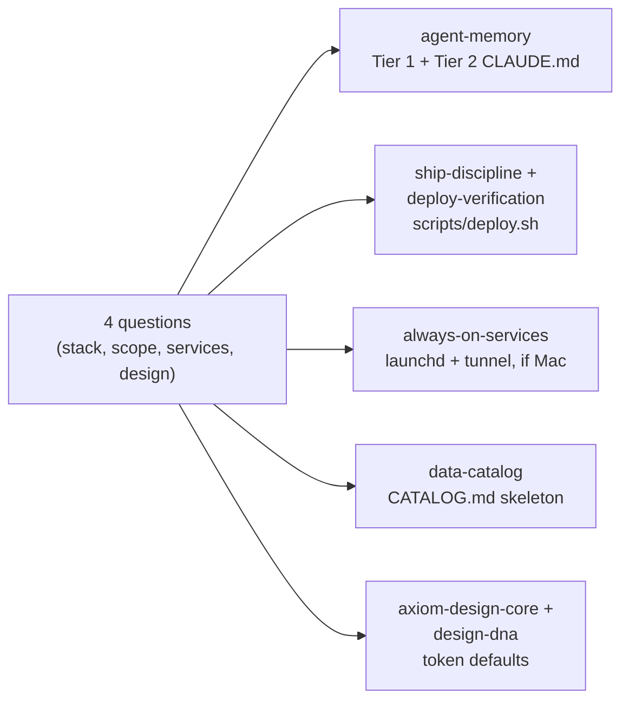

# Full-Stack Bootstrap

> This skill can be automated directly via `./setup.sh --init-project <path>` (or `scripts/new-project.sh <path>`), or run conversationally through [`BLUEPRINT.md`](../../BLUEPRINT.md) at the repo root.

*Visual summary: [`INFOGRAPHICS.md`](../../INFOGRAPHICS.md), page 7.*

If you're an agent reading this because it fired: **open `BLUEPRINT.md` now and follow it from "Step 1" onward.** Alternatively, execute `./setup.sh --init-project <path>` to scaffold the project structure immediately. It establishes the workspace index, project contracts, deploy script, service pattern, and design defaults.

If `BLUEPRINT.md` isn't present in this checkout, tell the user directly rather than improvising a replacement — the blueprint's value is in its specificity (exact commands, exact file templates), and a paraphrase from memory will drift from what's actually in `templates/`.

---

## Why this is a separate skill from the document

`BLUEPRINT.md` is written to be **pasted directly into a fresh session** — no repo context assumed, no other skills necessarily loaded yet. This skill exists so that once `full-stack-bootstrap` (and its siblings) *are* installed in `~/.claude/skills/`, you don't need to go find and paste the document again for the next project — just say "bootstrap this workspace" or "set this up like the blueprint" and the skill fires, reads `BLUEPRINT.md` from wherever the repo was cloned, and runs the same nine steps.

## What it touches, at a glance

Every branch is conditional on the answers — this doesn't force a backend-service setup onto a static site, or a design system onto a pure API project. It asks first.

## When not to use this

- An existing, already-configured project. Point the agent at the individual skill that matches what's missing instead (a project missing a deploy script needs `deploy-verification`, not a full re-bootstrap).
- A quick script or one-off tool with no deploy target and no multi-session lifespan. The whole point of the ladder is amortizing setup cost across many future sessions — for a five-minute script, the setup costs more than it saves.
