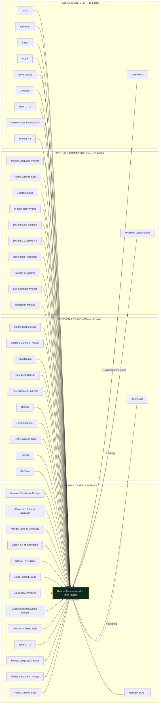

# Library of Human Wisdom

> The books that taught us how to design for humans, written before AI made it cheap to generate *competent* work — and therefore the books most at risk of being forgotten.

This is the **router**, not the library. The library is the **35+ book-derived skills** already in `skills/`, each one distilled by the book-to-skill pipeline at [`nonscrape.nonarkara.org`](https://nonscrape.nonarkara.org) and mirrored locally. Your job here is to know the shape of the library well enough that you load the right book for the right moment.

The full version of each skill — 5–10 chapters with glossary, patterns, and cheatsheet — lives on the live skillhub. The local SKILL.md is the offline copy and the agent-loadable front door.

---

## When to load THIS skill

You are about to do work that touches a human in a way the literature has spent decades studying. Specifically:

- **Designing any UI**: load the design cluster first (Norman × 2, Alexander, Maeda, Kelley × 4, Williams, IDEO × 4).
- **Evaluating a claim, scoring options, recommending**: load the decision cluster (Kahneman, Thaler × 2, Christensen, Ries × 2, Dobelli, Levitt/Dubner, Heath brothers, Graham, Kiyosaki).
- **Writing prose for humans to read**: load the writing cluster (Williams, Pinker, Heath brothers + Dr Non's own).
- **Understanding users as cultural beings**: load the people cluster (Malinowski, Leach, Kleinman, Bayat, Augé, Favret-Saada, Douglas, Geertz × 3).
- **Picking a business model or proposition**: load the business cluster (Osterwalder × 2, Christensen, Kiyosaki, Graham).
- **Reasoning about money and risk**: load the finance cluster (Graham, Kiyosaki, Thaler × 2, Kahneman).

The full index — every book, the one-line essence, the trigger list — is in [`reference/library/`](../../reference/library/) (the local mirror index) and on the live skillhub.

---

## The four clusters

(The diagram is approximate — some books appear in more than one cluster, and that overlap is the point. Made to Stick shows up under both Design and Writing. Geertz shows up three times because his work genuinely does.)

---

## The routing rules — load the right book, not the whole shelf

### 1. Load the *minimum* necessary set

If you are designing a dashboard's data display, you need Norman (DOET) + Maeda + Williams. You do not need Leach's structural anthropology. Be honest about the scope of the question.

### 2. Load *before* you start designing, not after

The cost of consulting Norman before sketching a button is one minute. The cost of redoing the button because it shipped with a Norman violation is an afternoon and an anti-regression note.

### 3. When two books disagree, load a third

Norman says "make it discoverable"; Maeda says "reduce features." Both right. Pull in Heath brothers or Williams to arbitrate the specific copy and you'll find the resolution.

### 4. The Dr Non books are meta-tools, not domain books

`non-writing-the-editor-brain-skill`, `solo-scribble-the-discipline-of-unedited-drafting`, the `100-days-of-writing-*` series, `design-by-writing-100-day-reflection-engine`, `self-managed-project-mastery-100-days-of-writing`, `repetition-mantra-building-skill-through-simple-repeats`, and `boilerplate-reduction` are *about the practice of producing under agents*. They sit beside this skill, not inside any single cluster. Load them when you are stuck on *how to write*, not on what to write.

---

## How a book-derived skill is structured

Each book skill in `skills/<book-slug>-<id>/SKILL.md` follows the same shape (per the consolidated SKILL.md discipline from PR #3117114):

1. **YAML frontmatter** — name, description, license, source (the live skillhub URL), book credit.
2. **One-line essence** — the single sentence you take away.
3. **Core claim** — 2–3 sentences in Dr Non's voice.
4. **When to load** — three to five concrete triggers.
5. **The moves** — three to five concrete moves you can apply now, **inline glossary terms**, **inline patterns**, **inline cheatsheet items**.
6. **Connects to** — pointers to the *other* repo skills that complement it.
7. **For the full thing** — link to the live skillhub chapter set.

That last section is the honesty contract: the local file is the consolidated essence, not a substitute for the book's argument. Agents that need depth pull from the live skillhub.

---

## The anti-pattern: loading the library as a checklist

Do not open every book SKILL.md in a session and start "applying" them. That is the same failure mode as `route-dont-scan`: trying to be thorough by being wide. One task, one book, one decision rule.

The closest this skill should ever come to "load everything" is when you're at the *start* of a new project with a clear human-impact surface, and you spend fifteen minutes scanning the table of contents in [`reference/library/`](../../reference/library/) to identify which 3–5 books belong on that project's shelf.

---

## Where this skill fits in the repo

This is the **fifth layer** of the practice, after the four already documented in the README:

1. **The Antigravity Origin** — discipline of how an agent works.
2. **The Cursor Desk** — discipline of how an IDE-resident agent works.
3. **The Sibling Practice** — domain-specific workflows mined from real code.
4. **The Mavis/Claude Extension** — Claude-Code-specific primitives.
5. **The Library of Human Wisdom** *(this skill)* — the pre-AI literature that gives the practice its sense of human consequence.

The other four layers tell your agent *how to ship*. This one tells it *what shipping for humans actually requires*.

Without the library, the practice ships software.
With the library, the practice ships software that *matters*.

---

## The illustrations

Six AI-generated hero illustrations live in [`assets/illustrations/`](../../assets/illustrations/) for the book cluster, the design lineage, the security stack, and the backend surface. Use them in slides, on the repo page, or in skill hero images. All Vignelli/Rams visual language to match the existing 19-page infographic deck.

| File | Hero for |
|---|---|
| `library-of-human-wisdom-cover.jpg` | The library as a whole |
| `book-to-skill-pipeline.jpg` | This router skill — book → essence flow |
| `design-lineage-rams-braun.jpg` | `axiom-design-core` and any design skill |
| `security-threat-model.jpg` | `appsec-stack`, `secrets-management` |
| `security-stack-four-layers.jpg` | `appsec-stack` |
| `backend-architecture.jpg` | `api-design`, `observability-budget` |
