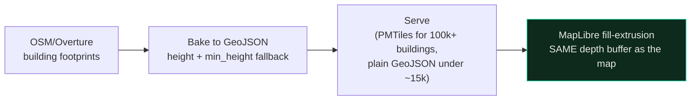

# 3D City Map

> Two tiers, deliberately separate: a real Minecraft world for exploration, and MapLibre's native building extrusion for the live dashboard. Conflating them is the mistake this skill exists to prevent.

Building-populated 3D city maps are the signature front-end of this whole practice — flood dashboards, transit dashboards, heritage dashboards, all map-first, most now 3D by default.

---

## Tier 1 — the deep twin, via Arnis

[Arnis](https://github.com/louis-e/arnis) (Apache-2.0) converts OSM + Overture building/land-cover data into a real, playable Minecraft world, block by block, offline. This is for exploration and storytelling — walking a heritage district, not an operational dashboard. Generated worlds carry a manifest (bounds, Minecraft version, teleport coordinates) so a build can be regenerated or spot-checked without re-deriving the whole pipeline.

## Tier 2 — the live web dashboard, via MapLibre native `fill-extrusion`

**Not deck.gl.** A deck.gl canvas overlay on top of a base map causes incorrect occlusion and duplicated building faces at the seam between the two rendering systems — the buildings and the map disagree about depth. MapLibre's native `fill-extrusion` paint layer shares the map's own depth buffer, so there's no seam to disagree across.

The recipe:
1. **Bake footprints** — OSM → GeoJSON, with a `height`/`min_height` fallback for buildings missing that tag (most of them, in practice).
2. **Serve at scale** — PMTiles behind a Range-request-capable edge proxy for large cities (100k+ buildings); a plain GeoJSON file is fine under roughly 15k buildings — don't build tile infrastructure you don't need yet.
3. **Extrude** — `fill-extrusion-height` from the baked property, `fill-extrusion-base` from `min_height`.
4. **Terrain, optional** — drape over a DEM (e.g. AWS Terrarium tiles via `map.setTerrain`) behind a feature flag, so 2D stays the safe default and 3D is opt-in per deployment.

## The mistake that costs the most time

Reimplementing this per project. The paint spec, the height-fallback logic, and the footprint baker are the same problem every time — extract them into one shared module (`_shared` in this repo's own [`data-catalog`](../data-catalog/SKILL.md) sense) the first time a second project needs buildings, not the fourth. This is [`dr-non-golden-rules`](../dr-non-golden-rules/SKILL.md) Rule 3 ("use what you already have") and Rule 5 ("reuse templates, not code") applied to a specific asset class — the rule already existed, this is just naming where it was quietly being broken.

## Scar-earned rules

- **One depth buffer.** All operational 3D overlays render through the map's own layer system — never a second canvas composited on top.
- **Scope pointer/click handlers to the canvas**, not the window — a window-level raycast listener swallows clicks meant for UI panels sitting over the map.
- **Set a zoom floor and disable world-copy repetition** (`minZoom`, `renderWorldCopies: false`) — zoomed out far enough, an unconstrained map tiles the whole planet sideways and it reads as broken, not zoomed out.
- **No procedural filler on a real-city surface.** Generated trees/props on top of real building data is a visual lie the moment someone compares it to the actual street. If the data doesn't contain it, the map doesn't show it.
- **Test the extruded view on a real phone.** 3D must degrade gracefully — provide the 2D fallback when the terrain/extrusion flag is off, and confirm the flag actually turns it off on a mid-range Android before shipping.

## The one-line version

> Minecraft for the walk-through, MapLibre-native extrusion for the dashboard — and extract the extrusion code the second time you write it, not the fourth.
