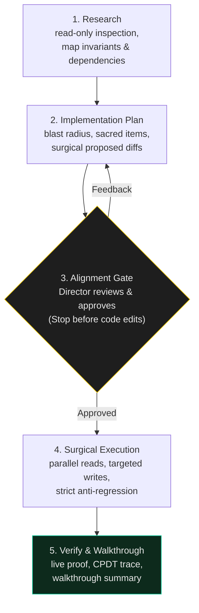

# Planning Discipline

> Directing an agent is ten times cheaper than debugging collateral damage. Write the plan first.

When a non-programmer directs an AI agent, the most dangerous moment is the jump straight from prompt to multi-file edits. An unconstrained agent guesses intent, modifies adjacent files, collapses hard-won nuance, and reports "done" on broken architecture.

This skill is the **Spec-First Execution Protocol** pioneered by Antigravity — the first agent in Dr Non's practice. It turns agentic coding from unguided typing into predictable, director-guided engineering.

---

## The Spec-First Loop



---

## The 5-Step Protocol

### 1. Research (Read-Only)
- **Zero code changes** during research.
- Inspect targeted files, caller functions, and configuration points.
- On fast hardware (Apple Silicon M5 Max), run independent reads in parallel.
- Identify the system conservation law and any project sacred items before writing a single proposal.

### 2. Implementation Plan
Before touching source code, publish a structured plan covering four mandatory sections:

```markdown
# [Feature / Bugfix Name]

## User Review Required / Critical Decisions
- [Decisions that change UX, schema, or API boundaries]

## Sacred Items & Anti-Regression Check
- [ ] No rounded corners / default blue / unwanted gradients
- [ ] Live map / ticker / chart / interactive elements preserved
- [ ] File shrinkage < 30% (preserve domain nuance)

## Proposed Changes
### [Component / Layer]
- [MODIFY] path/to/file.ts — exact surgical change & rationale
- [NEW] path/to/new-file.ts — purpose and structure

## Verification Plan
- Automated test command / curl endpoint verification
- Live URL inspection step
```

### 3. The Alignment Gate (Hard Stop)
- Present the plan clearly. Highlight trade-offs and open questions.
- **Stop and wait for director approval.**
- For a director who directs rather than types, checking a 30-line plan takes 30 seconds; untangling 500 lines of cowboy code takes an hour.

### 4. Surgical Execution
- Once approved, execute only what was planned.
- Edit only targeted lines; do not "clean up" adjacent functions or restyle working code.
- If an unforeseen architectural blocker arises mid-execution, **pause, update the plan, and realign** rather than improvising.

### 5. Verification & Walkthrough
- Prove the change works (tests, build, curl, live URL).
- Provide a concise walkthrough of exact modifications.
- Link directly to modified files and verification outputs.

---

## The Three Golden Invariants

| Invariant | The Hard Rule | Why it Exists |
|---|---|---|
| **Preserve live elements** | Never delete a map, canvas, HUD, or chart | These are the product, not decoration. |
| **The 30% shrink limit** | Never collapse a file by >30% in one edit | Dense, sprawling code often carries domain personality and edge-case protection. |
| **Surgical blast radius** | Touch only files named in the approved plan | Prevents cascading breaks in sibling services and subdomains. |

The full Codex Incident laws — recovery protocol, red-flag phrases, orphaned-WIP pre-flight — live in [`anti-regression`](../anti-regression/SKILL.md). This skill is the gate before code. That skill is the law while the file is open.
