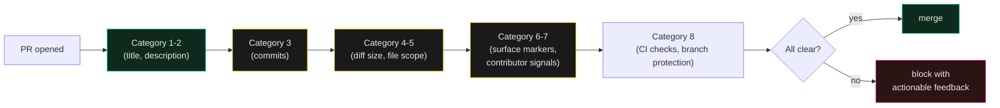

# PR Slop — Patterns

> The PR is the surface the reviewer sees. A 200-line code change with "feat: stuff" as its title is not a pull request — it's a hostage note.

A pull request is *not* the diff. The diff is what changed; the PR is the *contract* between the author and the reviewer: *what changed, why it changed, what to look at, what's out of scope.* AI-generated PRs ship the diff confidently and leave the contract blank. The result is reviewers who can't tell what they should be reviewing, who skip the PR because the title tells them nothing, who merge a 200-line diff because "the tests pass."

This skill encodes the deterministic checks that catch that pattern *before* merge. The checks run on PR metadata (title, description, commit messages, file count, contributor signals) — not on the code itself. The code side lives in [`code-slop-patterns`](../code-slop-patterns/SKILL.md).

*Companion to [`no-ai-tells`](../no-ai-tells/SKILL.md) (prose), [`no-design-tells`](../no-design-tells/SKILL.md) (UI), and [`code-slop-patterns`](../code-slop-patterns/SKILL.md) (code). Orchestrated by [`slop-detect-stack`](../slop-detect-stack/SKILL.md).*

---

## The core claim

A pull request has **four surfaces**, each of which can carry the AI-slop fingerprint:

1. **Title** — what the reviewer sees first. "fix: stuff", "WIP", "update" are slop.
2. **Description** — the contract. Empty, two-line, or copy-pasted-from-the-template is slop.
3. **Commits** — the history. "fix", "wip", "address comments" repeated 8 times is slop.
4. **The diff itself** — too big to review in one sitting, with no per-file change rationale, is slop.

The cheap, deterministic checks catch all four. They are not subjective; they are rule-based, configurable, and run in CI without an LLM. The reference implementation is [`peakoss/anti-slop`](https://github.com/peakoss/anti-slop) — a GitHub Action with 34 checks and 57 configurable options.

**The hard-won lesson:** *do not* enable every check at once. Tune the rules to your repo. Punishing legitimate contributors with a 30-check wall is worse than no wall — it just teaches them to disable the action.

---

## When to load

- You are setting up a PR quality gate for an AI-assisted workflow.
- You are reviewing a PR that includes AI-generated changes and want a checklist.
- You are auditing a repo that has been flooded with low-quality PRs (open source, hackathon, AI-tool integrations).
- You are writing the contributor-facing documentation that explains what "good PR" means for your project.

---

## The moves — the 8 categories

### Category 1 — Title is a verb + noun, not a noun phrase or single word

```text
❌ "Update"                              ❌ "fixes"
❌ "WIP"                                 ❌ "stuff"
❌ "feat: add feature"                   ❌ "PR for issue #123"
✅ "feat(api): add /v2/users endpoint with cursor pagination"
✅ "fix(auth): close IDOR on device-binding endpoint"
```

**Rule:** title must match a conventional-commits pattern (`type(scope): subject`), be 20–80 chars, and have a verb. Single words and noun phrases are not titles.

**Detection:** regex on `pull_request.title` against conventional-commits + length + verb-presence.

### Category 2 — Description answers "what" and "why", not just "what I did"

```markdown
❌ (empty)
❌ "Fixes bug."
❌ "Updated code per review."

✅
## What
Adds cursor pagination to `/v2/users` to replace offset pagination
that timed out at >10k records.

## Why
The dashboard 500'd twice this week when the user table exceeded 10k
records. Offset pagination's `OFFSET 10000 LIMIT 50` query takes 8s.

## How
- New `cursor` query param (opaque, base64-encoded `created_at:id`)
- Backwards-compatible: missing cursor = first page
- Old `page`/`limit` params deprecated (still work, log a warning)

## Out of scope
- Cursor stability across writes (deferred — see issue #482)
- New index on `users(created_at, id)` (deferred — see #483)
```

**Rule:** description has at least 3 of: *what changed*, *why it changed*, *how to verify*, *out of scope*. Templates help; reviewers trust templates that are filled in, not templates that are blank.

**Detection:** description length, presence of section headers (`## What`, `## Why`, etc.), absence of one-liner-only PRs.

### Category 3 — Commits tell a coherent story, not a fix-up diary

```text
❌
- WIP
- fix
- fix
- WIP
- address comments
- fix
- fix
- final

✅
- feat(api): add cursor pagination to /v2/users
- test(api): cover cursor pagination edge cases
- docs(api): document cursor param + deprecation warning
```

**Rule:** commits follow conventional-commits, group by intent (feat / test / docs / fix), don't include "fix" or "WIP" as standalone messages.

**Detection:** regex on each commit message; require conventional-commits pattern; flag "WIP", "fix", "address comments", "oops" as standalone messages.

### Category 4 — Diff size matches the description

```text
❌
Title: "fix typo in docs"
Diff:  47 files changed, 1200 insertions(+), 800 deletions(-)

✅
Title: "fix typo in docs"
Diff:  1 file changed, 2 insertions(+), 1 deletion(-)

✅
Title: "feat(api): add cursor pagination"
Diff:  4 files changed, 180 insertions(+), 40 deletions(-)
```

**Rule:** the diff size should match what the title implies. A "fix typo" PR with 47 changed files is not a typo fix. A feature PR with 1200 lines is a feature review, not a typo review — review burden scales non-linearly.

**Detection:** diff size threshold per category (e.g., >500 lines requires description with `## How` AND `## Out of scope` sections). Flag mismatches for human review.

### Category 5 — File changes match a coherent scope

```text
❌
Title: "feat(api): add cursor pagination"
Files: src/api/users.ts,
       src/api/auth.ts,            ← unrelated
       src/components/Header.tsx,  ← unrelated
       package-lock.json,          ← unrelated
       docs/random.md              ← unrelated

✅
Title: "feat(api): add cursor pagination"
Files: src/api/users.ts,
       src/api/__tests__/users.test.ts,
       docs/api/users.md,
       package.json (one dep added)
```

**Rule:** the files in the diff should be related to what the title says. A "feature in /api/users" PR that touches the auth module, the Header component, and `package-lock.json` is doing too much.

**Detection:** require ≥80% of changed files to match the path implied by the title (or a configurable allowlist). Flag the rest for human review.

### Category 6 — No "AI generated" surface markers

```markdown
❌ (in PR description)
"🤖 Generated with Claude Code"
"This PR was co-authored by Cursor"
"Co-Authored-By: CLAUDE"

✅
(no marker — or, if required by policy, a clean attribution line)
"Assisted by Claude Code; reviewed by hand."
```

**Rule:** AI-generated PRs often include markers that are fine in *intent* but wrong in *form*. The "Co-Authored-By: CLAUDE" trailer is technically valid but reads as "I didn't actually write this." Surface markers are useful for honesty, harmful if they become a banner.

**Detection:** configurable — either ban, require a specific format, or require a human reviewer signoff.

### Category 7 — Contributor signals match the change

```text
❌
First-time contributor, single PR,
3,200 lines added, all in one go,
no review history.

✅
Returning contributor, multiple PRs,
small diff with clear rationale,
past reviews show pattern of care.
```

**Rule:** the contributor's history (PR count, review history, time in repo) is a signal of risk. A first-time contributor with a 3,200-line PR is high-risk. A returning contributor with a 200-line PR is low-risk. Neither is automatic reject; both are flag-for-extra-attention.

**Detection:** contributor PR count + total LOC + review history. Flag first-PR + >X LOC combinations.

### Category 8 — Required CI checks actually run

```text
❌
PR merged with:
- "All checks skipped" badge
- No review approval
- Branch-protection bypassed

✅
PR merged with:
- All CI checks green
- 2 reviewer approvals
- Branch protection respected
```

**Rule:** a PR is not mergeable until its CI gates have run and human review has approved. Branch protection is the enforcement.

**Detection:** GitHub branch protection settings, required status checks, required review count. Anti-slop can't enforce this — GitHub does.

---

## The detection stack



The 8 categories form a layered gate: cheap metadata checks first, structural diff checks next, contributor-signal checks last. Each layer catches a different class of "looks mergeable but shouldn't" PR.

---

## Connects to

- [`../slop-detect-stack/SKILL.md`](../slop-detect-stack/SKILL.md) — orchestration skill that chains all the slop-detect skills
- [`../code-slop-patterns/SKILL.md`](../code-slop-patterns/SKILL.md) — the code-side companion (deterministic checks on the diff itself)
- [`../no-ai-tells/SKILL.md`](../no-ai-tells/SKILL.md) — prose slop (catches AI-tells in the PR description)
- [`../adversarial-review/SKILL.md`](../adversarial-review/SKILL.md) — for the conceptual review this skill can't do
- [`../ship-discipline/SKILL.md`](../ship-discipline/SKILL.md) — the commit-message style this skill's category 3 enforces

---

## The rollout order that respects a real backlog

Do **not** turn on every check at once. The order that respects how contributors actually behave:

1. **Week 1**: Turn on `Category 1` (title) and `Category 3` (commits). Cheap, fast, immediately educational. Contributors learn within a PR or two.
2. **Week 2**: Add `Category 2` (description) with a filled-in template. Provide the template in `.github/PULL_REQUEST_TEMPLATE.md` so the friction is "fill in the boxes," not "write from scratch."
3. **Week 3**: Add `Category 4` (diff size). Set the threshold generously — start at 800 lines, not 200.
4. **Week 4**: Add `Category 5` (file scope). Configure per-repo path allowlists.
5. **Month 2**: Add `Category 6` (AI surface markers) only if your org has a policy on them.
6. **Month 3**: Add `Category 7` (contributor signals) carefully — too aggressive and you punish legitimate new contributors.

The lesson: **the rule that fires the most false positives is the rule that gets disabled.** Tune before you enable.

---

## For the full thing

The reference implementation is [`peakoss/anti-slop`](https://github.com/peakoss/anti-slop) — a GitHub Action with 34 checks and 57 configurable options. It can fail or auto-close PRs based on configurable thresholds. This skill is the *agent-facing summary* of the patterns; the tool is the enforcement; the discipline is the practice.
