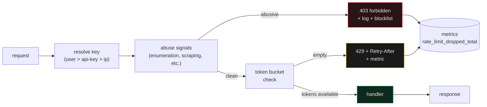

# Rate Limiting

> The difference between 429 and 403 is whether the caller did something wrong or whether your system is overloaded. Conflating them costs you either abuse or customers.

A rate limit that punishes the wrong user is worse than no rate limit. A rate limit that doesn't page you when it's hit is decoration. A rate limit that triggers during a flash sale and locks out your paying customers is a revenue event, not a security event. **The hard part isn't the math; it's choosing the right key, the right window, the right response, and the right escalation.**

*See [`appsec-stack`](../appsec-stack/SKILL.md) for the abuse-prevention side; this skill is the API-shape side.*

---

## The core claim

There are exactly two failure modes a rate limit protects against:

1. **Retryable overload** — the system is busy, but the caller is legitimate. **Respond 429 with `Retry-After: <seconds>`** so well-behaved clients back off and retry.
2. **Permanent abuse** — the caller is hammering the system with intent to harm. **Respond 403 (or drop silently) and add to a blocklist** so the abuse doesn't continue.

The mistake is responding 403 to overload (locks out customers) or responding 429 to abuse (the abuser ignores `Retry-After` and keeps hammering). The fix is structural: two exit paths from the limiter, two responses, two log lines.

---

## When to load

- You're exposing a public endpoint that anonymous callers can hit.
- You're seeing real abuse (scraping, credential stuffing, denial-of-wallet).
- A spike took your service down and you want to keep the next spike from being a full outage.
- You need quota alerts before a customer blows through their plan.
- You're choosing between rate-limit libraries / Redis-based limits / edge limits.

---

## The moves

### Pick the right key

```javascript
// Hierarchy of preferred keys — pick the FIRST one that's available.
function rateLimitKey(req) {
  if (req.user?.id)        return `user:${req.user.id}`;        // authenticated
  if (req.apiKey)          return `key:${req.apiKey}`;          // API-keyed
  if (req.headers['x-forwarded-for']) return `ip:${req.ip}`;    // anonymous
  return `anon:${req.sessionId}`;                                // session-only
}
```

**Per-user is always safer than per-IP.** A single NAT'd corporate office can share an IP with hundreds of users; per-IP limits punish them all. Per-user with `Retry-After` is the right default; per-IP is the fallback for endpoints that can't authenticate.

### Token bucket vs sliding window — pick by traffic shape

| Pattern | Best for | Memory cost |
|---|---|---|
| **Token bucket** | APIs where burst is OK but steady-state matters (uploads, expensive endpoints) | O(1) per key |
| **Sliding window** | APIs where any minute over the limit is bad (login, password reset) | O(window-size) per key |
| **Fixed window** | Cheap, simple, but allows 2x burst at window boundaries | O(1) per key |

For most public APIs, **token bucket** is the right default: 60 requests, refilling 1 per second, allows a real burst without letting an abuser sustain it.

### Graceful 429 with Retry-After

```javascript
res.status(429)
   .set('Retry-After', String(Math.ceil(retryAfterSec)))
   .set('X-RateLimit-Limit', '60')
   .set('X-RateLimit-Remaining', '0')
   .set('X-RateLimit-Reset', String(resetEpoch))
   .json({
     error: 'rate_limited',
     message: 'Too many requests. Retry after the time given.',
     retryAfter: retryAfterSec
   });
```

**Always set `Retry-After`.** Without it, clients either hammer until they get through (amplifying the problem) or back off arbitrarily (waiting longer than needed). The header is the contract.

### Distinguish 429 from 403

```javascript
// 429: legitimate caller, system is overloaded
if (bucketTokens < 1) return rateLimited(res, retryAfter);

// 403: caller is doing something they shouldn't
if (abuseSignals(req, key)) return forbidden(res);

// 200 / 4xx: normal business response
return handle(req, res);
```

The `abuseSignals` check is independent of the bucket. A user with a valid token can still be abusive (enumeration, scraping); an unauthenticated request can still be legitimate (rate-limit but don't ban).

### Page when the limit hits, not when it fails

If your limiter is dropping 50% of traffic, your system is at 50% effective capacity and the operator should know — *before* it falls over. Wire a metric (`rate_limit_dropped_total{kind="429"|"403"}`) and alert on rate, not on absolute count.

---

## The architecture



Two exits, two log lines, two metrics. The handler never sees an abusive request; the operator sees both classes of rejection.

---

## Connects to

- [`../appsec-stack/SKILL.md`](../appsec-stack/SKILL.md) — abuse prevention, WAF rules, the seven-layer scanner stack
- [`../api-design/SKILL.md`](../api-design/SKILL.md) — the rate-limit headers belong in your API contract from day one, not bolted on
- [`../auth-entitlement/SKILL.md`](../auth-entitlement/SKILL.md) — paid tiers get different rate limits; the entitlement is the key
- [`../risk-posture/SKILL.md`](../risk-posture/SKILL.md) — a 429 that locks out paying customers during a spike is a P0 incident, not a security win
- [`../caching-layers/SKILL.md`](../caching-layers/SKILL.md) — caching the limit-check result is a footgun; limits should be near-real-time

---

## For the full thing

If you're on Cloudflare: `Rate Limit Rules` in the dashboard, plus Workers for custom logic. If you're behind a CDN: edge limit at the CDN, per-user limit at the origin. If you're running solo: Redis with `INCR` + `EXPIRE` is the simplest viable limiter. The math is straightforward; the discipline is what this skill encodes.
