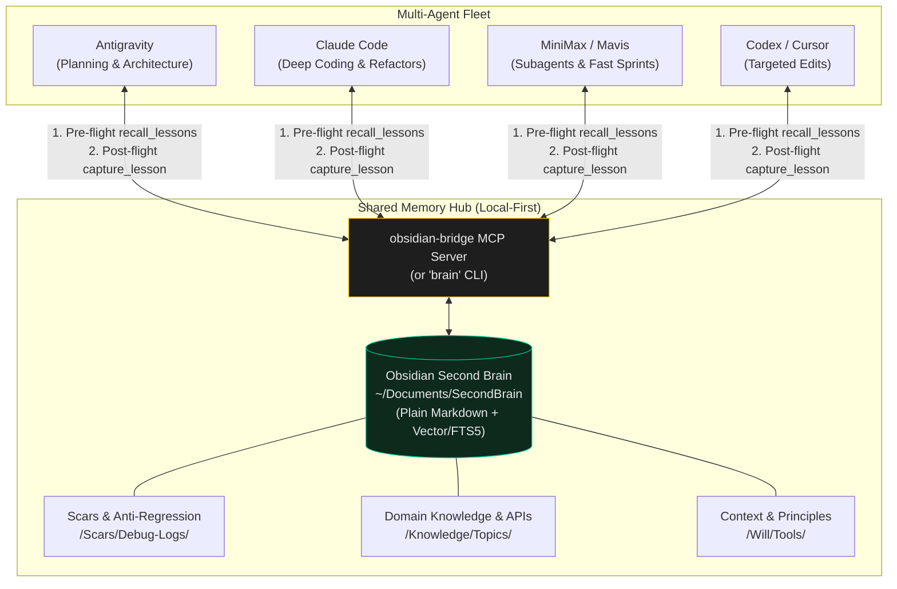

# Shared Memory Hub

> One verified lesson is stored once, recalled only when relevant, and shared across every agent in the fleet.

In a multi-agent practice where Claude Code, Codex, Antigravity, Cursor, and MiniMax work concurrently on the same codebase, **agent-private memory is a liability**. If Claude discovers a fatal edge-case bug in an API adapter and stores it in Claude-private storage, Codex or Cursor will walk into the exact same trap two hours later.

This skill defines the **Vault-Centric Memory Architecture** — connecting all agents to a local-first Obsidian Second Brain (`~/Documents/SecondBrain`) via the `obsidian-bridge` MCP server or shell CLI (`brain recall`).

---

## Memory Topology



---

## The Two-Step Ritual

### 1. Pre-Flight Recall (Before Coding)
Before writing code, refactoring architecture, or debugging an unfamiliar error:
- Call `recall_lessons(query: "<task / stack / error>")` via MCP, or run `brain recall "<task>"`.
- Retrieve **at most 3 targeted lessons**. Never dump or load the entire vault into the context window.
- If a verified scar exists for this subsystem (e.g. "deck.gl occlusion bug on MapLibre" or "Cloudflare Worker json() status code swallow"), follow the proven fix immediately.

### 2. Post-Flight Capture (After Verification)
When a novel bug, API failure, or architectural fix is **verified on the live system**:
- Call `capture_lesson` before closing the session or writing to any agent-private scratchpad.
- A valid lesson requires six concrete fields:

```markdown
---
type: scar
updated: YYYY-MM-DD
tags: [stack, subsystem, bug-type]
---

# [Symptom / What Broke]

## Symptom
Exact error message, status code, or visual glitch observed in production.

## Failed Attempt
What an intuitive or standard LLM fix attempted and why it failed.

## Root Cause
The underlying mechanism (e.g. CDN caching header collision, unhandled promise rejection).

## Verified Fix
The exact minimal code change that resolved the problem.

## Verification Evidence
The `curl` response, test output, or live URL proving the fix works.
```

---

## Memory Governance Laws

1. **Hierarchy of Authority:**
   `Current AGENTS.md` → `Project CLAUDE.md / context.md` → `Verified Scars & Knowledge Notes` → `Raw Evidence`.
   *A recalled lesson never overrides an explicitly newer project rule.*

2. **No Unverified Ideas in Memory:**
   Only fixes verified in production qualify as durable lessons. Unverified hypotheses remain session scratch and must not guide future agents.

3. **Zero Secrets in Markdown:**
   API keys, passwords, and private tokens live strictly in gitignored `.env` files or system keychains. Never write credential strings into the shared vault.

4. **Self-Test at Session End:**
   If you solved a tricky bug today, test `recall_lessons` with your problem statement. If it returns generic boilerplate instead of your specific fix, capture was skipped.
