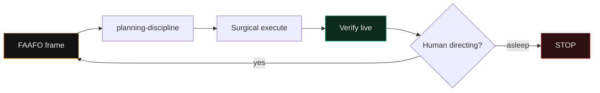

# Vibe Coding · FAAFO Bridge

> Trust the vibes **with** verification. You are the head chef — intent, taste, and judgment. Agents cook. Never fall asleep at the wheel.

This skill is a **thin bridge** from Gene Kim and Steve Yegge public Vibe Coding / FAAFO vocabulary onto this repository's existing operating system. It does **not** replace [`planning-discipline`](../planning-discipline/SKILL.md), [`director-not-typer`](../director-not-typer/SKILL.md), or [`design-thinking-vibecoding`](../design-thinking-vibecoding/SKILL.md).

Public sources (cite, do not paste book body): [FAAFO value](https://itrevolution.com/articles/the-value-of-vibe-coding-or-the-good-faafo/), [Essential skills](https://itrevolution.com/articles/essential-skills-of-a-vibe-coder/), [FAAFO Measurement Toolkit (PDF)](https://itrevolution.com/wp-content/uploads/2025/02/FAAFO-Measurement-Toolkit.pdf). Full map: [`playbooks/17-kim-yegge-faafo-bridge.md`](../../playbooks/17-kim-yegge-faafo-bridge.md).

---

## When to load

- Before a multi-file, ambiguous, or ambitious build.
- When the brief is "just vibe it" with no success criteria.
- When you need optionality (try two paths) without creating haunted code.

Skip for one-line typos and pure mechanical follow-ups already scoped.

---

## The 30-second FAAFO frame

Fill this block **before** proposing diffs. Keep each line short.

```markdown
## FAAFO
- **Faster:** what feedback loop must be minutes, not days?
- **Ambitious:** what becomes worth building only because agents exist?
- **Autonomous:** what can one director + agents finish without a committee?
- **Fun:** what keeps the human in flow (not rubber-stamping diffs)?
- **Optionality:** which 2 paths stay open until evidence picks one?
## Constraints
- Sacred / anti-regression:
- Verification (test / curl / live URL):
- Stop rule (when NOT to accept the diff):
```

Then continue with [`planning-discipline`](../planning-discipline/SKILL.md) Spec-First steps 0-5.



---

## Route map (one level deep)

| Need | Load |
|---|---|
| Intent vs mechanics | [`director-not-typer`](../director-not-typer/SKILL.md) |
| Lived problem to MVP | [`design-thinking-vibecoding`](../design-thinking-vibecoding/SKILL.md) |
| Plan + alignment gate | [`planning-discipline`](../planning-discipline/SKILL.md) |
| Fast feedback / UI truth | [`browser-as-t`](../browser-as-t/SKILL.md) |
| False greens | [`wrong-green`](../wrong-green/SKILL.md) |
| Context saturation | [`context-economy`](../context-economy/SKILL.md) + [`context-save`](../context-save/SKILL.md) |
| Bad cleanup risk | [`anti-regression`](../anti-regression/SKILL.md) |
| Diff challenge | [`adversarial-review`](../adversarial-review/SKILL.md) |
| Parallel agents | [`staff-swarm`](../staff-swarm/SKILL.md) / [`agent-relay`](../agent-relay/SKILL.md) |
| Done equals live | [`ship-discipline`](../ship-discipline/SKILL.md) + [`result-honesty`](../result-honesty/SKILL.md) |

Failure patterns: [`reference/vibe-coding-failure-patterns.md`](../../reference/vibe-coding-failure-patterns.md).

---

## Success criteria

- FAAFO block exists for nontrivial work.
- At least one verification step is named before code.
- Human remains director; agent does not self-approve its own diff.
