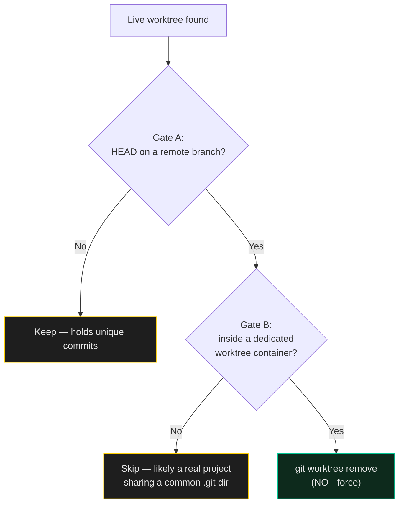

# Workspace Lean

> `git worktree prune` only removes registrations whose directory is already gone. It does nothing for the ninety worktrees still sitting on disk from finished work. This is the method for the part `prune` doesn't cover.

A workspace that's been running for months with multiple agents accumulates worktrees the way a kitchen accumulates jars. This skill is how to clear them without losing anything or taking down a live service.

---

## Rule 0 — map what's alive before touching anything

```bash
ps aux | grep -E "node|python|bun" | grep <your-projects-dir>
ls ~/Library/LaunchAgents/*.plist | xargs grep -l <your-projects-dir>   # macOS
```

Commit age lies. A repo untouched for six weeks can be serving production right now via a supervised service (see [`always-on-services`](../always-on-services/SKILL.md)). Nothing gets removed from a project a running process or service definition still references.

## The two-gate worktree triage

For every live worktree — not just the ones `prune` already caught — ask two independent questions before removing it:

**Gate A — is anything here unique?**
```bash
git -C "$worktree" branch -r --contains "$(git -C "$worktree" rev-parse HEAD)"
```
If this returns at least one remote branch, the worktree's commits already live on a remote. The directory is disposable; nothing is lost by removing it.

**Gate B — is this actually a disposable worktree, or a real project?**
Git registers any sibling clone sharing a common `.git` dir as a "worktree" of the original — including, sometimes, what is functionally a *second top-level project* someone spun off from a branch. Removing that destroys real work, not scratch space. Restrict removal to paths inside a clearly dedicated container: `*/.worktrees/*`, `*/.claude/worktrees/*`, `*/.codex/worktrees/*`, or whatever your own convention is. If a "worktree" doesn't live inside one of those, treat it as a project until proven otherwise.



Then call `git worktree remove` **without `--force`.** Git's own refusal on uncommitted changes is a third safety rail you don't have to implement — let it do the job.

## Dependency and build weight

Clear `node_modules` only where a lockfile exists — no lockfile means the reinstall may not reproduce the same tree, and "faster to clean than to verify" stops being true. Never touch build/dependency weight in a repo a live service depends on. The full list of build-artifact directories worth clearing on genuinely dormant projects, beyond the obvious `.next`/`dist`/`build`: `.turbo`, `.vite`, `.open-next`, `.netlify`, `out` — the last three are the ones a quick pass forgets, because they're framework-adapter output, not the framework's own default.

## Before any destructive pass — the unpushed-work sweep

```bash
git rev-list --count origin/<branch>..HEAD   # per repo
git branch -r --contains HEAD                # per feature branch
```
Run this across the whole workspace first. It's cheap, and it's the difference between "safe to clean" and "one push away from safe to clean."

## Verify after

Re-run the Rule 0 liveness check and confirm every service that was up before the pass is still up after. A cleanup that silently kills a bot isn't a cleanup — it's an incident with a delay on it.

## The one-line version

> Map what's alive first, gate every removal on remote-containment AND path-location, never force, then verify the services you started with are the services you end with.
